# 误差理论与测量平差 · 例题、思考题与课后习题册

> 来源：用户提供的18份课程PDF，共474页。本册现有 **152道编号题**（复合题含多个小问），按课件章节编排。

题目集中在前，**全部答案集中在文末**。每题的“查看答案”可直接跳到该题答案，答案中的“返回题目”可跳回；目录也提供每章的题目与答案入口。

- 页码一律使用PDF物理页码（从第1页起），便于查找；原课件页脚编号不一致时仍以PDF页码为准。
- 收录例题、思考题、课堂练习、课后作业及具有明确问题的教学演示。相同数据的跨页题目合并并保留出处；数据不同的版本分别列出。
- 解答注明“课件答案”“整理补解”或“条件答案”。课件数值或公式有疑误时，题面保留原信息，在答案中解释并复算。
- 若PDF只引用教材题号、课程网站数据或外部程序而未给题面/数据，保留任务索引并说明可解范围，不补造题目或实验结果。
- 公式使用GitHub支持的LaTeX；下载本册时请一并保留同目录的 `assets/` 图片文件夹。

[查看课件覆盖与校核说明](课件覆盖与校核说明.md) · [直接前往全部答案](#answers)

<a id="contents"></a>
## 章节目录

| 章节 | 主题 | 编号题数 | 题目 | 答案 |
|---|---|---:|---|---|
| 02 | 偶然误差特性及精度指标 | 6 | [做题](#chapter-02) | [答案](#answers-02) |
| 03 | 协方差传播律 1 | 14 | [做题](#chapter-03) | [答案](#answers-03) |
| 04 | 协方差传播律 2 | 17 | [做题](#chapter-04) | [答案](#answers-04) |
| 05 | 权、协因数及其传播律 | 18 | [做题](#chapter-05) | [答案](#answers-05) |
| 06 | 单位权中误差的计算、系统误差传播与综合 | 5 | [做题](#chapter-06) | [答案](#answers-06) |
| 07 | 条件平差建模与求解（含节段9-1） | 11 | [做题](#chapter-07) | [答案](#answers-07) |
| 08 | 条件平差精度评定（含节段9-2） | 5 | [做题](#chapter-08) | [答案](#answers-08) |
| 10 | 间接平差建模、求解与精度评定 | 10 | [做题](#chapter-10) | [答案](#answers-10) |
| 11 | 典型网型的建模 | 11 | [做题](#chapter-11) | [答案](#answers-11) |
| 12 | 典型控制网的基准 | 13 | [做题](#chapter-12) | [答案](#answers-12) |
| 13 | 带约束的间接平差 | 8 | [做题](#chapter-13) | [答案](#answers-13) |
| 14 | 附有参数的条件平差 | 8 | [做题](#chapter-14) | [答案](#answers-14) |
| 15 | 概括平差函数模型 | 3 | [做题](#chapter-15) | [答案](#answers-15) |
| 16 | 误差椭圆及应用 | 11 | [做题](#chapter-16) | [答案](#answers-16) |
| 17 | 统计假设原理与常用统计量 | 12 | [做题](#chapter-17) | [答案](#answers-17) |

## 题目

<a id="chapter-02"></a>
### 02　偶然误差特性及精度指标

[返回目录](#contents) · [本章答案](#answers-02)

<a id="q-02-01"></a>
#### 02-01　一维正态分布的数学期望和方差

**类型：** 演示算例  
**出处：** 2-偶然误差特性及精度指标.pdf，PDF第6页

设 $X\sim N(\mu,\sigma^2)$，其概率密度为


$$
f(x)=\frac{1}{\sigma\sqrt{2\pi}}\exp\!\left[-\frac{(x-\mu)^2}{2\sigma^2}\right].
$$


计算 $E(X)$ 和 $D(X)$。（本页为课程展示计算，整理为复习题。）

[查看答案 →](#answer-02-01) · [本章开头](#chapter-02)

---

<a id="q-02-02"></a>
#### 02-02　二维正态分布五个参数如何影响密度形态

**类型：** 思考题  
**出处：** 2-偶然误差特性及精度指标.pdf，PDF第7页

二维正态分布有五个参数 $\mu_1,\mu_2,\sigma_1,\sigma_2,\rho$。这五个参数分别如何影响概率密度函数的形态？

[查看答案 →](#answer-02-02) · [本章开头](#chapter-02)

---

<a id="q-02-03"></a>
#### 02-03　观测误差与观测值的精度是否相同

**类型：** 思考题  
**出处：** 2-偶然误差特性及精度指标.pdf，PDF第17页

观测误差的精度与观测值的精度是否相同？

A. 相同；B. 不相同。

已知观测模型 $L=\widetilde L+\Delta$，真值 $\widetilde L$ 是确定量。

[查看答案 →](#answer-02-03) · [本章开头](#chapter-02)

---

<a id="q-02-04"></a>
#### 02-04　“误差控制在 0.5 毫米”中的误差指标

**类型：** 思考题  
**出处：** 2-偶然误差特性及精度指标.pdf，PDF第18页

“误差控制在 $0.5\,\mathrm{mm}$”中，误差是指方差、中误差、或然误差，还是极限误差？

[查看答案 →](#answer-02-04) · [本章开头](#chapter-02)

---

<a id="q-02-05"></a>
#### 02-05　由 0.5 毫米限差反推中误差

**类型：** 思考题  
**出处：** 2-偶然误差特性及精度指标.pdf，PDF第18页

“误差控制在 $0.5\,\mathrm{mm}$”，要求中误差控制在多少以内？按本页通常采用的 $3\sigma$ 限差回答，并说明采用 $2\sigma$ 时的结果。

[查看答案 →](#answer-02-05) · [本章开头](#chapter-02)

---

<a id="q-02-06"></a>
#### 02-06　单个误差较小是否说明精度较高

**类型：** 思考题  
**出处：** 2-偶然误差特性及精度指标.pdf，PDF第19页

铁轨高程测量的散点示意中，有两个观测误差 $e_1<e_2$。是否可认为 $e_1$ 对应观测的精度高于 $e_2$ 对应观测？课件设定这些观测是在相同观测条件下取得的一组观测值。

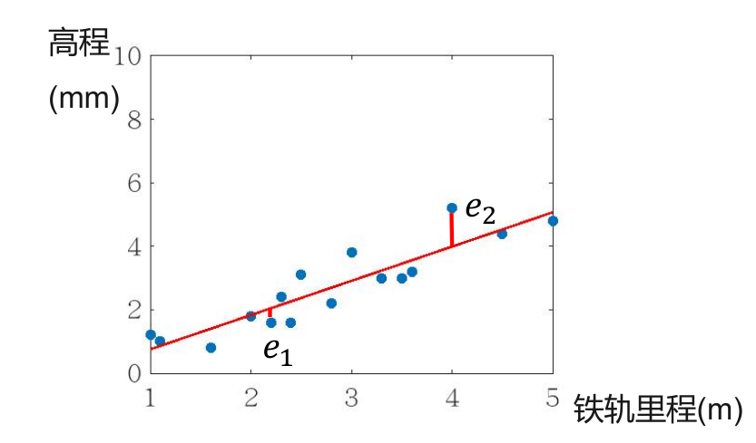

[查看答案 →](#answer-02-06) · [本章开头](#chapter-02)

---

<a id="chapter-03"></a>
### 03　协方差传播律 1

[返回目录](#contents) · [本章答案](#answers-03)

<a id="q-03-01"></a>
#### 03-01　铁轨平整度测量使用的仪器

**类型：** 思考题  
**出处：** 3-协方差传播律1.pdf，PDF第3页

在铁路建设、维护中的铁轨平整度测量场景中，使用了哪些测绘仪器？主要测量什么量？

[查看答案 →](#answer-03-01) · [本章开头](#chapter-03)

---

<a id="q-03-02"></a>
#### 03-02　附合水准路线的高程、协方差及线性模型（含选做题 3-1）

**类型：** 例题  
**出处：** 3-协方差传播律1.pdf，PDF第3、4、5、19、23页

水准路线为 $A\to1\to2\to3\to B$。已知 $H_A=45.286\,\mathrm m$、$H_B=49.579\,\mathrm m$，已知点视为无误差。四段高差相互独立：

| 段 | $h_i$（m） | $S_i$（km） |
|---|---:|---:|
| $A\to1$ | $+2.331$ | $1.6$ |
| $1\to2$ | $+2.813$ | $2.1$ |
| $2\to3$ | $-2.244$ | $1.7$ |
| $3\to B$ | $+1.430$ | $2.0$ |

每公里高差观测中误差为 $\sigma_{\mathrm{km}}=5\,\mathrm{mm}$，按路线长度分配闭合差：


$$
f_h=\sum_{i=1}^4h_i-(H_B-H_A),\quad
v_i=-\frac{S_i}{\sum_jS_j}f_h,\quad \widehat h_i=h_i+v_i.
$$


高程递推为 $\widehat H_1=H_A+\widehat h_1$、$\widehat H_2=\widehat H_1+\widehat h_2$、$\widehat H_3=\widehat H_2+\widehat h_3$。

1. 求各点高程的中误差。
2. 能否直接写 $D(\widehat H_2)=D(\widehat H_1)+D(\widehat h_2)$？
3. 求三个高程的方差及两两协方差。
4. 选做题 3-1：令 $\widehat{\boldsymbol H}=A\boldsymbol L+\boldsymbol a_0$，$\boldsymbol L=(h_1,h_2,h_3,h_4)^T$，写出 $A$ 和 $\boldsymbol a_0$。

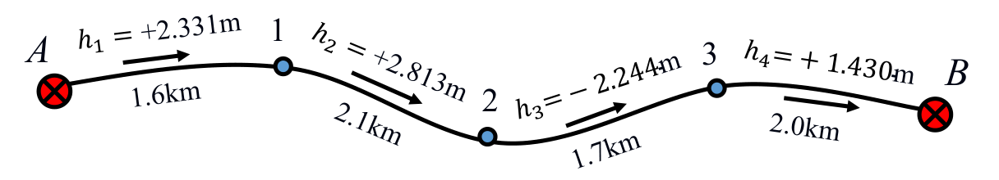

[查看答案 →](#answer-03-02) · [本章开头](#chapter-03)

---

<a id="q-03-03"></a>
#### 03-03　独立观测值加权组合的中误差

**类型：** 课堂练习  
**出处：** 3-协方差传播律1.pdf，PDF第6页

独立观测值 $l_1,l_2,l_3$ 的中误差分别为 $3\,\mathrm{mm},2\,\mathrm{mm},1\,\mathrm{mm}$。函数


$$
x=\frac17l_1+\frac27l_2+\frac47l_3.
$$


$x$ 的中误差为多少？

A. $41/49$；B. $\sqrt{41/49}$；C. $11/7$；D. $\sqrt{11/49}$。（单位为 mm。）

[查看答案 →](#answer-03-03) · [本章开头](#chapter-03)

---

<a id="q-03-04"></a>
#### 03-04　图上量距的实地距离中误差

**类型：** 课堂练习  
**出处：** 3-协方差传播律1.pdf，PDF第7页

量得比例尺为 $1:500$ 的地形图上两点间长度 $d=134.7\,\mathrm{mm}$，图上量距中误差为 $0.2\,\mathrm{mm}$。实地距离 $D$ 的中误差是多少？

[查看答案 →](#answer-03-04) · [本章开头](#chapter-03)

---

<a id="q-03-05"></a>
#### 03-05　测距与 GNSS 坐标试验中的随机变量和随机向量

**类型：** 演示算例  
**出处：** 3-协方差传播律1.pdf，PDF第12页

Leica DISTO-A3 对同一段长度测量，得到 $4.9984,5.0026,5.0029,5.0010,4.9970,4.9984,\ldots$，课件写 $L_1\sim N(5.0000,\sigma^2)$。

GNSS 接收机重复测量同一点位坐标，示例记录如下：

| 坐标分量 | 第 1 次 | 第 2 次 | 第 3 次 | 第 4 次 |
|---|---:|---:|---:|---:|
| $X$ | $-2267747.794$ | $-2267747.533$ | $-2267752.510$ | $-2267747.273$ |
| $Y$ | $5009153.697$ | $5009151.934$ | $5009163.876$ | $5009156.551$ |
| $Z$ | $3221294.594$ | $3221291.923$ | $3221297.466$ | $3221293.697$ |

如何理解这两类观测？课件在 $\boldsymbol L=(X,Y,Z)^T$ 后标注“$\sim??$”，应如何建立分布模型？

[查看答案 →](#answer-03-05) · [本章开头](#chapter-03)

---

<a id="q-03-06"></a>
#### 03-06　水准路线的观测向量及其单位

**类型：** 课堂练习  
**出处：** 3-协方差传播律1.pdf，PDF第13页

课堂练习 1：写出水准路线 $A\to1\to2\to3\to B$ 的观测向量。沿路线方向的四个高差依次为 $+2.331,+2.813,-2.244,+1.430\,\mathrm m$（原课件引用《测量学》P39 图 2-25）。

追问：观测向量有没有单位？

[查看答案 →](#answer-03-06) · [本章开头](#chapter-03)

---

<a id="q-03-07"></a>
#### 03-07　正态观测向量的分布与统计特性

**类型：** 思考题  
**出处：** 3-协方差传播律1.pdf，PDF第14页

1. 已知各观测值 $L_i\sim N(\widetilde L_i,\sigma_i^2)$，那么观测向量 $\boldsymbol L=(L_1,\ldots,L_n)^T$ 服从什么分布？
2. 如何描述观测向量 $\boldsymbol L$ 的统计特性？

[查看答案 →](#answer-03-07) · [本章开头](#chapter-03)

---

<a id="q-03-08"></a>
#### 03-08　证明协方差阵为对称阵

**类型：** 思考题  
**出处：** 3-协方差传播律1.pdf，PDF第16页

证明随机向量 $\boldsymbol L$ 的方差—协方差阵 $D_{LL}$ 是对称阵，并说明其对角元素和非对角元素的含义。

[查看答案 →](#answer-03-08) · [本章开头](#chapter-03)

---

<a id="q-03-09"></a>
#### 03-09　按每公里高差中误差组成协方差阵

**类型：** 课堂练习  
**出处：** 3-协方差传播律1.pdf，PDF第17页

课堂练习 2：四段相互独立水准高差 $\boldsymbol L=(h_1,h_2,h_3,h_4)^T$ 的路线长依次为 $1.6,2.1,1.7,2.0\,\mathrm{km}$。每公里高差观测中误差 $\sigma_{\mathrm{km}}=5\,\mathrm{mm}$，且 $\sigma_{h_i}^2=\sigma_{\mathrm{km}}^2S_i$（$S_i$ 用 km 数值）。写出 $D_{LL}$。

[查看答案 →](#answer-03-09) · [本章开头](#chapter-03)

---

<a id="q-03-10"></a>
#### 03-10　从协方差阵读取中误差、协方差和相关系数

**类型：** 课堂练习  
**出处：** 3-协方差传播律1.pdf，PDF第18页

观测向量 $\boldsymbol L=(L_1,L_2,L_3)^T$ 的协方差阵为


$$
D_{LL}=\begin{bmatrix}4&-2&0\\-2&9&-3\\0&-3&16\end{bmatrix}.
$$


填出以下九个空：

1. $L_1,L_2,L_3$ 的中误差分别为（1）（2）（3）。
2. $L_1,L_2$ 的协方差（4），相关系数（5）。
3. $L_1,L_3$ 的协方差（6），相关系数（7）。
4. $L_2,L_3$ 的协方差（8），相关系数（9）。

[查看答案 →](#answer-03-10) · [本章开头](#chapter-03)

---

<a id="q-03-11"></a>
#### 03-11　线性协方差传播律及其分布前提

**类型：** 思考题  
**出处：** 3-协方差传播律1.pdf，PDF第21、22页

已知随机向量 $\boldsymbol x$ 的均值和协方差阵，$\boldsymbol f=A\boldsymbol x+\boldsymbol a_0$，其中 $A,\boldsymbol a_0$ 为常量。求并证明 $D_{ff}$ 的表达式。

该结论是否要求 $\boldsymbol x$、$\boldsymbol f$ 服从正态分布？

[查看答案 →](#answer-03-11) · [本章开头](#chapter-03)

---

<a id="q-03-12"></a>
#### 03-12　方向观测组成两个角的精度（例 3-5）

**类型：** 例题  
**出处：** 3-协方差传播律1.pdf，PDF第24页

方向观测值 $l_1,l_2,l_3$ 相互独立，中误差均为 $\sigma$。由它们组成


$$
\alpha_1=l_2-l_1,\qquad\alpha_2=l_3-l_2.
$$


求 $\sigma_{\alpha_1},\sigma_{\alpha_2}$ 和协方差 $\sigma_{\alpha_1\alpha_2}$。

[查看答案 →](#answer-03-12) · [本章开头](#chapter-03)

---

<a id="q-03-13"></a>
#### 03-13　三角形内角平均分配闭合差后的精度（例 3-6）

**类型：** 例题  
**出处：** 3-协方差传播律1.pdf，PDF第25、26页

等精度观测三角形三个内角 $\alpha,\beta,\gamma$，中误差均为 $\sigma$，按课件模型视为相互独立。令


$$
w=180^\circ-(\alpha+\beta+\gamma),
$$


平均分配闭合差：$\widehat\alpha=\alpha+w/3$、$\widehat\beta=\beta+w/3$、$\widehat\gamma=\gamma+w/3$。

求平差后三角的中误差，并说明为什么按 $D(\widehat\alpha)=D(\alpha)+D(w)/9$ 得到 $4\sigma^2/3$ 是错误的。

[查看答案 →](#answer-03-13) · [本章开头](#chapter-03)

---

<a id="q-03-14"></a>
#### 03-14　三角高程的中误差

**类型：** 例题  
**出处：** 3-协方差传播律1.pdf，PDF第28页

珠峰测高的三角高程引例给出 $h=S\tan\alpha$。已知测角中误差 $\sigma_\alpha$，测边中误差（原课件误写为 $\sigma_h$，以下记为 $\sigma_S$），如何计算高差中误差 $\sigma_h$？课件背景文字同时提到观测斜边距离，应注意距离含义。

[查看答案 →](#answer-03-14) · [本章开头](#chapter-03)

---

<a id="chapter-04"></a>
### 04　协方差传播律 2

[返回目录](#contents) · [本章答案](#answers-04)

<a id="q-04-01"></a>
#### 04-01　水准路线高程与平差高差的互协方差（选做题 4-3）

**类型：** 例题  
**出处：** 4-协方差传播律2.pdf，PDF第7、11、16页

同一水准路线 $A\to1\to2\to3\to B$，四段长度为 $1.6,2.1,1.7,2.0\,\mathrm{km}$，高差观测 $\boldsymbol L=(L_1,L_2,L_3,L_4)^T$，协方差阵


$$
D_{LL}=\operatorname{diag}(40,52.5,42.5,50)\,\mathrm{mm}^2.
$$


按 $\widehat L_i=L_i-S_if_h/\sum_jS_j$ 分配闭合差，且


$$
\widehat H_1=H_A+\widehat L_1,\quad
\widehat H_2=H_A+\widehat L_1+\widehat L_2,\quad
\widehat H_3=H_A+\widehat L_1+\widehat L_2+\widehat L_3.
$$


已知端点高程无误差。求参数向量 $\widehat{\boldsymbol H}$ 与观测平差值向量 $\widehat{\boldsymbol L}$ 的互协方差阵。

**原题文字说明：** 原页写“与 $\widehat L_1\sim\widehat L_6$ 的协方差”，但图中只有四段、$D_{LL}$ 为 $4\times4$；本题保留这一矛盾，按已给四段数据计算。

[查看答案 →](#answer-04-01) · [本章开头](#chapter-04)

---

<a id="q-04-02"></a>
#### 04-02　互协方差阵的维数与转置关系

**类型：** 思考题  
**出处：** 4-协方差传播律2.pdf，PDF第8页

$\boldsymbol x$ 是 $n$ 维随机列向量，$\boldsymbol y$ 是 $m$ 维随机列向量。$D_{xy}$ 和 $D_{yx}$ 各有几行几列？两者有什么关系？

[查看答案 →](#answer-04-02) · [本章开头](#chapter-04)

---

<a id="q-04-03"></a>
#### 04-03　三维与二维随机向量的自协方差、互协方差阵

**类型：** 课堂练习  
**出处：** 4-协方差传播律2.pdf，PDF第9页

设 $\boldsymbol x=(x_1,x_2,x_3)^T$，$\boldsymbol y=(y_1,y_2)^T$，写出 $D_{xx},D_{yy},D_{xy},D_{yx}$ 的分量形式。

[查看答案 →](#answer-04-03) · [本章开头](#chapter-04)

---

<a id="q-04-04"></a>
#### 04-04　一个随机向量的线性函数协方差（复习）

**类型：** 思考题  
**出处：** 4-协方差传播律2.pdf，PDF第13页

随机向量 $\boldsymbol x$ 的协方差为 $D_{xx}$，$\boldsymbol f=A\boldsymbol x+\boldsymbol a_0$，其中系数为常量。如何求 $\boldsymbol f$ 的自协方差阵？

[查看答案 →](#answer-04-04) · [本章开头](#chapter-04)

---

<a id="q-04-05"></a>
#### 04-05　同一随机向量两个函数的互协方差（选做题 4-1）

**类型：** 思考题  
**出处：** 4-协方差传播律2.pdf，PDF第14页

设 $\boldsymbol f=A\boldsymbol x+\boldsymbol a_0$，$\boldsymbol g=B\boldsymbol x+\boldsymbol b_0$，系数为常量。推导


$$
D_{fg}=AD_{xx}B^T,\qquad D_{gf}=BD_{xx}A^T.
$$

[查看答案 →](#answer-04-05) · [本章开头](#chapter-04)

---

<a id="q-04-06"></a>
#### 04-06　不同随机向量函数间的互协方差（选做题 4-2）

**类型：** 思考题  
**出处：** 4-协方差传播律2.pdf，PDF第15页

随机向量 $\boldsymbol x,\boldsymbol y$ 的互协方差为 $D_{xy}$。令 $\boldsymbol f=A\boldsymbol x+\boldsymbol a_0$，$\boldsymbol w=C\boldsymbol y+\boldsymbol c_0$。推导


$$
D_{fw}=AD_{xy}C^T,\qquad D_{wf}=CD_{yx}A^T.
$$

[查看答案 →](#answer-04-06) · [本章开头](#chapter-04)

---

<a id="q-04-07"></a>
#### 04-07　连续线性变换的五个协方差阵（第一组，例 2）

**类型：** 例题  
**出处：** 4-协方差传播律2.pdf，PDF第18页

已知 $D_{LL}$，$\boldsymbol x=A\boldsymbol L$，$\boldsymbol y=B\boldsymbol x$，求 $D_{xx},D_{yy},D_{xL},D_{yL},D_{xy}$。

[查看答案 →](#answer-04-07) · [本章开头](#chapter-04)

---

<a id="q-04-08"></a>
#### 04-08　两个相关向量之线性组合（第二组，例 3-4）

**类型：** 例题  
**出处：** 4-协方差传播律2.pdf，PDF第19页

已知


$$
\boldsymbol f_{t\times1}=A_{t\times n}\boldsymbol x_{n\times1}+B_{t\times r}\boldsymbol y_{r\times1},
$$


以及 $D_{xx},D_{yy},D_{xy}$。求 $D_{ff},D_{fx},D_{fy}$。

[查看答案 →](#answer-04-08) · [本章开头](#chapter-04)

---

<a id="q-04-09"></a>
#### 04-09　三角高程的误差传播（引例、第五组）

**类型：** 例题  
**出处：** 4-协方差传播律2.pdf，PDF第21、28页

珠峰测高的三角高程引例给出 $h=S\tan\alpha$。已知测角中误差 $\sigma_\alpha$，测边中误差（原课件误写为 $\sigma_h$，以下记为 $\sigma_S$），如何计算高差中误差 $\sigma_h$？课件背景文字同时提到观测斜边距离，应注意距离含义。

[查看答案 →](#answer-04-09) · [本章开头](#chapter-04)

---

<a id="q-04-10"></a>
#### 04-10　为什么全微分的协方差可用于原非线性函数

**类型：** 思考题  
**出处：** 4-协方差传播律2.pdf，PDF第23、24页

非线性函数 $\boldsymbol z=\boldsymbol f(\boldsymbol x)$ 在 $\boldsymbol x^0$ 处线性化，令 $d\boldsymbol x=\boldsymbol x-\boldsymbol x^0$，$d\boldsymbol z=\boldsymbol z-\boldsymbol f(\boldsymbol x^0)$，并写 $d\boldsymbol z\approx Kd\boldsymbol x$。

课件在 $D_{zz}=KD_{xx}K^T$ 后标注“??”。为什么可以由增量传播得到原变量的协方差？这是精确关系还是近似关系？

[查看答案 →](#answer-04-10) · [本章开头](#chapter-04)

---

<a id="q-04-11"></a>
#### 04-11　建筑用地矩形面积及中误差（第三组）

**类型：** 课堂练习  
**出处：** 4-协方差传播律2.pdf，PDF第26页

建筑用地的图上放样数据如图，全部内角为直角。求矩形 $ABGF$ 的图上面积及其中误差。

已知 $FH=y_1=7\,\mathrm{cm}$，$BC=y_2=2\,\mathrm{cm}$，$HE=x_1=1\,\mathrm{cm}$，$EC=x_2=3\,\mathrm{cm}$；$A,B,C$ 在同一直线上，$F,G,H$ 在同一直线上，$C,E,H$ 在同一直线上。


$$
\boldsymbol y=(y_1,y_2)^T,\qquad\boldsymbol x=(x_1,x_2)^T,
$$


$$
D_{yy}=D_{xx}=\begin{bmatrix}2&1\\1&2\end{bmatrix}\,\mathrm{mm}^2,\qquad D_{xy}=0.
$$

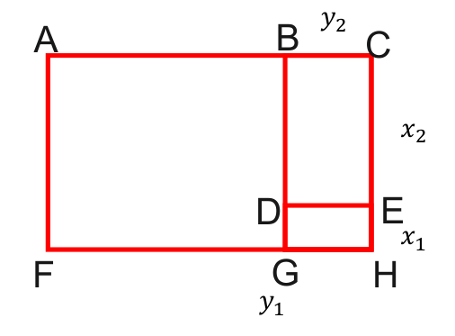

[查看答案 →](#answer-04-11) · [本章开头](#chapter-04)

---

<a id="q-04-12"></a>
#### 04-12　三角形平差角推算两边的协方差（第四组）

**类型：** 课堂练习  
**出处：** 4-协方差传播律2.pdf，PDF第27页

三角形三内角平均分配闭合差后，角度平差值为


$$
\widehat L_1=40^\circ10'30'',\quad\widehat L_2=50^\circ05'20'',\quad\widehat L_3=89^\circ44'10''.
$$


协方差阵为


$$
D_{\widehat L\widehat L}=\begin{bmatrix}6&-3&-3\\-3&6&-3\\-3&-3&6\end{bmatrix}.
$$


图中角 1 在 $A$、角 2 在 $B$、角 3 在 $C$；边 $BC=S_a$，边 $AC=S_b$。已知边 $AB=S_0=1500.0\,\mathrm m$，无误差。求另外两边的协方差阵。

原页未明确标注角协方差的单位；数值解按测角题通常使用的 $(\mathrm{arcsec})^2$ 计算，并在答案中给出单位转换关系。

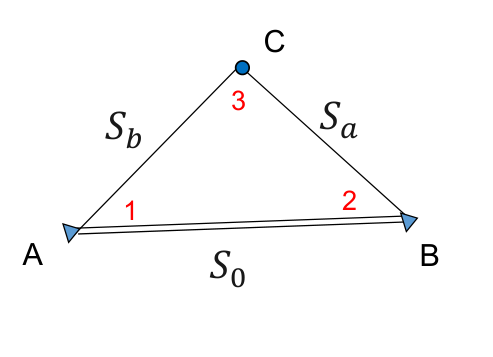

[查看答案 →](#answer-04-12) · [本章开头](#chapter-04)

---

<a id="q-04-13"></a>
#### 04-13　含折光修正的高差中误差（第六组）

**类型：** 课堂练习  
**出处：** 4-协方差传播律2.pdf，PDF第29页

某山区测量采用改进的高差模型


$$
h=S\sin\alpha+k\frac{S^2}{2R}\cos^2\alpha.
$$


已知 $S=800\,\mathrm m$（无误差），$\alpha=15^\circ$，测角中误差 $\sigma_\alpha=3''$，$k=0.002$（大气折光系数，常数），$R=6371\,\mathrm{km}$。求高差 $h$ 的中误差。

提示：角度转为弧度，$1''\approx4.848\times10^{-6}\,\mathrm{rad}$，忽略二阶小项。

[查看答案 →](#answer-04-13) · [本章开头](#chapter-04)

---

<a id="q-04-14"></a>
#### 04-14　像点坐标协方差传播（第七组）

**类型：** 课堂练习  
**出处：** 4-协方差传播律2.pdf，PDF第30页

像点坐标与物方点坐标的关系为


$$
x=\frac{fX}{Z},\qquad y=\frac{fY}{Z}.
$$


已知 $f=50\,\mathrm{mm}$（无误差），$X=100\,\mathrm m$、$Y=200\,\mathrm m$、$Z=500\,\mathrm m$，其协方差阵为


$$
D_{XYZ}=\begin{bmatrix}0.01&0.002&0.001\\0.002&0.04&0.003\\0.001&0.003&0.09\end{bmatrix}\,\mathrm m^2.
$$


求像点坐标 $(x,y)$ 的协方差矩阵。

[查看答案 →](#answer-04-14) · [本章开头](#chapter-04)

---

<a id="q-04-15"></a>
#### 04-15　局部坐标到国家坐标的协方差（第八组）

**类型：** 课堂练习  
**出处：** 4-协方差传播律2.pdf，PDF第31页

局部坐标 $(x,y)$ 转为国家坐标 $(X,Y)$，模型为


$$
X=ax\cos\theta-by\sin\theta+t_x,
$$


$$
Y=ax\sin\theta+by\cos\theta+t_y.
$$


已知 $a=1.002,b=0.998,\theta=5^\circ$（均视为常数），平移参数 $t_x,t_y$ 无误差。观测值 $x=100.000\,\mathrm m,y=200.000\,\mathrm m$，协方差阵为


$$
D_{xy}=\begin{bmatrix}0.04&0.01\\0.01&0.09\end{bmatrix}\,\mathrm{cm}^2.
$$


求 $(X,Y)$ 的方差—协方差矩阵。

[查看答案 →](#answer-04-15) · [本章开头](#chapter-04)

---

<a id="q-04-16"></a>
#### 04-16　GPS 基线长度的中误差（第九组）

**类型：** 课堂练习  
**出处：** 4-协方差传播律2.pdf，PDF第32页

GPS 基线分量 $(\Delta X,\Delta Y,\Delta Z)$ 的协方差阵为


$$
D_{\Delta}=\begin{bmatrix}0.25&0.1&0.05\\0.1&0.36&0.12\\0.05&0.12&0.16\end{bmatrix}\,\mathrm m^2.
$$


基线长为 $L=\sqrt{\Delta X^2+\Delta Y^2+\Delta Z^2}$。设 $\Delta X=100.0\,\mathrm m$，$\Delta Y=200.0\,\mathrm m$，$\Delta Z=50.0\,\mathrm m$，求 $L$ 的中误差。

[查看答案 →](#answer-04-16) · [本章开头](#chapter-04)

---

<a id="q-04-17"></a>
#### 04-17　应变模型的数值与中误差（第十组，含条件缺失说明）

**类型：** 课堂练习  
**出处：** 4-协方差传播律2.pdf，PDF第33页

某材料力学实验中，应变片测量应变的模型为


$$
\varepsilon=\frac{V}{kGL_0}.
$$


已知：

- 电压 $V=5.0\,\mathrm V\pm0.1\,\mathrm V$；
- 灵敏度 $k=2.0\,\mu\varepsilon/\mathrm V$（无误差）；
- 增益 $G=100\pm2$；
- 标距长度 $L_0=1.00\,\mathrm m\pm0.02\,\mathrm m$。

要求：1. 计算应变 $\varepsilon$ 的测量值；2. 计算 $\varepsilon$ 的中误差（标准差）。

[查看答案 →](#answer-04-17) · [本章开头](#chapter-04)

---

<a id="chapter-05"></a>
### 05　权、协因数及其传播律

[返回目录](#contents) · [本章答案](#answers-05)

<a id="q-05-01"></a>
#### 05-01　三个水准点测定 P 点高程：为什么采用加权平均

**类型：** 例题  
**出处：** 5-协方差传播律3.pdf，PDF第4、31页

三个已知水准点 $BM_1,BM_2,BM_3$ 的高程均为零。甲、乙、丙相互独立观测三条通往 $P$ 的水准路线，数据为：

|路线|高差/m|长度/km|
|---|---:|---:|
|1|1.102|1|
|2|1.100|3|
|3|1.107|5|

设每公里高差中误差为 $\sigma_{km}$。分别只使用一条路线、采用算术平均、采用正确的加权平均，求 $P$ 点高程及中误差，并比较精度。

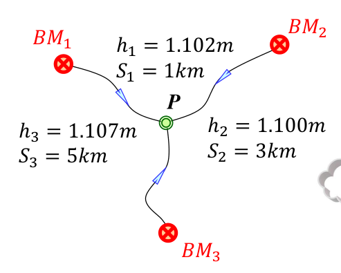

[查看答案 →](#answer-05-01) · [本章开头](#chapter-05)

---

<a id="q-05-02"></a>
#### 05-02　改变单位权方差时三个观测值的权

**类型：** 例题  
**出处：** 5-协方差传播律3.pdf，PDF第8页

三个观测值 $L_1,L_2,L_3$ 的中误差分别为 $\pm1,\pm2,\pm4$。分别取 $\mu^2=1$ 与 $\mu^2=16$，求各观测值的权及权比。

[查看答案 →](#answer-05-02) · [本章开头](#chapter-05)

---

<a id="q-05-03"></a>
#### 05-03　五条水准路线的定权与实际单位权观测值

**类型：** 课堂练习  
**出处：** 5-协方差传播律3.pdf，PDF第9、11页

已知 $S=(1.5,2.5,2.0,4.0,3.0)\rm\,km$，各路线每公里观测高差等精度。分别令 $\sigma_0^2=\sigma_5^2$、$\sigma_0^2=\sigma_1^2$、$\sigma_0^2=\sigma_{km}^2$，求五个高差的权，并指出单位权观测值。

[查看答案 →](#answer-05-03) · [本章开头](#chapter-05)

---

<a id="q-05-04"></a>
#### 05-04　单位权观测值是否一定存在

**类型：** 思考题  
**出处：** 5-协方差传播律3.pdf，PDF第10页

单位权中误差与单位权观测值有什么关系？单位权观测值是否一定实际存在？

[查看答案 →](#answer-05-04) · [本章开头](#chapter-05)

---

<a id="q-05-05"></a>
#### 05-05　权阵主对角元素是否就是单个观测值的权

**类型：** 课堂练习  
**出处：** 5-协方差传播律3.pdf，PDF第15、16、19页

单选：权阵中的主对角元素是不是观测值的权？A. 一定是；B. 不一定。请说明条件。

[查看答案 →](#answer-05-05) · [本章开头](#chapter-05)

---

<a id="q-05-06"></a>
#### 05-06　由三阶权阵求三个观测值的权

**类型：** 课堂练习  
**出处：** 5-协方差传播律3.pdf，PDF第17页

已知 $L=(L_1,L_2,L_3)^{\mathsf T}$ 的权阵


$$
P=\begin{bmatrix}3&2&1\\2&4&2\\1&2&3\end{bmatrix}.
$$


求单个观测值的权 $p_1,p_2,p_3$。

[查看答案 →](#answer-05-06) · [本章开头](#chapter-05)

---

<a id="q-05-07"></a>
#### 05-07　权阵的零元素能否说明观测值独立

**类型：** 思考题  
**出处：** 5-协方差传播律3.pdf，PDF第18页

权阵含有零元素，是否说明对应观测值独立？以


$$
P=\begin{bmatrix}2&-1&0\\-1&2&-1\\0&-1&2\end{bmatrix}
$$


为例说明。

[查看答案 →](#answer-05-07) · [本章开头](#chapter-05)

---

<a id="q-05-08"></a>
#### 05-08　二阶协因数阵的逆阵与边际权

**类型：** 课堂练习  
**出处：** 5-协方差传播律3.pdf，PDF第20页

已知 $Q=\begin{bmatrix}2&-1\\-1&3\end{bmatrix}$。求权阵和两个观测值的权。单个权的两组备选结果为 A. $(3/5,2/5)$；B. $(1/2,1/3)$，哪组正确？

[查看答案 →](#answer-05-08) · [本章开头](#chapter-05)

---

<a id="q-05-09"></a>
#### 05-09　分块观测向量：不能直接分割权阵

**类型：** 课堂练习  
**出处：** 5-协方差传播律3.pdf，PDF第22页

已知 $z=\begin{bmatrix}x_{2\times1}\\y_{1\times1}\end{bmatrix}$ 的权阵为


$$
P_{zz}=\begin{bmatrix}2&0&-1\\0&2&-1\\-1&-1&2\end{bmatrix}.
$$


求 $P_{xx},P_{yy},Q_{xy}$。（原填空栏末项误排为 $P_{xy}$，此处按题干的 $Q_{xy}$ 解答。）

[查看答案 →](#answer-05-09) · [本章开头](#chapter-05)

---

<a id="q-05-10"></a>
#### 05-10　指定一条路线的权后求其余路线的权

**类型：** 例题  
**出处：** 5-协方差传播律3.pdf，PDF第26页

已知 $S_1=3.0,S_2=6.0,S_3=2.0,S_4=1.5\rm\,km$，每公里高差等精度，第四路线的权为 $p_4=3$。求 $p_1,p_2,p_3$。

[查看答案 →](#answer-05-10) · [本章开头](#chapter-05)

---

<a id="q-05-11"></a>
#### 05-11　不同单位权路线长的两名测量者如何比较权

**类型：** 例题  
**出处：** 5-协方差传播律3.pdf，PDF第27页

甲、乙在同一对水准点 $P_1,P_2$ 间测得高差 $h_A,h_B$。甲以 $2\rm\,km$ 为单位权路线长，单位权中误差 $2\rm\,mm$；乙以 $1\rm\,km$ 为单位权路线长，单位权中误差 $1\rm\,mm$。求两高差的权比。

[查看答案 →](#answer-05-11) · [本章开头](#chapter-05)

---

<a id="q-05-12"></a>
#### 05-12　推导算术平均值与加权平均值的权

**类型：** 例题  
**出处：** 5-协方差传播律3.pdf，PDF第29、30、36页

已知相互独立的观测值 $L_i$，权为 $p_i$。用协因数传播律求加权平均值 $\bar L=\sum p_iL_i/\sum p_i$ 的权。若各 $p_i=1$，结果是什么？

[查看答案 →](#answer-05-12) · [本章开头](#chapter-05)

---

<a id="q-05-13"></a>
#### 05-13　GNSS 伪距观测如何定权

**类型：** 思考题  
**出处：** 5-协方差传播律3.pdf，PDF第32页

在 GNSS 定位中，伪距观测值的权如何确定？课件列出等权、高度角相关、卫星类型相关三种思路。请解释。

[查看答案 →](#answer-05-13) · [本章开头](#chapter-05)

---

<a id="q-05-14"></a>
#### 05-14　不同子向量函数之间的互协因数

**类型：** 课堂练习  
**出处：** 5-协方差传播律3.pdf，PDF第37页

设 $x=(x_1^{\mathsf T},x_2^{\mathsf T})^{\mathsf T}$，


$$
Q_{xx}=\begin{bmatrix}Q_{x_1x_1}&Q_{x_1x_2}\\Q_{x_2x_1}&Q_{x_2x_2}\end{bmatrix},\qquad y=Fx_1,\quad z=Kx_2.
$$


求 $Q_{yz}$。

[查看答案 →](#answer-05-14) · [本章开头](#chapter-05)

---

<a id="q-05-15"></a>
#### 05-15　相关性、子向量权阵与方差

**类型：** 课堂练习  
**出处：** 5-协方差传播律3.pdf，PDF第38页

已知 $L=(L_1,L_2,L_3)^{\mathsf T}$，


$$
P_{LL}=\frac18\begin{bmatrix}5&-2&1\\-2&4&-2\\1&-2&5\end{bmatrix},\quad Q_{LL}=\begin{bmatrix}2&1&0\\1&3&1\\0&1&2\end{bmatrix}.
$$


（1）各观测值是否独立？（2）设 $L'=(L_1,L_2)^{\mathsf T}$，求 $P_{L'L'}$。（3）已知 $\sigma_0^2=2$，求各观测值方差。

[查看答案 →](#answer-05-15) · [本章开头](#chapter-05)

---

<a id="q-05-16"></a>
#### 05-16　联系数、改正数的协因数传播

**类型：** 例题  
**出处：** 5-协方差传播律3.pdf，PDF第39页

已知 $Q_{LL}$，且


$$
v=Q_{LL}A^{\mathsf T}k,\quad AQ_{LL}A^{\mathsf T}k+w=0,\quad w=AL+a_0,
$$


其中 $AQ_{LL}A^{\mathsf T}$ 可逆，$A,a_0$ 为常量。求 $Q_{kk},Q_{vv},Q_{kv}$。

[查看答案 →](#answer-05-16) · [本章开头](#chapter-05)

---

<a id="q-05-17"></a>
#### 05-17　协因数可用作精度指标吗

**类型：** 思考题  
**出处：** 5-协方差传播律3.pdf，PDF第13页

课件问：协因数可以用作精度指标吗？协因数与中误差、权之间如何联系？

[查看答案 →](#answer-05-17) · [本章开头](#chapter-05)

---

<a id="q-05-18"></a>
#### 05-18　补全三组函数的协因数传播公式

**类型：** 课堂练习  
**出处：** 5-协方差传播律3.pdf，PDF第34、41页；6-协方差传播律4.pdf，PDF第3页

设 $F=Ax+A_0,G=Bx+B_0,W=Cy+C_0$，已知 $Q_{xx},Q_{yy},Q_{xy}$，矩阵与常数向量均无误差。补全 $Q_{FF},Q_{GG},Q_{WW},Q_{FG},Q_{GF},Q_{FW},Q_{WF}$。（第5份PDF第34页的对应公式由蓝色块遮挡，作为课堂填式整理。）

[查看答案 →](#answer-05-18) · [本章开头](#chapter-05)

---

<a id="chapter-06"></a>
### 06　单位权中误差的计算、系统误差传播与综合

[返回目录](#contents) · [本章答案](#answers-06)

<a id="q-06-01"></a>
#### 06-01　五段双次水准观测的中误差

**类型：** 课堂练习  
**出处：** 6-协方差传播律4.pdf，PDF第10、11页

分五段测定 $A,B$ 间高差，每段各独立测两次，且两次等精度、每公里精度相同。

|测段|$h_i'$/m|$h_i''$/m|$S_i$/km|
|---|---:|---:|---:|
|1|+3.248|+3.240|4.0|
|2|+0.348|+0.356|3.2|
|3|+1.444|+1.437|2.0|
|4|-3.360|-3.352|2.6|
|5|-3.699|-3.704|3.4|

求：（1）每公里观测高差的中误差；（2）第二段单次高差的中误差；（3）第二段平均高差的中误差；（4）全长单次高差的中误差；（5）全长平均高差的中误差。

[查看答案 →](#answer-06-01) · [本章开头](#chapter-06)

---

<a id="q-06-02"></a>
#### 06-02　由双观测之差求单个观测值与差值的中误差

**类型：** 思考题  
**出处：** 6-协方差传播律4.pdf，PDF第11页

同类量各独立观测两次，$d_i=L_i'-L_i''$，两次单个观测值的权均为 $p_i$。推导差值的权及单位权中误差估值，并求 $\widehat\sigma_{L_i}$、$\widehat\sigma_{d_i}$。

[查看答案 →](#answer-06-02) · [本章开头](#chapter-06)

---

<a id="q-06-03"></a>
#### 06-03　综合误差的方差与均方误差是否相同

**类型：** 思考题  
**出处：** 6-协方差传播律4.pdf，PDF第15、16、17页

设 $\Omega_i=\Delta_i+\varepsilon_i$，其中 $\Delta_i$ 为零均值偶然误差，$\varepsilon_i$ 为固定系统误差，$z=\sum_i k_iL_i$。求 $z$ 的系统误差、综合误差的方差与均方误差，并说明三者关系。

[查看答案 →](#answer-06-03) · [本章开头](#chapter-06)

---

<a id="q-06-04"></a>
#### 06-04　第三章教材作业索引（题干未随课件提供）

**类型：** 作业  
**出处：** 6-协方差传播律4.pdf，PDF第21页

课件指定：教材第46—49页，第3—5、10、11、12、14、17、19、20题，共10题。课件只列题号，没有这10题的题干。

[查看答案 →](#answer-06-04) · [本章开头](#chapter-06)

---

<a id="q-06-05"></a>
#### 06-05　例3-14：改变统一权比例会改变最终精度吗

**类型：** 例题  
**出处：** 6-协方差传播律4.pdf，PDF第23页

课件仅保留“例3-14”编号和结论提示：不同的 $c$ 对应不同的 $P,\widehat\sigma_0,\widehat Q_{ii}$，但最终观测值中误差相同。原例的具体数值题面未提供。解释该提示。

[查看答案 →](#answer-06-05) · [本章开头](#chapter-06)

---

<a id="chapter-07"></a>
### 07　条件平差建模与求解（含节段9-1）

[返回目录](#contents) · [本章答案](#answers-07)

<a id="q-07-01"></a>
#### 07-01　只使用必要观测为什么会得到不同结果

**类型：** 思考题  
**出处：** 7-条件平差的建模及求解方法.pdf，PDF第4、5、6、7页；09-1-条件平差的建模及求解方法.pdf，PDF第2、3、4、5页

如图，已知 $H_0=36.000\rm\,m$，测得九段高差 $y_1,\ldots,y_9$，要求 $H_1\sim H_5$。只选择五个必要观测值时，不同路线为什么可能得到不同结果？能否利用全部观测得到唯一的最优解？课件此处未给高差数值。

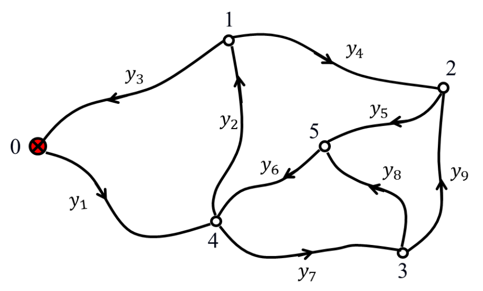

[查看答案 →](#answer-07-01) · [本章开头](#chapter-07)

---

<a id="q-07-02"></a>
#### 07-02　九边水准网列四个独立条件方程

**类型：** 课堂练习  
**出处：** 7-条件平差的建模及求解方法.pdf，PDF第10、11页；09-1-条件平差的建模及求解方法.pdf，PDF第8、9页

高差正方向依次为 $L_1:0\to4,L_2:4\to1,L_3:1\to0,L_4:1\to2,L_5:2\to5,L_6:5\to4,L_7:4\to3,L_8:3\to5,L_9:3\to2$。 已知 $H_0$，其余五点高程未知。请写出足数、独立的条件方程及矩阵 $A$，指出 $n,t,r$。

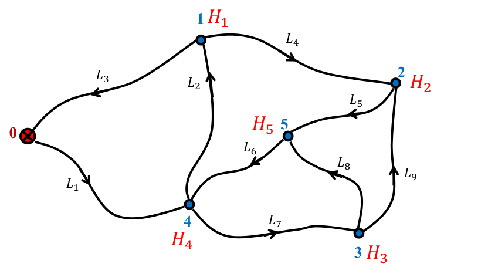

[查看答案 →](#answer-07-02) · [本章开头](#chapter-07)

---

<a id="q-07-03"></a>
#### 07-03　秩亏网、独立网与附合网的条件数

**类型：** 课堂练习  
**出处：** 7-条件平差的建模及求解方法.pdf，PDF第12页

高差正方向依次为 $L_1:0\to4,L_2:4\to1,L_3:1\to0,L_4:1\to2,L_5:2\to5,L_6:5\to4,L_7:4\to3,L_8:3\to5,L_9:3\to2$。 对同一九边六点水准网，分别考察无已知点、只知点0高程、同时知道点0和点5高程的情形。判断网的类型及独立条件数，说明如何处理基准。

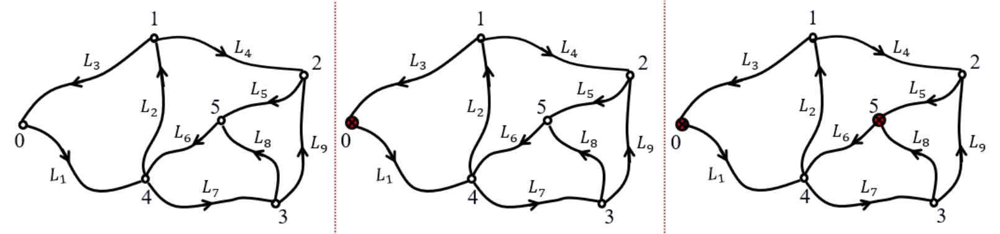

[查看答案 →](#answer-07-03) · [本章开头](#chapter-07)

---

<a id="q-07-04"></a>
#### 07-04　十二边、三个已知点的旧版水准网列条件

**类型：** 演示算例  
**出处：** 7-条件平差的建模及求解方法.pdf，PDF第13页

如图，$A,B,C$ 为已知高程点，其余五点未知，共12段高差 $h_1,\ldots,h_{12}$。求 $n,t,r$ 并列足数独立的条件方程。为便于书写，将图中五个未知点按“上左、上右、中左、下中、下右”记作 $u,v,w,x,y$。

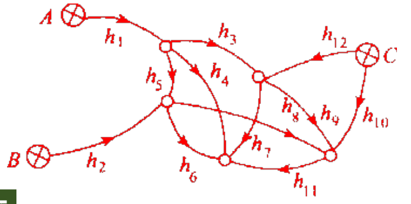

[查看答案 →](#answer-07-04) · [本章开头](#chapter-07)

---

<a id="q-07-05"></a>
#### 07-05　十二边、三个已知点的9-1版水准网列条件

**类型：** 课堂练习  
**出处：** 09-1-条件平差的建模及求解方法.pdf，PDF第10页

图中 $A,B,C$ 高程已知，1—5点高程未知。正方向为 $L_1:A\to1,L_2:1\to2,L_3:2\to C,L_4:B\to3,L_5:3\to1,L_6:1\to4,L_7:4\to3,L_8:2\to4,L_9:4\to5,L_{10}:5\to C,L_{11}:3\to5,L_{12}:2\to5$。列足数、独立、尽量简单的条件方程。

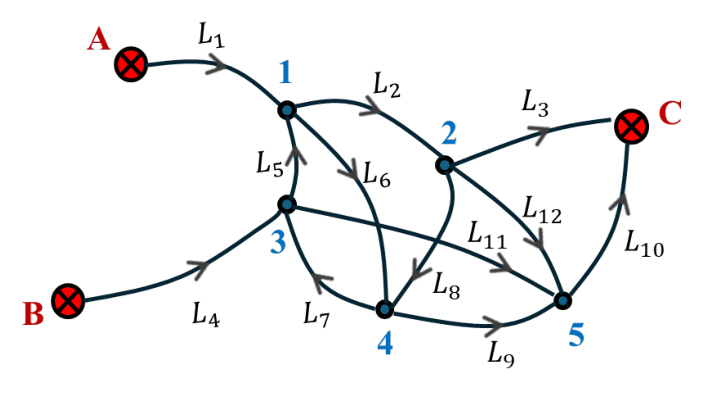

[查看答案 →](#answer-07-05) · [本章开头](#chapter-07)

---

<a id="q-07-06"></a>
#### 07-06　选做7-1：旧版观测数据的独立水准网

**类型：** 作业  
**出处：** 7-条件平差的建模及求解方法.pdf，PDF第20页

高差正方向依次为 $L_1:0\to4,L_2:4\to1,L_3:1\to0,L_4:1\to2,L_5:2\to5,L_6:5\to4,L_7:4\to3,L_8:3\to5,L_9:3\to2$。

已知 $H_0=1.368\rm\,m$。各高差独立、每公里精度相同，取 $P=\operatorname{diag}(1/S_i)$。

|$i$|$L_i$/m|$S_i$/km|
|---|---:|---:|
|1|+2.369|1.3|
|2|+1.357|1.5|
|3|-3.714|1.8|
|4|+0.579|2.1|
|5|-1.137|0.7|
|6|-0.799|0.9|
|7|+1.876|1.1|
|8|-1.077|0.9|
|9|+0.060|1.4|

请用条件平差求五个未知高程。

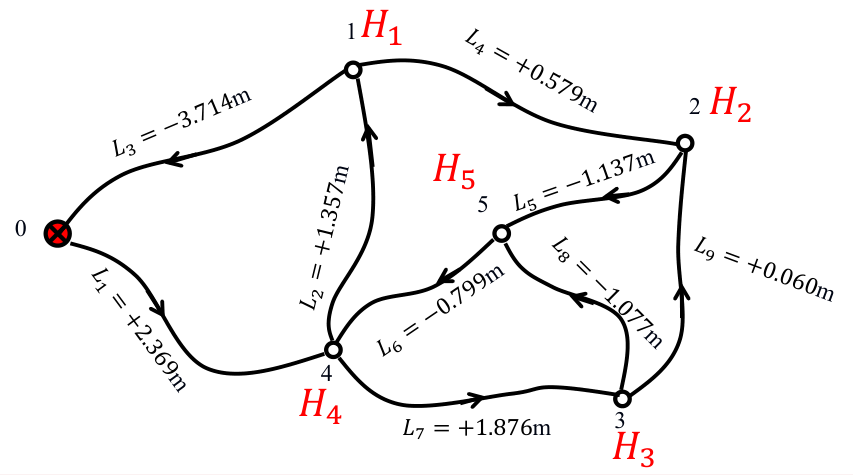

[查看答案 →](#answer-07-06) · [本章开头](#chapter-07)

---

<a id="q-07-07"></a>
#### 07-07　选做7-2：旧版观测数据的双基准水准网

**类型：** 作业  
**出处：** 7-条件平差的建模及求解方法.pdf，PDF第21页

高差正方向依次为 $L_1:0\to4,L_2:4\to1,L_3:1\to0,L_4:1\to2,L_5:2\to5,L_6:5\to4,L_7:4\to3,L_8:3\to5,L_9:3\to2$。

已知 $H_0=1.368\rm\,m$，$H_5=4.532\rm\,m$。各高差独立、每公里精度相同，取 $P=\operatorname{diag}(1/S_i)$。

|$i$|$L_i$/m|$S_i$/km|
|---|---:|---:|
|1|+2.369|1.3|
|2|+1.357|1.5|
|3|-3.714|1.8|
|4|+0.579|2.1|
|5|-1.137|0.7|
|6|-0.799|0.9|
|7|+1.876|1.1|
|8|-1.077|0.9|
|9|+0.060|1.4|

请用条件平差求 $H_1\sim H_4$。

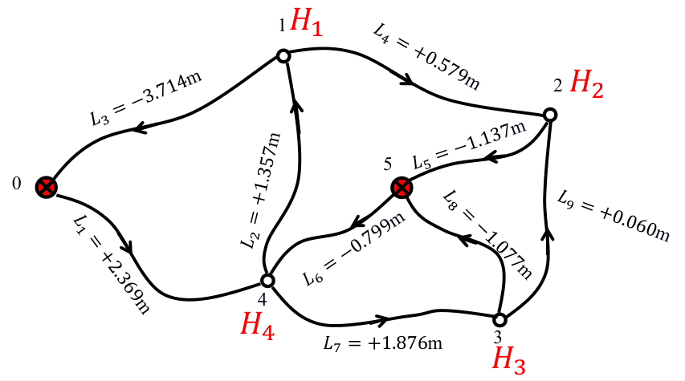

[查看答案 →](#answer-07-07) · [本章开头](#chapter-07)

---

<a id="q-07-08"></a>
#### 07-08　作业9-1-a：新版观测数据的独立水准网

**类型：** 作业  
**出处：** 09-1-条件平差的建模及求解方法.pdf，PDF第18页；8-条件平差的精度评定.pdf，PDF第3、4、5、11页；09-2-条件平差的精度评定.pdf，PDF第2、3、4、10页

高差正方向依次为 $L_1:0\to4,L_2:4\to1,L_3:1\to0,L_4:1\to2,L_5:2\to5,L_6:5\to4,L_7:4\to3,L_8:3\to5,L_9:3\to2$。

已知 $H_0=1.368\rm\,m$。各高差独立、每公里精度相同，取 $P=\operatorname{diag}(1/S_i)$。

|$i$|$L_i$/m|$S_i$/km|
|---|---:|---:|
|1|+2.369|1.3|
|2|+1.357|1.5|
|3|-3.714|1.8|
|4|+0.579|2.1|
|5|-1.139|0.7|
|6|-0.802|0.9|
|7|+1.872|1.1|
|8|-1.074|0.9|
|9|+0.060|1.4|

请用条件平差求五个未知高程，检核不同路线计算的同一点高程是否一致。

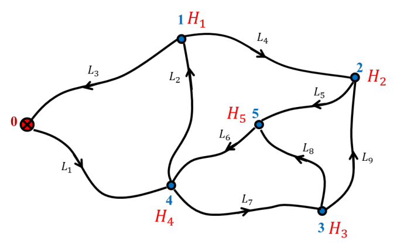

[查看答案 →](#answer-07-08) · [本章开头](#chapter-07)

---

<a id="q-07-09"></a>
#### 07-09　作业9-1-b：新版观测数据的双基准水准网

**类型：** 作业  
**出处：** 09-1-条件平差的建模及求解方法.pdf，PDF第19页

高差正方向依次为 $L_1:0\to4,L_2:4\to1,L_3:1\to0,L_4:1\to2,L_5:2\to5,L_6:5\to4,L_7:4\to3,L_8:3\to5,L_9:3\to2$。

已知 $H_0=1.368\rm\,m$，$H_5=4.534\rm\,m$。各高差独立、每公里精度相同，取 $P=\operatorname{diag}(1/S_i)$。

|$i$|$L_i$/m|$S_i$/km|
|---|---:|---:|
|1|+2.369|1.3|
|2|+1.357|1.5|
|3|-3.714|1.8|
|4|+0.579|2.1|
|5|-1.139|0.7|
|6|-0.802|0.9|
|7|+1.872|1.1|
|8|-1.074|0.9|
|9|+0.060|1.4|

请用条件平差求 $H_1\sim H_4$。

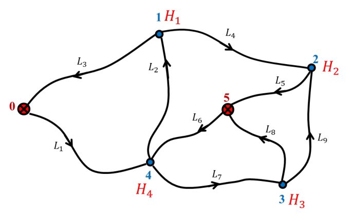

[查看答案 →](#answer-07-09) · [本章开头](#chapter-07)

---

<a id="q-07-10"></a>
#### 07-10　为什么需要测量平差，平差要完成哪些任务

**类型：** 思考题  
**出处：** 7-条件平差的建模及求解方法.pdf，PDF第3页；8-条件平差的精度评定.pdf，PDF第6页；09-2-条件平差的精度评定.pdf，PDF第5页；10-2-间接平差的精度评定-上课版本.pdf，PDF第4页

为什么需要测量平差？测量平差要完成哪些任务？

[查看答案 →](#answer-07-10) · [本章开头](#chapter-07)

---

<a id="q-07-11"></a>
#### 07-11　证明条件平差拉格朗日函数的微分公式

**类型：** 演示算例  
**出处：** 7-条件平差的建模及求解方法.pdf，PDF第18页；09-1-条件平差的建模及求解方法.pdf，PDF第15页

设 $P=P^{\mathsf T}$ 为常量权阵，


$$
\Phi=v^{\mathsf T}Pv-2k^{\mathsf T}(Av-w).
$$


证明按行向量记法 $\partial\Phi/\partial v=2v^{\mathsf T}P-2k^{\mathsf T}A$，并据此得到改正数方程。

[查看答案 →](#answer-07-11) · [本章开头](#chapter-07)

---

<a id="chapter-08"></a>
### 08　条件平差精度评定（含节段9-2）

[返回目录](#contents) · [本章答案](#answers-08)

<a id="q-08-01"></a>
#### 08-01　独立水准网的全部精度评定与最弱点（作业9-2-a）

**类型：** 作业  
**出处：** 8-条件平差的精度评定.pdf，PDF第5、9、12、13、14、15页；09-2-条件平差的精度评定.pdf，PDF第4、8、11、12、13、14、21页

高差正方向依次为 $L_1:0\to4,L_2:4\to1,L_3:1\to0,L_4:1\to2,L_5:2\to5,L_6:5\to4,L_7:4\to3,L_8:3\to5,L_9:3\to2$。

已知 $H_0=1.368\rm\,m$。各高差独立、每公里精度相同，取 $P=\operatorname{diag}(1/S_i)$。

|$i$|$L_i$/m|$S_i$/km|
|---|---:|---:|
|1|+2.369|1.3|
|2|+1.357|1.5|
|3|-3.714|1.8|
|4|+0.579|2.1|
|5|-1.139|0.7|
|6|-0.802|0.9|
|7|+1.872|1.1|
|8|-1.074|0.9|
|9|+0.060|1.4|

完成条件平差的精度评定，求 $D_{vv},D_{\widehat L\widehat L},D_{\widehat H\widehat H},D_{\widehat H\widehat L}$；比较平差观测值与原观测值的精度，并指出五个高程中哪个精度最低。课件将高程向量也记为 $\widehat X$。


[查看答案 →](#answer-08-01) · [本章开头](#chapter-08)

---

<a id="q-08-02"></a>
#### 08-02　桥梁附合路线的五个未知点精度如何比较

**类型：** 思考题  
**出处：** 8-条件平差的精度评定.pdf，PDF第16页；09-2-条件平差的精度评定.pdf，PDF第15页

图示桥梁控制路线，两端连至已知控制点及已知方向，中间为 $P_2,\ldots,P_6$ 五个未知点，路线含六段观测。试讨论五个未知点的精度高低。课件未给边长、角度及各类观测精度。

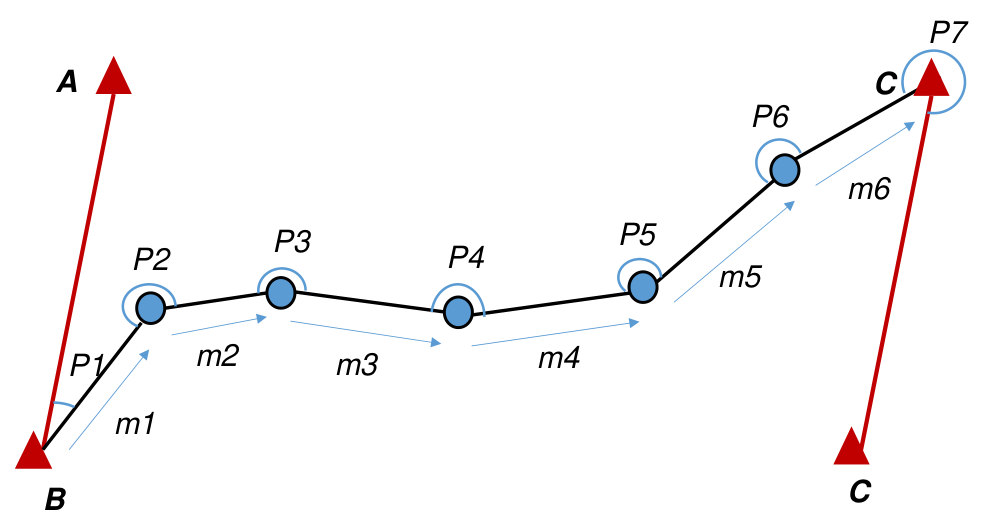

[查看答案 →](#answer-08-02) · [本章开头](#chapter-08)

---

<a id="q-08-03"></a>
#### 08-03　条件平差中改正数、平差观测与参数的相关性

**类型：** 思考题  
**出处：** 8-条件平差的精度评定.pdf，PDF第18、19、20页；09-2-条件平差的精度评定.pdf，PDF第17、18、19页

条件平差中，$v$ 与 $\widehat L$ 是否相关？$\widehat H=M\widehat L+m_0$ 与 $\widehat L$ 是否相关？能否由 $\widehat L=L+v$ 写成 $Q_{\widehat L\widehat L}=Q_{LL}+Q_{vv}$？

[查看答案 →](#answer-08-03) · [本章开头](#chapter-08)

---

<a id="q-08-04"></a>
#### 08-04　补全条件平差基本向量的协因数表

**类型：** 思考题  
**出处：** 8-条件平差的精度评定.pdf，PDF第21页；09-2-条件平差的精度评定.pdf，PDF第20页

课件总结表给出基本向量 $L,w,k,v,\widehat L$。已知 $w=-(AL+a_0)$、$k=N^{-1}w$、$v=QA^{\mathsf T}k$、$\widehat L=L+v$、$N=AQA^{\mathsf T}$，补全它们之间的协因数与互协因数。

[查看答案 →](#answer-08-04) · [本章开头](#chapter-08)

---

<a id="q-08-05"></a>
#### 08-05　双基准水准网的全部精度评定（作业9-2-b）

**类型：** 作业  
**出处：** 09-2-条件平差的精度评定.pdf，PDF第22页

高差正方向依次为 $L_1:0\to4,L_2:4\to1,L_3:1\to0,L_4:1\to2,L_5:2\to5,L_6:5\to4,L_7:4\to3,L_8:3\to5,L_9:3\to2$。

已知 $H_0=1.368\rm\,m$，$H_5=4.534\rm\,m$。各高差独立、每公里精度相同，取 $P=\operatorname{diag}(1/S_i)$。

|$i$|$L_i$/m|$S_i$/km|
|---|---:|---:|
|1|+2.369|1.3|
|2|+1.357|1.5|
|3|-3.714|1.8|
|4|+0.579|2.1|
|5|-1.139|0.7|
|6|-0.802|0.9|
|7|+1.872|1.1|
|8|-1.074|0.9|
|9|+0.060|1.4|

完成条件平差的精度评定，求 $D_{vv},D_{\widehat L\widehat L},D_{\widehat H\widehat H},D_{\widehat H\widehat L}$，其中 $\widehat H=(\widehat H_1,\ldots,\widehat H_4)^{\mathsf T}$。


[查看答案 →](#answer-08-05) · [本章开头](#chapter-08)

---

<a id="chapter-10"></a>
### 10　间接平差建模、求解与精度评定

[返回目录](#contents) · [本章答案](#answers-10)

<a id="q-10-01"></a>
#### 10-01　单基准九边水准网的参数方程

**类型：** 课堂练习  
**出处：** 10-1-间接平差的建模及求解方法.pdf，PDF第4、5页

高差正方向依次为 $L_1:0\to4,L_2:4\to1,L_3:1\to0,L_4:1\to2,L_5:2\to5,L_6:5\to4,L_7:4\to3,L_8:3\to5,L_9:3\to2$。 仅 $H_0$ 已知，取 $X=(H_1,H_2,H_3,H_4,H_5)^{\mathsf T}$。请列参数方程 $\widetilde L=B\widetilde X+b_0$，指出方程数与参数数。

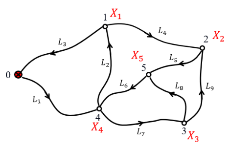

[查看答案 →](#answer-10-01) · [本章开头](#chapter-10)

---

<a id="q-10-02"></a>
#### 10-02　双基准九边水准网的参数方程

**类型：** 课堂练习  
**出处：** 10-1-间接平差的建模及求解方法.pdf，PDF第6页

高差正方向依次为 $L_1:0\to4,L_2:4\to1,L_3:1\to0,L_4:1\to2,L_5:2\to5,L_6:5\to4,L_7:4\to3,L_8:3\to5,L_9:3\to2$。

已知 $H_0=1.368\rm\,m$，$H_5=4.534\rm\,m$。各高差独立、每公里精度相同，取 $P=\operatorname{diag}(1/S_i)$。

|$i$|$L_i$/m|$S_i$/km|
|---|---:|---:|
|1|+2.369|1.3|
|2|+1.357|1.5|
|3|-3.714|1.8|
|4|+0.579|2.1|
|5|-1.139|0.7|
|6|-0.802|0.9|
|7|+1.872|1.1|
|8|-1.074|0.9|
|9|+0.060|1.4|

取 $X=(H_1,H_2,H_3,H_4)^{\mathsf T}$，列参数方程。

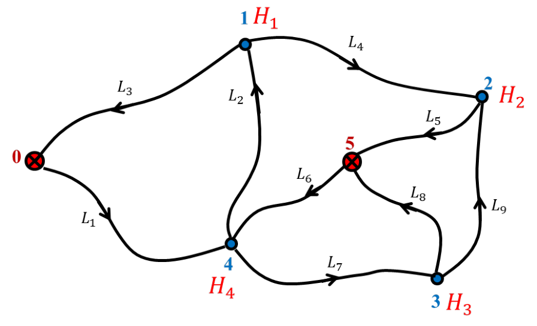

[查看答案 →](#answer-10-02) · [本章开头](#chapter-10)

---

<a id="q-10-03"></a>
#### 10-03　应用举例中的已知量、观测量与待求量

**类型：** 思考题  
**出处：** 10-1-间接平差的建模及求解方法.pdf，PDF第7、8、9、10页

分别指出传统控制测量、卫星导航定位、摄影测量三类应用的已知量、观测量与待求量。课件摄影测量示意图中，观测量是特征点像素坐标，待求量是地面特征点坐标；课件问“已知量？”——如何回答，并如何理解这是一种间接平差建模？

[查看答案 →](#answer-10-03) · [本章开头](#chapter-10)

---

<a id="q-10-04"></a>
#### 10-04　作业10-1-a：独立水准网的间接平差

**类型：** 作业  
**出处：** 10-1-间接平差的建模及求解方法.pdf，PDF第17页；10-2-间接平差的精度评定-上课版本.pdf，PDF第2、3、9页

高差正方向依次为 $L_1:0\to4,L_2:4\to1,L_3:1\to0,L_4:1\to2,L_5:2\to5,L_6:5\to4,L_7:4\to3,L_8:3\to5,L_9:3\to2$。

已知 $H_0=1.368\rm\,m$。各高差独立、每公里精度相同，取 $P=\operatorname{diag}(1/S_i)$。

|$i$|$L_i$/m|$S_i$/km|
|---|---:|---:|
|1|+2.369|1.3|
|2|+1.357|1.5|
|3|-3.714|1.8|
|4|+0.579|2.1|
|5|-1.139|0.7|
|6|-0.802|0.9|
|7|+1.872|1.1|
|8|-1.074|0.9|
|9|+0.060|1.4|

请用间接平差求五个未知高程，并计算高差改正数与平差值。

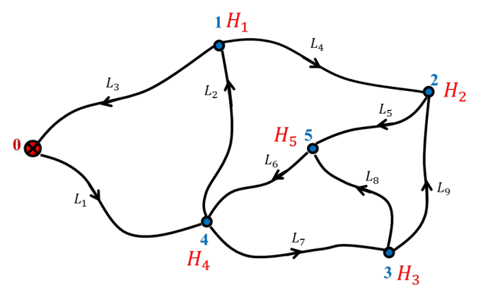

[查看答案 →](#answer-10-04) · [本章开头](#chapter-10)

---

<a id="q-10-05"></a>
#### 10-05　作业10-1-b：双基准水准网的间接平差

**类型：** 作业  
**出处：** 10-1-间接平差的建模及求解方法.pdf，PDF第18页

高差正方向依次为 $L_1:0\to4,L_2:4\to1,L_3:1\to0,L_4:1\to2,L_5:2\to5,L_6:5\to4,L_7:4\to3,L_8:3\to5,L_9:3\to2$。

已知 $H_0=1.368\rm\,m$，$H_5=4.534\rm\,m$。各高差独立、每公里精度相同，取 $P=\operatorname{diag}(1/S_i)$。

|$i$|$L_i$/m|$S_i$/km|
|---|---:|---:|
|1|+2.369|1.3|
|2|+1.357|1.5|
|3|-3.714|1.8|
|4|+0.579|2.1|
|5|-1.139|0.7|
|6|-0.802|0.9|
|7|+1.872|1.1|
|8|-1.074|0.9|
|9|+0.060|1.4|

请用间接平差求四个未知高程，并计算高差改正数与平差值。


[查看答案 →](#answer-10-05) · [本章开头](#chapter-10)

---

<a id="q-10-06"></a>
#### 10-06　两种网形如何选择条件平差或间接平差

**类型：** 思考题  
**出处：** 10-1-间接平差的建模及求解方法.pdf，PDF第19页

对图中的两个水准网，你更倾向采用条件平差还是间接平差？左图有12条观测边、3个已知点、5个未知点；右图有5条观测边、1个已知点、3个未知点。请根据模型规模和建模便利性说明。

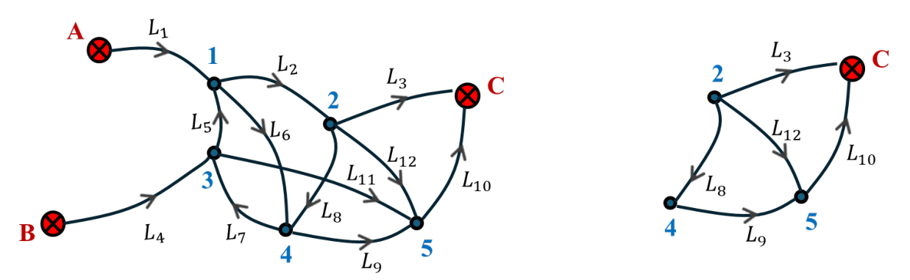

[查看答案 →](#answer-10-06) · [本章开头](#chapter-10)

---

<a id="q-10-07"></a>
#### 10-07　独立水准网间接平差的精度评定（作业10-2-a）

**类型：** 作业  
**出处：** 10-2-间接平差的精度评定-上课版本.pdf，PDF第3、7、8、10、11、12、13、19页

高差正方向依次为 $L_1:0\to4,L_2:4\to1,L_3:1\to0,L_4:1\to2,L_5:2\to5,L_6:5\to4,L_7:4\to3,L_8:3\to5,L_9:3\to2$。

已知 $H_0=1.368\rm\,m$。各高差独立、每公里精度相同，取 $P=\operatorname{diag}(1/S_i)$。

|$i$|$L_i$/m|$S_i$/km|
|---|---:|---:|
|1|+2.369|1.3|
|2|+1.357|1.5|
|3|-3.714|1.8|
|4|+0.579|2.1|
|5|-1.139|0.7|
|6|-0.802|0.9|
|7|+1.872|1.1|
|8|-1.074|0.9|
|9|+0.060|1.4|

求 $D_{\widehat X\widehat X},D_{vv},D_{\widehat L\widehat L}$ 及 $Q_{\widehat X\widehat L}$，其中 $X$ 为五个未知高程。比较原始高差与平差高差的精度。注意本作业末项要求的是**互协因数阵 $Q$**。


[查看答案 →](#answer-10-07) · [本章开头](#chapter-10)

---

<a id="q-10-08"></a>
#### 10-08　间接平差中基本向量的相关性与协因数表

**类型：** 思考题  
**出处：** 10-2-间接平差的精度评定-上课版本.pdf，PDF第15、16、17、18页

在 $v=B\widehat x-l$ 的间接平差中，$v$ 与 $\widehat x$ 是否相关？$v$ 与 $\widehat L$ 是否相关？补全 $L,\widehat x,v,\widehat L$ 的协因数关系，并判断能否直接将 $Q_{LL}$ 与 $Q_{vv}$ 相加得到 $Q_{\widehat L\widehat L}$。

[查看答案 →](#answer-10-08) · [本章开头](#chapter-10)

---

<a id="q-10-09"></a>
#### 10-09　双基准水准网间接平差的精度评定（作业10-2-b）

**类型：** 作业  
**出处：** 10-2-间接平差的精度评定-上课版本.pdf，PDF第20页

高差正方向依次为 $L_1:0\to4,L_2:4\to1,L_3:1\to0,L_4:1\to2,L_5:2\to5,L_6:5\to4,L_7:4\to3,L_8:3\to5,L_9:3\to2$。

已知 $H_0=1.368\rm\,m$，$H_5=4.534\rm\,m$。各高差独立、每公里精度相同，取 $P=\operatorname{diag}(1/S_i)$。

|$i$|$L_i$/m|$S_i$/km|
|---|---:|---:|
|1|+2.369|1.3|
|2|+1.357|1.5|
|3|-3.714|1.8|
|4|+0.579|2.1|
|5|-1.139|0.7|
|6|-0.802|0.9|
|7|+1.872|1.1|
|8|-1.074|0.9|
|9|+0.060|1.4|

求 $D_{\widehat X\widehat X},D_{vv},D_{\widehat L\widehat L}$ 及 $Q_{\widehat X\widehat L}$，其中 $X=(H_1,\ldots,H_4)^{\mathsf T}$。


[查看答案 →](#answer-10-09) · [本章开头](#chapter-10)

---

<a id="q-10-10"></a>
#### 10-10　小组作业：用仿真研究无偏性、一致性与最优性

**类型：** 作业  
**出处：** 10-2-间接平差的精度评定-上课版本.pdf，PDF第21页

设计实验，用数据结果说明条件平差或间接平差结果的无偏性、一致性和最优性。以课件给出的四类网形之一为准：网形1对应组1—3，网形2对应组4—6，网形3对应组7—9，网形4对应组10—11。

可假设已知点高程、仪器精度 $\sigma_0^2$、各测段路线长 $S_i$，仿真生成多组带误差观测。比较多组估计的均值与真值、经验方差与理论方差；设计能检验一致性的实验；思考如何说明最优性。原页提示说“仿真次数越多，平差结果越趋近真值”，请辨析其适用含义。

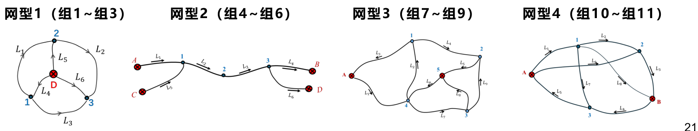

[查看答案 →](#answer-10-10) · [本章开头](#chapter-10)

---

<a id="chapter-11"></a>
### 11　典型网型的建模

[返回目录](#contents) · [本章答案](#answers-11)

<a id="q-11-01"></a>
#### 11-01　单三角形：条件模型、坐标恢复与间接平差

**类型：** 课堂练习  
**出处：** 11-典型网型的建模.pdf，PDF第6、7页

已知$A,B$两点坐标，观测三角形$AB1$的三个内角$\beta_1,\beta_2,\beta_3$（分别位于$A,1,B$）。

1. 列出条件平差的$A,w$，说明改正数的单位。
2. 如何由平差后的角度求$1$点坐标？
3. 以$X_1,Y_1$为参数，写出间接平差$\mathbf v=B\hat{\mathbf x}-\mathbf l$中的$B,\mathbf l$。

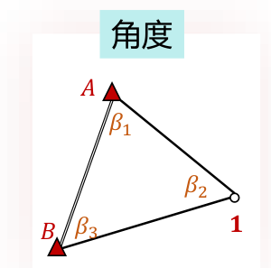

[查看答案 →](#answer-11-01) · [本章开头](#chapter-11)

---

<a id="q-11-02"></a>
#### 11-02　大地四边形测角网：四个独立条件

**类型：** 课堂练习  
**出处：** 11-典型网型的建模.pdf，PDF第8页

大地四边形中$A,B$为已知点，$1,2$为待定点，观测$\beta_1\sim\beta_8$，角号见图。写出$A\mathbf v-\mathbf w=0$中的$A,\mathbf w$，包括三个图形条件和一个极条件。

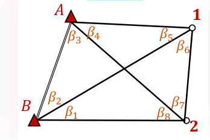

[查看答案 →](#answer-11-02) · [本章开头](#chapter-11)

---

<a id="q-11-03"></a>
#### 11-03　大地四边形测角网：八条误差方程

**类型：** 课堂练习  
**出处：** 11-典型网型的建模.pdf，PDF第9页

对上一题大地四边形测角网，取$\mathbf X=(X_1,Y_1,X_2,Y_2)^T$，列出间接平差误差方程。


[查看答案 →](#answer-11-03) · [本章开头](#chapter-11)

---

<a id="q-11-04"></a>
#### 11-04　中点多边形测角网：条件与参数模型

**类型：** 课堂练习  
**出处：** 11-典型网型的建模.pdf，PDF第10页

已知$A,B$点坐标，中点多边形的待定点为$1,2$，观测角为$\beta_1\sim\beta_9$。列出独立条件并线性化极条件；列出间接平差误差方程。

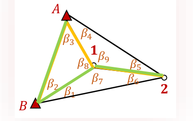

[查看答案 →](#answer-11-04) · [本章开头](#chapter-11)

---

<a id="q-11-05"></a>
#### 11-05　大地四边形测向网

**类型：** 演示算例  
**出处：** 11-典型网型的建模.pdf，PDF第11页

已知$A,B$点坐标，在$A,B,1,2$四站观测$L_1\sim L_{12}$（方向号见图）。列出条件方程及以坐标、定向角为参数的误差方程，确定$n,t,r$。

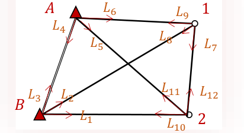

[查看答案 →](#answer-11-05) · [本章开头](#chapter-11)

---

<a id="q-11-06"></a>
#### 11-06　大地四边形测边网

**类型：** 课堂练习  
**出处：** 11-典型网型的建模.pdf，PDF第12页

已知$A,B$点坐标，观测$S_1=A1,S_2=B1,S_3=12,S_4=A2,S_5=B2$。列出间接平差误差方程，并说明可如何构造一个独立的边长条件。

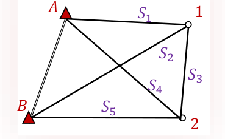

[查看答案 →](#answer-11-06) · [本章开头](#chapter-11)

---

<a id="q-11-07"></a>
#### 11-07　中点多边形测边网

**类型：** 课堂练习  
**出处：** 11-典型网型的建模.pdf，PDF第13页

已知$A,B$点坐标，观测$S_1=A1,S_2=A2,S_3=12,S_4=B2,S_5=B1$。分别写出条件平差与间接平差模型。

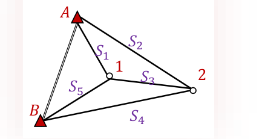

[查看答案 →](#answer-11-07) · [本章开头](#chapter-11)

---

<a id="q-11-08"></a>
#### 11-08　附合导线：方位角、坐标条件与参数模型

**类型：** 课堂练习  
**出处：** 11-典型网型的建模.pdf，PDF第14、15页

附合导线$A-B-1-2-3-C-D$中$A,B,C,D$为已知点。观测$B,1,2,3,C$处的五个角$\beta_1\sim\beta_5$及$B1,12,23,3C$四条边$S_1\sim S_4$。列出条件平差和间接平差的误差方程。

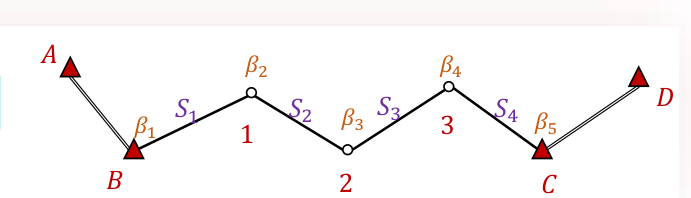

[查看答案 →](#answer-11-08) · [本章开头](#chapter-11)

---

<a id="q-11-09"></a>
#### 11-09　作业1：中点多边形测角网数值建模

**类型：** 作业  
**出处：** 11-典型网型的建模.pdf，PDF第18页

已知$A=(1000,1200)$ m，$B=(700,1100)$ m，观测中点多边形的九个角：

|角|观测值|角|观测值|角|观测值|
|---|---|---|---|---|---|
|$\beta_1$|$21^\circ48'06''$|$\beta_4$|$10^\circ18'18''$|$\beta_7$|$134^\circ59'58''$|
|$\beta_2$|$45^\circ00'02''$|$\beta_5$|$08^\circ07'51''$|$\beta_8$|$63^\circ26'05''$|
|$\beta_3$|$71^\circ33'51''$|$\beta_6$|$23^\circ11'53''$|$\beta_9$|$161^\circ34'00''$|

写出$A\mathbf v-\mathbf w=0$及$\mathbf v=B\hat{\mathbf x}-\mathbf l$。

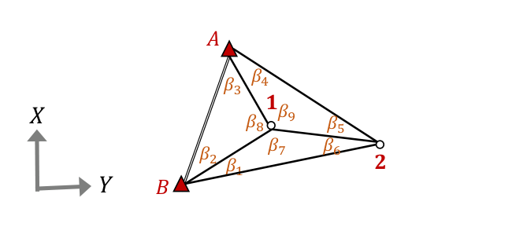

[查看答案 →](#answer-11-09) · [本章开头](#chapter-11)

---

<a id="q-11-10"></a>
#### 11-10　作业2：中点多边形测边网数值建模

**类型：** 作业  
**出处：** 11-典型网型的建模.pdf，PDF第18页

已知$A=(1000,1200)$ m，$B=(700,1100)$ m，观测$S_1=A1=250.000$ m，$S_2=A2=559.015$ m，$S_3=12=316.227$ m，$S_4=B2=602.082$ m，$S_5=B1=335.407$ m。写出间接平差误差方程$\mathbf v=B\hat{\mathbf x}-\mathbf l$。

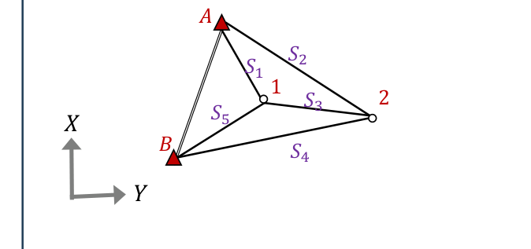

[查看答案 →](#answer-11-10) · [本章开头](#chapter-11)

---

<a id="q-11-11"></a>
#### 11-11　作业3：已知四点的边角导线数值建模

**类型：** 作业  
**出处：** 11-典型网型的建模.pdf，PDF第19页

附合导线$A-B-1-2-C-D$的已知坐标（m）为$A=(1000,1000),B=(850,1100),C=(990,1550),D=(870,1700)$。观测$S_1=B1=205.179$ m，$S_2=12=198.495$ m，$S_3=2C=198.493$ m；$\beta_1=80^\circ39'56'',\beta_2=263^\circ56'20'',\beta_3=98^\circ10'13'',\beta_4=259^\circ34'31''$。精度为$\sigma_\beta=3''$，$\sigma_{S_i}=2\text{ mm}+2\text{ ppm}\times S_i$。

写出$A\mathbf v-\mathbf w=0$及$\mathbf v=B\hat{\mathbf x}-\mathbf l$。

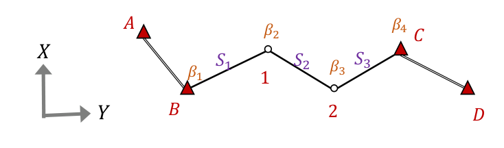

[查看答案 →](#answer-11-11) · [本章开头](#chapter-11)

---

<a id="chapter-12"></a>
### 12　典型控制网的基准

[返回目录](#contents) · [本章答案](#answers-12)

<a id="q-12-01"></a>
#### 12-01　典型网型的基准与观测数计数

**类型：** 演示算例  
**出处：** 12-典型控制网的基准.pdf，PDF第3、6、7、8、9页

对课件中的水准网、单三角形、大地四边形、中点多边形、附合导线，说明必要基准数$d_1$，并填写典型图示的$n,t,r,d_1,d$。解释何谓“完全多余”的观测和“完全必要”的观测，说明原课件测向网计数与独立条件数是否相容。

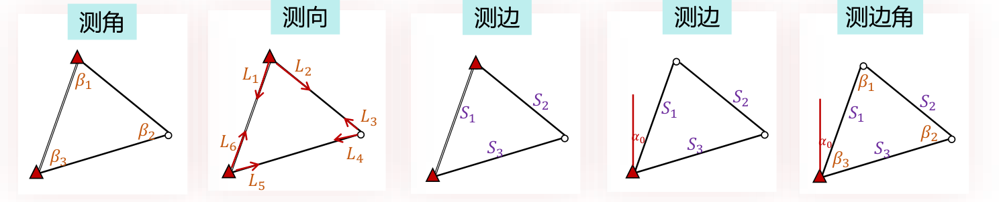

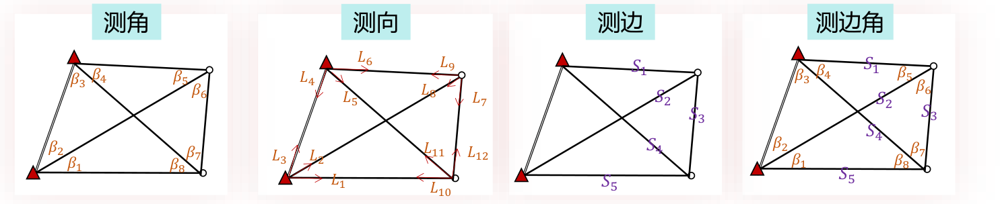

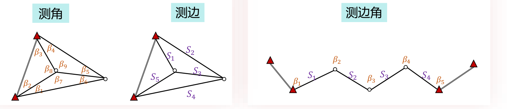

[查看答案 →](#answer-12-01) · [本章开头](#chapter-12)

---

<a id="q-12-02"></a>
#### 12-02　秩亏网能否平差，n、t、r如何确定

**类型：** 思考题  
**出处：** 12-典型控制网的基准.pdf，PDF第11、12页

图示水准网有0—5共六个点、九条高差观测，未给任何点的已知高程。$n,t,r$分别为多少？秩亏网能不能平差？能确定哪些量，不能唯一确定哪些量？

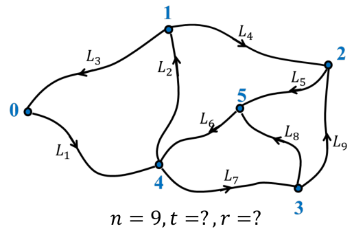

[查看答案 →](#answer-12-02) · [本章开头](#chapter-12)

---

<a id="q-12-03"></a>
#### 12-03　独立水准网改变唯一高程基准

**类型：** 思考题  
**出处：** 12-典型控制网的基准.pdf，PDF第11、13页

独立水准网已知$H_0=1.368$ m，平差结果为$H_1=1.234,H_2=1.397,H_3=1.425,H_4=2.132,H_5=1.124$ m。若唯一基准改成$H_0=2.368$ m、观测值不变，各点新高程是多少？各点间高差和观测改正数是否变化？

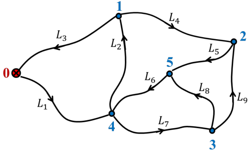

[查看答案 →](#answer-12-03) · [本章开头](#chapter-12)

---

<a id="q-12-04"></a>
#### 12-04　附合网两组基准的相容性检核

**类型：** 思考题  
**出处：** 12-典型控制网的基准.pdf，PDF第11、14、15、16、17页

图示水准网观测如下，长度$S_i$用km，高差$L_i$用m。

|路线|$S_i$|$L_i$|路线|$S_i$|$L_i$|路线|$S_i$|$L_i$|
|---|---:|---:|---|---:|---:|---|---:|---:|
|$L_1$|1.3|+2.369|$L_4$|2.1|+0.579|$L_7$|1.1|+1.872|
|$L_2$|1.5|+1.357|$L_5$|0.7|−1.139|$L_8$|0.9|−1.074|
|$L_3$|1.8|−3.714|$L_6$|0.9|−0.802|$L_9$|1.4|+0.060|

A组基准：$H_0=1.368,H_5=4.534$ m；B组基准：$H_0=1.368,H_5=4.584$ m。哪组更可能存在问题？如何检核？附合基准改变对网形有什么影响？

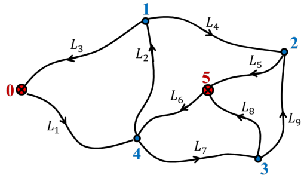

[查看答案 →](#answer-12-04) · [本章开头](#chapter-12)

---

<a id="q-12-05"></a>
#### 12-05　测角三角形的平移与旋转基准变换

**类型：** 课堂练习  
**出处：** 12-典型控制网的基准.pdf，PDF第21页

已知$B,A$的平面坐标分别为$(0,0)$和$(100,100)$，平差后1点为$(200,50)$。

1. 若$B,A$改为$(10,20),(110,120)$，观测角不变，1点新坐标是多少？
2. 若$B,A$改为$(0,0),(70.71,122.47)$，观测角不变，1点新坐标是多少？

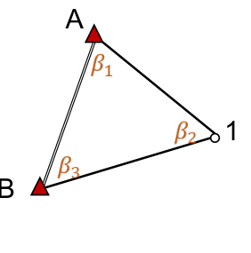

[查看答案 →](#answer-12-05) · [本章开头](#chapter-12)

---

<a id="q-12-06"></a>
#### 12-06　附合基准矛盾的影响

**类型：** 作业  
**出处：** 12-典型控制网的基准.pdf，PDF第22页

附合网中，如果多余基准（如多个已知点）之间存在矛盾，会导致（ ）。

A. 网形整体平移　B. 网形旋转　C. 网形扭曲（相对变形）　D. 无法平差

[查看答案 →](#answer-12-06) · [本章开头](#chapter-12)

---

<a id="q-12-07"></a>
#### 12-07　必要基准的主要作用

**类型：** 作业  
**出处：** 12-典型控制网的基准.pdf，PDF第22页

在测量控制网中，必要基准的主要作用是（ ）。

A. 增加多余观测数　B. 确定网的绝对位置　C. 提高观测精度　D. 减少观测值个数

[查看答案 →](#answer-12-07) · [本章开头](#chapter-12)

---

<a id="q-12-08"></a>
#### 12-08　多余观测数公式

**类型：** 作业  
**出处：** 12-典型控制网的基准.pdf，PDF第22页

在平差几何模型中，多余观测数$r$的计算公式为（ ）。

A. $r=n-t$　B. $r=n+t$　C. $r=t-n$　D. $r=n\times t$

[查看答案 →](#answer-12-08) · [本章开头](#chapter-12)

---

<a id="q-12-09"></a>
#### 12-09　缺少必要基准的网

**类型：** 作业  
**出处：** 12-典型控制网的基准.pdf，PDF第22页

在测量平差中，缺少必要基准（如无已知点高程或坐标）导致法方程秩亏的网型称为（ ）。

A. 附合网　B. 独立网　C. 秩亏网　D. 约束网

[查看答案 →](#answer-12-09) · [本章开头](#chapter-12)

---

<a id="q-12-10"></a>
#### 12-10　水准网必要基准

**类型：** 作业  
**出处：** 12-典型控制网的基准.pdf，PDF第22页

判断：水准网的必要基准是一个已知点的高程。

[查看答案 →](#answer-12-10) · [本章开头](#chapter-12)

---

<a id="q-12-11"></a>
#### 12-11　秩亏网是否无法平差

**类型：** 作业  
**出处：** 12-典型控制网的基准.pdf，PDF第22页

判断：秩亏网无法进行任何平差计算。

[查看答案 →](#answer-12-11) · [本章开头](#chapter-12)

---

<a id="q-12-12"></a>
#### 12-12　独立水准网改变基准

**类型：** 作业  
**出处：** 12-典型控制网的基准.pdf，PDF第22页

判断：对于一个独立水准网（只有一个已知高程点），改变该已知点的高程数值，各待定点之间的高差平差值不会改变。

[查看答案 →](#answer-12-12) · [本章开头](#chapter-12)

---

<a id="q-12-13"></a>
#### 12-13　测角网第四个必要基准量

**类型：** 作业  
**出处：** 12-典型控制网的基准.pdf，PDF第22页

填空：在测角网中，必要基准通常包括一个已知点的平面坐标、一条已知边的方位角，以及一条已知边的____。

[查看答案 →](#answer-12-13) · [本章开头](#chapter-12)

---

<a id="chapter-13"></a>
### 13　带约束的间接平差

[返回目录](#contents) · [本章答案](#answers-13)

<a id="q-13-01"></a>
#### 13-01　已知一条额外边长的六角网

**类型：** 课堂练习  
**出处：** 13-带约束的间接平差.pdf，PDF第2、13页

图中观测角$\beta_1\sim\beta_6$。已知$A,B$的平面坐标及$A1$间精确距离$S_{A1}$，待求1、2点坐标。

1. $n,t,r$是多少？
2. 必要基准数$d_1$与实际基准数$d$是多少？属于自由网还是约束网？
3. 如何选择间接平差参数？
4. 列出参数方程和约束方程。

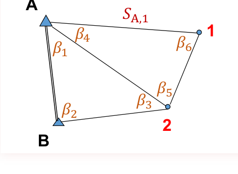

[查看答案 →](#answer-13-01) · [本章开头](#chapter-13)

---

<a id="q-13-02"></a>
#### 13-02　两个已知高程点的水准网参数选择

**类型：** 演示算例  
**出处：** 13-带约束的间接平差.pdf，PDF第3页

九条高差$L_1\sim L_9$组成图示水准网，已知$H_0,H_5$，待求$H_1\sim H_4$。回答$n,t,r,d_1,d$，判断网类型，选参数并列观测方程；若把$H_5$也作为参数应如何处理？

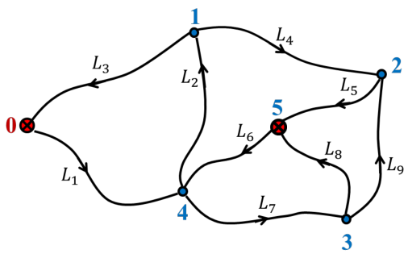

[查看答案 →](#answer-13-02) · [本章开头](#chapter-13)

---

<a id="q-13-03"></a>
#### 13-03　六条高差与一条精确高差约束的水准网

**类型：** 演示算例  
**出处：** 13-带约束的间接平差.pdf，PDF第4、7页

已知$H_A=45.286,H_B=49.579,H_C=46.732,H_D=46.345$ m，且$H_3-H_1=0.550$ m为精确已知。观测如下：

|高差|方向|值/m|路线长/km|
|---|---|---:|---:|
|$L_1$|$A\to1$|+2.331|1.6|
|$L_2$|$1\to2$|+2.813|2.1|
|$L_3$|$2\to3$|−2.244|1.7|
|$L_4$|$3\to B$|+1.430|2.0|
|$L_5$|$C\to1$|+0.879|2.3|
|$L_6$|$3\to D$|−1.810|3.5|

求$n,t,r$及基准情况，选择参数并列带约束间接平差模型。

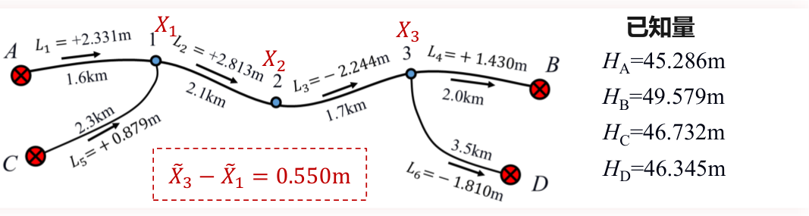

[查看答案 →](#answer-13-03) · [本章开头](#chapter-13)

---

<a id="q-13-04"></a>
#### 13-04　带约束间接平差的精度、线性函数与B/P比较

**类型：** 思考题  
**出处：** 13-带约束的间接平差.pdf，PDF第14、16、17、18、19、20页

同一组高差观测、同一套高程参数，普通间接平差与增添精确约束后的$B,P$是否相同？写出$\hat{\mathbf x}$与观测向量$\mathbf L$的函数，求$\hat{\mathbf x},\mathbf v,\hat{\mathbf L}$的协因数阵及单位权方差估值。

[查看答案 →](#answer-13-04) · [本章开头](#chapter-13)

---

<a id="q-13-05"></a>
#### 13-05　约束法方程分块矩阵的逆

**类型：** 思考题  
**出处：** 13-带约束的间接平差.pdf，PDF第24页

设$N=B^TPB$，求$\begin{bmatrix}N&C^T\\C&0\end{bmatrix}^{-1}$，并据此给出$\hat{\mathbf x}$与联系数$\mathbf k$的显式表达式。

[查看答案 →](#answer-13-05) · [本章开头](#chapter-13)

---

<a id="q-13-06"></a>
#### 13-06　拉格朗日微分为何把改正数与参数分开

**类型：** 思考题  
**出处：** 13-带约束的间接平差.pdf，PDF第25页

对于$\phi=\mathbf v^TP\mathbf v+2\mathbf k^T(C\hat{\mathbf x}-\mathbf w_x)-2\mathbf g^T(\mathbf v-B\hat{\mathbf x}+\mathbf l)$，证明对$\mathbf v,\hat{\mathbf x}$的驻点式。为什么求偏导时不考虑$\mathbf v$与$\hat{\mathbf x}$的函数关系？

[查看答案 →](#answer-13-06) · [本章开头](#chapter-13)

---

<a id="q-13-07"></a>
#### 13-07　教材P157第18题（原PDF未附题面）

**类型：** 作业  
**出处：** 13-带约束的间接平差.pdf，PDF第22页

原课件仅列出“教材P157，第18、19”，其中第18题未提供正文、图形或数据。

[查看答案 →](#answer-13-07) · [本章开头](#chapter-13)

---

<a id="q-13-08"></a>
#### 13-08　教材P157第19题（原PDF未附题面）

**类型：** 作业  
**出处：** 13-带约束的间接平差.pdf，PDF第22页

原课件仅列出“教材P157，第18、19”，其中第19题未提供正文、图形或数据。

[查看答案 →](#answer-13-08) · [本章开头](#chapter-13)

---

<a id="chapter-14"></a>
### 14　附有参数的条件平差

[返回目录](#contents) · [本章答案](#answers-14)

<a id="q-14-01"></a>
#### 14-01　在条件平差中直接估计2点相对A点的高差

**类型：** 演示算例  
**出处：** 14-附有参数的条件平差.pdf，PDF第2、7页

已知$H_A=45.286,H_B=48.188,H_C=47.401$ m，观测六条高差：

|观测|方向|值/m|长度/km|
|---|---|---:|---:|
|$L_1$|$A\to1$|+2.331|1.6|
|$L_2$|$1\to2$|+2.813|2.1|
|$L_3$|$2\to B$|−2.244|1.7|
|$L_4$|$1\to3$|+1.586|2.0|
|$L_5$|$3\to2$|+1.224|2.3|
|$L_6$|$3\to C$|−1.810|3.5|

如何在条件平差的同时获取2点与A点间高差$X=H_2-H_A$的估值及精度？

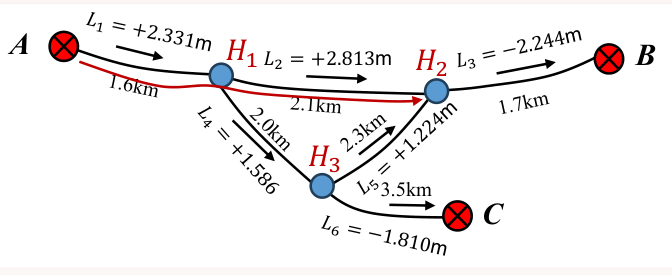

[查看答案 →](#answer-14-01) · [本章开头](#chapter-14)

---

<a id="q-14-02"></a>
#### 14-02　九角网：引入一个角参数以简化条件式

**类型：** 演示算例  
**出处：** 14-附有参数的条件平差.pdf，PDF第3、4页

已知$A,B$两点坐标及$AC$边长，观测图中的$\beta_1\sim\beta_9$。因直接列立边长条件困难，引入$X=\angle ABD$。确定$n,t,r,u,c$，写出附有参数的条件方程与线性化方法。

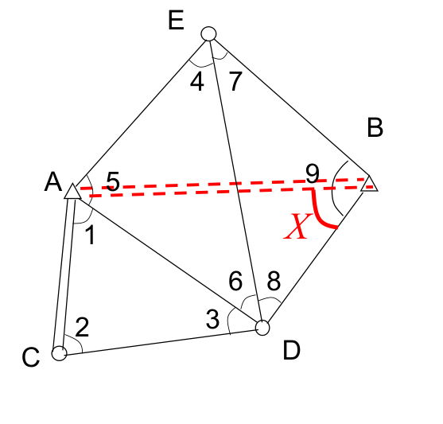

[查看答案 →](#answer-14-02) · [本章开头](#chapter-14)

---

<a id="q-14-03"></a>
#### 14-03　附有参数的条件平差：精度与11组协因数

**类型：** 思考题  
**出处：** 14-附有参数的条件平差.pdf，PDF第13、15、16、24、25、26页

对$A\mathbf v+B\hat{\mathbf x}-\mathbf w=0$、$\mathbf w=-(A\mathbf L+B\mathbf X^0+\mathbf a_0)$，设观测协因数阵为$Q$。回答参数精度如何评定，并完成课件p16分组要求：$Q_{ww},Q_{\hat x\hat x},Q_{kk},Q_{vv},Q_{\hat L\hat L},Q_{v\hat L},Q_{L\hat x},Q_{\hat x\hat L},Q_{\hat x v},Q_{Lv},Q_{L\hat L}$。给出$\hat F=G\hat{\mathbf L}+H\hat{\mathbf x}+\mathbf G_0$的精度式。

[查看答案 →](#answer-14-03) · [本章开头](#chapter-14)

---

<a id="q-14-04"></a>
#### 14-04　教材5-16：三条附参数条件的等权平差

**类型：** 作业  
**出处：** 14-附有参数的条件平差.pdf，PDF第20、21页

已知附有参数的条件方程（观测值等精度）为


$$
\begin{cases}v_1+v_3-\hat x+2=0,\\v_3-v_4+3=0,\\v_2+\hat x-3=0.\end{cases}
$$


（1）求$n,t,r,u,c$；（2）求参数估值$\hat x$及改正数向量$\mathbf v$。课件对应填空1—5为计数，填空6为$\hat x$，填空7—10为$v_1\sim v_4$。

[查看答案 →](#answer-14-04) · [本章开头](#chapter-14)

---

<a id="q-14-05"></a>
#### 14-05　教材5-18：大地四边形以CD边长为参数

**类型：** 作业  
**出处：** 14-附有参数的条件平差.pdf，PDF第20、22页

大地四边形测角网中$A,B$为已知点，$C,D$为待定点，观测8个角$L_1\sim L_8$，角号见图。将$CD$边长设为参数$\hat X$。

1. 附有参数的条件平差需要多少个条件？各是什么条件？
2. 列出含参数的平差值条件方程（不必线性化）。
3. 给出参数近似值$X^0$计算式。

课件另给选择式：含参数的正弦条件选A、B或C；初值式也选A、B或C，选项保留在题图中。

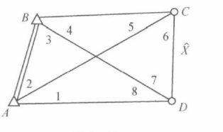

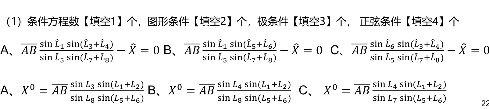

[查看答案 →](#answer-14-05) · [本章开头](#chapter-14)

---

<a id="q-14-06"></a>
#### 14-06　教材例5-7：测角网平差（原PDF仅引用）

**类型：** 例题  
**出处：** 14-附有参数的条件平差.pdf，PDF第26页

原课件p26仅写“例5-7：测角网平差”，未附该例题题干或数据。

[查看答案 →](#answer-14-06) · [本章开头](#chapter-14)

---

<a id="q-14-07"></a>
#### 14-07　教材例5-8：无定向导线平差（原PDF仅引用）

**类型：** 例题  
**出处：** 14-附有参数的条件平差.pdf，PDF第26页

原课件p26仅写“例5-8：无定向导线平差”，未附该例题题干或数据。

[查看答案 →](#answer-14-07) · [本章开头](#chapter-14)

---

<a id="q-14-08"></a>
#### 14-08　附参数条件平差的拉格朗日微分

**类型：** 演示算例  
**出处：** 14-附有参数的条件平差.pdf，PDF第27页

证明$\phi=\mathbf v^TP\mathbf v-2\mathbf k^T(A\mathbf v+B\hat{\mathbf x}-\mathbf w)$的驻点条件，并由此导出法方程。

[查看答案 →](#answer-14-08) · [本章开头](#chapter-14)

---

<a id="chapter-15"></a>
### 15　概括平差函数模型

[返回目录](#contents) · [本章答案](#answers-15)

<a id="q-15-01"></a>
#### 15-01　四种平差模型的参数独立性（6分）

**类型：** 课堂练习  
**出处：** 15-概括平差函数模型.pdf，PDF第6、7页

选择A“独立”、B“不独立”、C“包含”、D“不包含”，填写下表6个空。

|平差模型|参数数与方程数|参数独立性|是否包含$t$个独立参数|
|---|---|---|---|
|附有参数的条件平差|$0<u<t,c=r+u$|填空1|填空2|
|间接平差|$u=t,c=n$|填空3|填空4|
|带约束的间接平差|$u>t,c=n+s=r+u$|填空5|填空6|

[查看答案 →](#answer-15-01) · [本章开头](#chapter-15)

---

<a id="q-15-02"></a>
#### 15-02　由概括模型识别四种平差（4分）

**类型：** 课堂练习  
**出处：** 15-概括平差函数模型.pdf，PDF第8、9页

概括模型为$A\mathbf v+B\hat{\mathbf x}-\mathbf w=0,C\hat{\mathbf x}-\mathbf w_x=0$。按左上、右上、左下、右下四种情况，选择对应模型：

1. $A=I_n,u>t$，且含$t$个独立参数。
2. $A=I_n,C=0,u=t$，参数独立，$s=0$。
3. $C=0,u<t$，参数独立，$s=0$。
4. $C=0,B=0$，无参数，$u=0,s=0$。

选项A：条件平差；B：附有参数的条件平差；C：间接平差；D：带约束的间接平差。

[查看答案 →](#answer-15-02) · [本章开头](#chapter-15)

---

<a id="q-15-03"></a>
#### 15-03　综合案例：同一六角网的四种平差模型与求解

**类型：** 课堂练习  
**出处：** 15-概括平差函数模型.pdf，PDF第11、12页

已知$A=(1000,1000)$ m，$B=(700,1050)$ m，$A1$间精确平面距离$S_{A1}=424.563$ m，角观测为

|角|观测值|角|观测值|
|---|---|---|---|
|$\beta_1$|$46^\circ08'45''$|$\beta_4$|$26^\circ18'51''$|
|$\beta_2$|$82^\circ52'53''$|$\beta_5$|$87^\circ35'20''$|
|$\beta_3$|$50^\circ58'15''$|$\beta_6$|$66^\circ05'46''$|

T1：条件平差，求1、2点坐标估值及方差；T2：附有参数的条件平差，只求$S_{12}$估值及方差；T3：间接平差，求1、2点坐标估值及方差；T4：带约束间接平差，求1、2点坐标估值及方差。

每种模型均要求：Step1列$n,t,r$及列式思想；Step2非线性方程；Step3线性化误差方程；Step4平差求解。原课件未给角观测权阵或先验中误差。

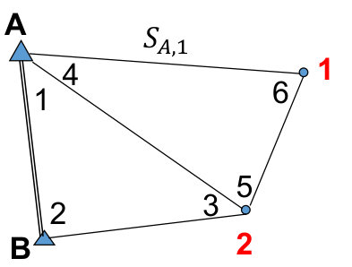

[查看答案 →](#answer-15-03) · [本章开头](#chapter-15)

---

<a id="chapter-16"></a>
### 16　误差椭圆及应用

[返回目录](#contents) · [本章答案](#answers-16)

<a id="q-16-01"></a>
#### 16-01　只有坐标轴方向的精度是否足够？

**类型：** 思考题  
**出处：** 16-误差椭圆及应用.pdf，PDF第6、7、12、13、14页

仅知道 $x$、$y$ 轴方向的精度，能否满足实际工程需求？如何表达任意方位角 $\alpha$ 方向的精度？纵、横向精度有什么关系？

[查看答案 →](#answer-16-01) · [本章开头](#chapter-16)

---

<a id="q-16-02"></a>
#### 16-02　点位总体精度与坐标系

**类型：** 思考题  
**出处：** 16-误差椭圆及应用.pdf，PDF第9、10、11页

点位的整体平面精度如何表示？$\sigma_P^2$ 的取值是否随坐标系旋转而变化？

[查看答案 →](#answer-16-02) · [本章开头](#chapter-16)

---

<a id="q-16-03"></a>
#### 16-03　点1的点位中误差、30°位差及误差椭圆；点1、2的相对误差椭圆

**类型：** 课堂练习＋小结练习＋课后个人作业  
**出处：** 16-误差椭圆及应用.pdf，PDF第15、28、41页

如图，$A,B$ 为已知点，1、2 为待定点。平差结果为 $\hat\sigma_0^2=6.8863('')^2$，$\hat\sigma_0=2.6242''$。按参数顺序 $(x_1,y_1,x_2,y_2)^T$，协因数阵为：


$$
Q_{\hat x\hat x}=\begin{bmatrix}
4.7123&0.6687&1.8325&1.0012\\
0.6687&0.0949&0.2600&0.1421\\
1.8325&0.2600&1.3817&0.8490\\
1.0012&0.1421&0.8490&1.1033
\end{bmatrix}\ (\mathrm{mm}/'')^2.
$$


1. 点1的点位中误差是多少？
2. 点1在方位角 $30^\circ$ 方向上的位差是多少？
3. 求点1误差椭圆三要素：极大值方向、极大值、极小值。
4. 绘制点1的误差椭圆。
5. 求点1、2相对误差椭圆三要素。

第15页问1、2；第28页问3、4；第41页汇总并增加第5问。

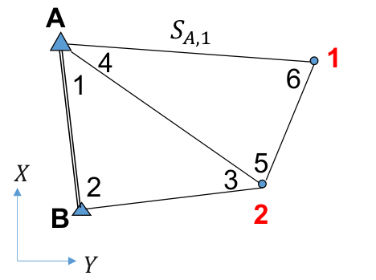

[查看答案 →](#answer-16-03) · [本章开头](#chapter-16)

---

<a id="q-16-04"></a>
#### 16-04　四个协方差阵的误差曲线与误差椭圆

**类型：** 课堂实践＋分析讨论  
**出处：** 16-误差椭圆及应用.pdf，PDF第20、21、24、25页

补充程序，对


$$
D(c)=\begin{bmatrix}5.03&c\\c&7.14\end{bmatrix},\qquad c=1.16,\ 2.16,\ 3.16,\ 4.16
$$


分别绘制误差曲线与误差椭圆。分析协方差增加时的形状变化，计算极大值、极小值及极大值方向。第24页单独使用 $c=4.16$ 演示误差椭圆。

[查看答案 →](#answer-16-04) · [本章开头](#chapter-16)

---

<a id="q-16-05"></a>
#### 16-05　为什么特征根是方向协因数的极值？

**类型：** 思考题  
**出处：** 16-误差椭圆及应用.pdf，PDF第21、22、23页

设 $Q$ 为二维坐标协因数阵，$c=(\cos\varphi,\sin\varphi)^T$，有 $Q_{\varphi\varphi}=c^TQc$。为什么 $Q$ 的特征根就是 $Q_{\varphi\varphi}$ 的极值？怎样确定极值方向？

[查看答案 →](#answer-16-05) · [本章开头](#chapter-16)

---

<a id="q-16-06"></a>
#### 16-06　椭圆径向距离是不是位差？

**类型：** 思考题  
**出处：** 16-误差椭圆及应用.pdf，PDF第26页

误差椭圆中心到椭圆上某点的距离，是否就是该方向的位差？能否从误差椭圆图解出准确的位差？

[查看答案 →](#answer-16-06) · [本章开头](#chapter-16)

---

<a id="q-16-07"></a>
#### 16-07　两个待定点的相对精度从哪里来？

**类型：** 思考题  
**出处：** 16-误差椭圆及应用.pdf，PDF第32、33、34、35、36页

已分别绘出点1、2的点位误差椭圆，能否直接得出两点之间的相对精度？两个待定点坐标差的协因数阵如何求得？若其中一点是已知点会怎样？

[查看答案 →](#answer-16-07) · [本章开头](#chapter-16)

---

<a id="q-16-08"></a>
#### 16-08　根据误差曲线填写八个精度量

**类型：** 个人作业  
**出处：** 16-误差椭圆及应用.pdf，PDF第39页

根据原图填写：①$x$向位差；②$y$向位差；③极大位差；④极小位差；⑤点位中误差；⑥$PA$方向的边长位差；⑦$PA$方位角的角度位差；⑧与长轴夹角为 $\psi$ 的任意方向位差。$A$ 为无误差已知点，$P$ 为待定点。

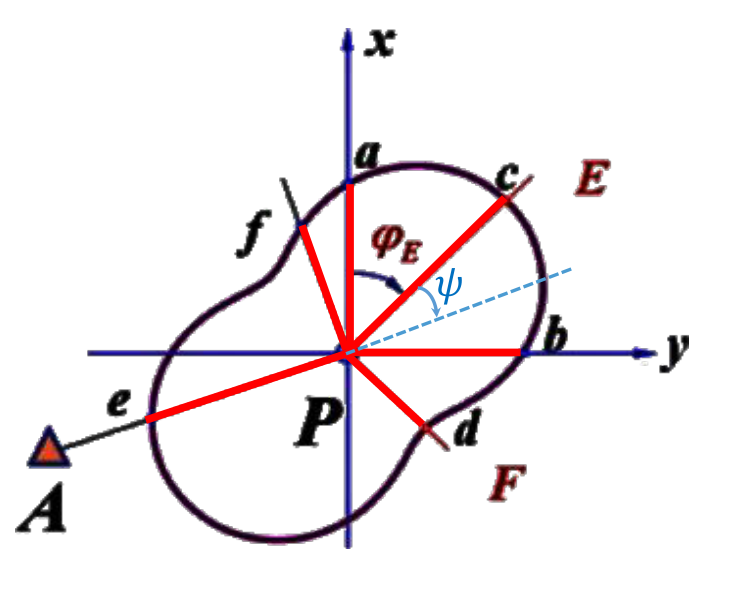

[查看答案 →](#answer-16-08) · [本章开头](#chapter-16)

---

<a id="q-16-09"></a>
#### 16-09　将四幅误差曲线与协方差阵配对

**类型：** 个人作业  
**出处：** 16-误差椭圆及应用.pdf，PDF第40页

判断原图 A、B、C、D 分别对应哪一协方差阵：


$$
D_1=\begin{bmatrix}5&1\\1&7\end{bmatrix},\quad D_2=\begin{bmatrix}5&3\\3&7\end{bmatrix},\quad D_3=\begin{bmatrix}5&4\\4&7\end{bmatrix},\quad D_4=\begin{bmatrix}5&2\\2&7\end{bmatrix}.
$$

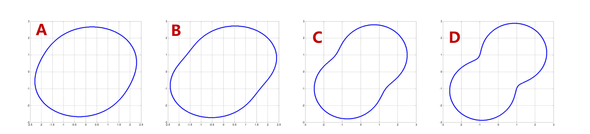

[查看答案 →](#answer-16-09) · [本章开头](#chapter-16)

---

<a id="q-16-10"></a>
#### 16-10　动态误差椭圆带与置信椭圆

**类型：** 课后小组作业  
**出处：** 16-误差椭圆及应用.pdf，PDF第42页

结合课程网站提供的点位坐标序列及协方差阵完成分析报告：

1. 编程绘制点位坐标序列的误差椭圆带，分析精度变化规律。
2. 预习置信椭圆，阐释其在航天器避碰风险决策中的作用。

课件仅列任务和二维码，未附该坐标序列、协方差数据或演示程序。

[查看答案 →](#answer-16-10) · [本章开头](#chapter-16)

---

<a id="q-16-11"></a>
#### 16-11　标准误差椭圆内的概率与误差曲线内概率

**类型：** 演示算例＋辨析  
**出处：** 16-误差椭圆及应用.pdf，PDF第43、44、45页

二维零均值正态误差在主轴方向的标准差为 $E,F$。求落入


$$
B_k:\quad x'^2/E^2+y'^2/F^2\le k^2
$$


的概率，计算 $k=1,2,3,4$。课件还比较了 $E=10$、$F=5,6,7,8,9,10$ 时误差椭圆与误差曲线内部的概率：两者能否视为相同？

[查看答案 →](#answer-16-11) · [本章开头](#chapter-16)

---

<a id="chapter-17"></a>
### 17　统计假设原理与常用统计量

[返回目录](#contents) · [本章答案](#answers-17)

<a id="q-17-01"></a>
#### 17-01　观测值2.5与两类错误

**类型：** 演示算例＋思考  
**出处：** 17-统计假设原理与常用统计量.pdf，PDF第7、8、10页

对 $H_0:X\sim N(0,1)$，观察到 $x=2.5$，按双侧检验分别取 $\alpha=10\%$ 和 $1\%$ 作判断。若数据事实上来自 $N(0,1)$ 或 $N(3,1)$，分别说明何时会出现弃真或纳伪。

[查看答案 →](#answer-17-01) · [本章开头](#chapter-17)

---

<a id="q-17-02"></a>
#### 17-02　已知精度时检验三角形内角和的均值

**类型：** 演示例题  
**出处：** 17-统计假设原理与常用统计量.pdf，PDF第13、14页

经纬仪的已知测角中误差为 $1.8''$。第一期三角网测量得到三角形内角和的平均值为 $180^\circ00'4.0''$，图中共有16个三角形。在 $\alpha=0.05$ 水平下检验是否存在显著系统偏差，并写出统计量。

[查看答案 →](#answer-17-02) · [本章开头](#chapter-17)

---

<a id="q-17-03"></a>
#### 17-03　检验测角精度是否与标定值一致

**类型：** 演示例题  
**出处：** 17-统计假设原理与常用统计量.pdf，PDF第14、15、17、18页

经纬仪标定测角中误差为 $\sigma_0=1.8''$，第一期测量估计得到 $\hat\sigma=1.7''$。按课件使用的16个独立样本、自由度15，在 $\alpha=0.05$ 水平下检验精度是否与标定精度相符。

[查看答案 →](#answer-17-03) · [本章开头](#chapter-17)

---

<a id="q-17-04"></a>
#### 17-04　方差未知时检验16个内角和

**类型：** 演示例题  
**出处：** 17-统计假设原理与常用统计量.pdf，PDF第19、21、22页

某经纬仪标定精度未知。16个三角形内角和均为 $180^\circ00'$ 加上下列秒数：

```text
3.0  2.2  1.4  3.4
4.0  3.6  2.4  1.6
3.8  4.2  4.4  2.2
2.8  3.0  4.6  2.4
```

在 $\alpha=0.05$ 水平下检验是否存在系统偏差。

[查看答案 →](#answer-17-04) · [本章开头](#chapter-17)

---

<a id="q-17-05"></a>
#### 17-05　第三期与第二期精度比较：2.0秒版本

**类型：** 演示例题  
**出处：** 17-统计假设原理与常用统计量.pdf，PDF第23、24、25页

为检验第二期测量是否存在问题，用同一经纬仪进行第三期观测，求得测角中误差估值 $2.0''$。这期精度与第二期是否有显著差异？写出应使用的统计量。

第23页未独立给出第二期同口径的测角方差、第三期自由度及显著性水平。

[查看答案 →](#answer-17-05) · [本章开头](#chapter-17)

---

<a id="q-17-06"></a>
#### 17-06　再次观测与第一期精度比较：1.2秒版本

**类型：** 演示例题  
**出处：** 17-统计假设原理与常用统计量.pdf，PDF第26页

为检验是否由于操作错误导致系统误差，用同一经纬仪再次观测三角网，所得测角中误差估值 $1.2''$，与第一期的估值 $1.7''$ 比较。显著性水平 $\alpha=0.10$，沿用课件两组自由度均15的口径，问精度是否有显著差异。

[查看答案 →](#answer-17-06) · [本章开头](#chapter-17)

---

<a id="q-17-07"></a>
#### 17-07　还有哪些原因造成系统偏差？

**类型：** 思考题  
**出处：** 17-统计假设原理与常用统计量.pdf，PDF第28、29页

除仪器故障和操作不当外，还有哪些原因可能导致三角网观测结果出现系统偏差？课件给出的主要解释是什么？

[查看答案 →](#answer-17-07) · [本章开头](#chapter-17)

---

<a id="q-17-08"></a>
#### 17-08　教材9-2：32个三角形闭合差，已知标准差

**类型：** 作业  
**出处：** 17-统计假设原理与常用统计量.pdf，PDF第30页

某等级32个三角形闭合差（单位：秒）如下：
```text
-0.82 -0.07  1.36 -0.60  0.13  0.37 -1.55  0.17 -0.88 -0.24 -0.20
-0.60  0.11 -0.58 -1.34  0.83  0.89 -1.28 -1.29 -0.45  0.41  0.59
 0.71 -1.20  0.19 -0.16  0.15  1.68  0.92  0.62  1.89 -2.21
```
其总体服从正态分布，已知 $\sigma=1.0''$。在 $\alpha=0.05$ 水平下检验 $H_0:\mu=0$。填写 $u$（保留三位小数）及接受/拒绝判断。

[查看答案 →](#answer-17-08) · [本章开头](#chapter-17)

---

<a id="q-17-09"></a>
#### 17-09　教材9-3：32个三角形闭合差，未知标准差

**类型：** 作业  
**出处：** 17-统计假设原理与常用统计量.pdf，PDF第31页

沿用教材9-2的32个闭合差（见[上一题](#q-17-08)），但总体标准差未知。在 $\alpha=0.05$ 水平下检验 $H_0:\mu=0$，填写 $t$（保留两位小数）及接受/拒绝判断。

[查看答案 →](#answer-17-09) · [本章开头](#chapter-17)

---

<a id="q-17-10"></a>
#### 17-10　教材9-5：两人纬度观测结果的差异

**类型：** 作业  
**出处：** 17-统计假设原理与常用统计量.pdf，PDF第32页

甲、乙各观测某地纬度8次，平均值分别为 $24^\circ11'12.33''$ 和 $24^\circ11'12.38''$。根据以往大量类似观测资料，两人的单次纬度观测中误差均为 $0.63''$。在 $\alpha=0.05$ 水平下检验两人结果差异是否显著。

填写检验种类、统计量（两位小数），以及“有/无”系统误差。

[查看答案 →](#answer-17-10) · [本章开头](#chapter-17)

---

<a id="q-17-11"></a>
#### 17-11　教材9-8：检验精密水准仪读数精度

**类型：** 作业  
**出处：** 17-统计假设原理与常用统计量.pdf，PDF第33页

用设有测微器的精密水准仪，在水准尺上读得15个读数（单位：mm）：

```text
1412.80 1412.85 1412.87 1413.09 1412.50 1412.80 1412.86 1412.84
1412.66 1412.80 1412.84 1412.84 1412.78 1413.02 1412.72
```

以 $\alpha=0.05$ 检验：

1. $H_0:\sigma=0.08\ \mathrm{mm}$，$H_1:\sigma\ne0.08\ \mathrm{mm}$。
2. $H_0:\sigma=0.20\ \mathrm{mm}$，$H_1:\sigma\ne0.20\ \mathrm{mm}$。

填写两个统计量（两位小数）和应接受的原假设编号。

[查看答案 →](#answer-17-11) · [本章开头](#chapter-17)

---

<a id="q-17-12"></a>
#### 17-12　教材9-12：两个独立测角网的后验单位权方差

**类型：** 作业  
**出处：** 17-统计假设原理与常用统计量.pdf，PDF第34页

两个测角三角网独立平差后：


$$
\hat\sigma_{01}^2=\frac{V_1^TP_1V_1}{r_1}=\frac{4.3928}{31}=0.1417,\quad
\hat\sigma_{02}^2=\frac{V_2^TP_2V_2}{r_2}=\frac{8.7152}{49}=0.1779.
$$


欲知两网精度是否相同（$\alpha=0.05$）：①用什么检验，原假设是什么？②统计量多少？③单尾还是双尾？使用什么自由度和概率值查表？是否接受原假设？课件另要求统计量两位小数、查表概率三位小数。

[查看答案 →](#answer-17-12) · [本章开头](#chapter-17)

---

<a id="answers"></a>
## 全部习题答案

本区与前文题目一一对应。数值结果的单位、独立性假设、自由度及课件疑误说明属于解答的一部分。

<a id="answers-02"></a>
### 02　偶然误差特性及精度指标 · 答案

[返回目录](#contents) · [本章题目](#chapter-02)

<a id="answer-02-01"></a>
#### 02-01　一维正态分布的数学期望和方差

[← 返回题目](#q-02-01)

**课件结论，整理补充推导。** 令 $Z=(X-\mu)/\sigma$，则 $Z\sim N(0,1)$，$X=\mu+\sigma Z$。

标准正态密度 $\varphi(z)$ 关于零对称，因此 $E(Z)=\int z\varphi(z)\,dz=0$。又由 $\varphi'(z)=-z\varphi(z)$，分部积分得


$$
E(Z^2)=-\int_{-\infty}^{\infty}z\varphi'(z)\,dz
=[-z\varphi(z)]_{-\infty}^{\infty}+\int_{-\infty}^{\infty}\varphi(z)\,dz=1.
$$


所以


$$
\boxed{E(X)=\mu,\qquad D(X)=\sigma^2.}
$$


注意 $E(X^2)=\mu^2+\sigma^2$，不能把二阶原点矩与方差混淆。

[← 返回题目](#q-02-01) · [返回目录](#contents)

---

<a id="answer-02-02"></a>
#### 02-02　二维正态分布五个参数如何影响密度形态

[← 返回题目](#q-02-02)

**整理补解。**

- $\mu_1,\mu_2$ 确定分布中心 $(\mu_1,\mu_2)$，改变它们只平移密度曲面。
- $\sigma_1,\sigma_2$ 分别决定两个坐标方向的边缘离散程度；相应标准差越大，该方向越分散。
- $\rho$ 决定相关方向及强弱。$\rho>0$ 时高密度区沿同向变化的方向延伸，$\rho<0$ 时沿反向变化的方向延伸；$|\rho|$ 越接近 1，标准化后的等密度椭圆越狭长。$\rho=0$ 时椭圆轴与坐标轴一致，且**在联合正态前提下**两个分量独立。

协方差阵为


$$
D=\begin{bmatrix}\sigma_1^2&\rho\sigma_1\sigma_2\\\rho\sigma_1\sigma_2&\sigma_2^2\end{bmatrix}.
$$


等密度椭圆的方向由 $D$ 的特征向量决定，轴长比例由特征值决定。峰值为 $1/(2\pi\sigma_1\sigma_2\sqrt{1-\rho^2})$。普通二维密度公式要求 $\sigma_1,\sigma_2>0$、$|\rho|<1$；$|\rho|=1$ 是退化分布。

[← 返回题目](#q-02-02) · [返回目录](#contents)

---

<a id="answer-02-03"></a>
#### 02-03　观测误差与观测值的精度是否相同

[← 返回题目](#q-02-03)

**课件答案：A，相同。** 因为常数平移不改变方差：


$$
D(L)=D(\widetilde L+\Delta)=D(\Delta)=\sigma^2.
$$


因此观测值与相应观测误差具有同一中误差。这里比较的是分布的离散程度，不是说一次观测值与一次误差的数值相等。

[← 返回题目](#q-02-03) · [返回目录](#contents)

---

<a id="answer-02-04"></a>
#### 02-04　“误差控制在 0.5 毫米”中的误差指标

[← 返回题目](#q-02-04)

**课件所指答案：极限误差（限差）。** 本页正在讲“通常取 3 倍，少数取 2 倍中误差作为偶然误差的限差”，因而该语境下 $0.5\,\mathrm{mm}$ 表示允许的误差限值。

**表述边界：** 脱离课件语境，仅凭“误差控制在 0.5 毫米”并不能严格确定统计指标或保证概率，应说明它是限差、标准差还是其他指标。方差的单位是 $\mathrm{mm}^2$，不能直接称为 $0.5\,\mathrm{mm}$。

[← 返回题目](#q-02-04) · [返回目录](#contents)

---

<a id="answer-02-05"></a>
#### 02-05　由 0.5 毫米限差反推中误差

[← 返回题目](#q-02-05)

**整理补解。** 若限差规定为 $\Delta_{\mathrm{lim}}=3\sigma$，则


$$
3\sigma\le0.5\,\mathrm{mm}\quad\Rightarrow\quad
\boxed{\sigma\le0.1667\,\mathrm{mm}.}
$$


若规定 $\Delta_{\mathrm{lim}}=2\sigma$，则 $\sigma\le0.25\,\mathrm{mm}$。

对零均值正态误差，$P(|\Delta|<3\sigma)\approx99.73\%$，$P(|\Delta|<2\sigma)\approx95.45\%$。这不是绝对不会超限的数学保证；正态分布在任何有限界限之外仍有非零概率。

[← 返回题目](#q-02-05) · [返回目录](#contents)

---

<a id="answer-02-06"></a>
#### 02-06　单个误差较小是否说明精度较高

[← 返回题目](#q-02-06)

**课件答案：不能；在题设同精度条件下精度相同。** 精度描述随机误差分布的离散程度，例如用中误差 $\sigma$ 衡量；$e_1,e_2$ 是该分布的两个具体实现。单次误差较小，不足以推出其所属观测分布的中误差较小。

相同观测条件且服从同一种误差分布的各观测值具有同一精度。另需注意：若比较“误差大小”，通常应比较 $|e_1|$ 与 $|e_2|$，只比较带符号的 $e_1<e_2$ 本身也不能说明误差幅值更小。

[← 返回题目](#q-02-06) · [返回目录](#contents)

---

<a id="answers-03"></a>
### 03　协方差传播律 1 · 答案

[返回目录](#contents) · [本章题目](#chapter-03)

<a id="answer-03-01"></a>
#### 03-01　铁轨平整度测量使用的仪器

[← 返回题目](#q-03-01)

**课件列出的答案：** 全站仪、水准仪、激光测高仪；这里关注铁轨间（或沿线各点之间）的高差，继而确定点位高程及平整度。课件下一页用水准路线处理说明高程精度的计算。

[← 返回题目](#q-03-01) · [返回目录](#contents)

---

<a id="answer-03-02"></a>
#### 03-02　附合水准路线的高程、协方差及线性模型（含选做题 3-1）

[← 返回题目](#q-03-02)

**课件给出分配闭合差与传播思路；以下为整理补全、数值复核。**

总长 $T=7.4\,\mathrm{km}$，已知高程差 $H_B-H_A=4.293\,\mathrm m$。所以


$$
f_h=4.330-4.293=0.037\,\mathrm m=37\,\mathrm{mm},
$$


$$
\boldsymbol v=(-8,-10.5,-8.5,-10)^T\,\mathrm{mm},
$$


$$
\widehat{\boldsymbol H}=(47.6090,50.4115,48.1590)^T\,\mathrm m.
$$


令前三个点至 $A$ 的累计距离 $t=(1.6,3.7,5.4)^T\,\mathrm{km}$，则


$$
A=\begin{bmatrix}
5.8/7.4&-1.6/7.4&-1.6/7.4&-1.6/7.4\\
1/2&1/2&-1/2&-1/2\\
2/7.4&2/7.4&2/7.4&-5.4/7.4
\end{bmatrix},
$$


$$
\boldsymbol a_0=H_A\boldsymbol1+\frac{H_B-H_A}{T}\boldsymbol t
=\begin{bmatrix}46.21421622\\47.43250000\\48.41872973\end{bmatrix}\,\mathrm m.
$$


由独立性，$D_{LL}=25\operatorname{diag}(1.6,2.1,1.7,2.0)\,\mathrm{mm}^2$，故


$$
\boxed{D_{\widehat H\widehat H}=AD_{LL}A^T
=\begin{bmatrix}
31.351351&20&10.810811\\
20&46.25&25\\
10.810811&25&36.486486
\end{bmatrix}\,\mathrm{mm}^2.}
$$


也可直接使用 $\operatorname{Cov}(\widehat H_i,\widehat H_j)=25[\min(t_i,t_j)-t_it_j/T]$（长度以 km 代入）。

因此三个中误差依次为


$$
\boxed{5.5992\,\mathrm{mm},\quad6.8007\,\mathrm{mm},\quad6.0404\,\mathrm{mm}.}
$$


不能遗漏协方差项：


$$
D(\widehat H_2)=D(\widehat H_1)+D(\widehat h_2)
+2\operatorname{Cov}(\widehat H_1,\widehat h_2).
$$


这里 $\operatorname{Cov}(\widehat H_1,\widehat h_2)=-11.351351\,\mathrm{mm}^2$，平差后的高差不再独立。

**课件勘误：** 第 5 页的 $4.239$ 与给定高程不符，应为 $4.293$；某些页分配公式中的分子写为 $S_1$，一般第 $i$ 段应写 $S_i$。这些笔误不影响按正确模型得到的上述结果。

[← 返回题目](#q-03-02) · [返回目录](#contents)

---

<a id="answer-03-03"></a>
#### 03-03　独立观测值加权组合的中误差

[← 返回题目](#q-03-03)

**课件选择 B；整理复算。** 独立时没有交叉协方差项：


$$
D(x)=\left(\frac17\right)^2 3^2+
\left(\frac27\right)^2 2^2+\left(\frac47\right)^2 1^2
=\frac{41}{49}\,\mathrm{mm}^2.
$$


$$
\boxed{\sigma_x=\frac{\sqrt{41}}7\,\mathrm{mm}\approx0.9147\,\mathrm{mm}.}
$$

[← 返回题目](#q-03-03) · [返回目录](#contents)

---

<a id="answer-03-04"></a>
#### 03-04　图上量距的实地距离中误差

[← 返回题目](#q-03-04)

**课件手写答案与整理复算。** 比例尺视为无误差常数，$D=500d$，所以


$$
\boxed{\sigma_D=500\sigma_d=100\,\mathrm{mm}=0.1\,\mathrm m.}
$$


实地距离为 $D=500\times134.7\,\mathrm{mm}=67.35\,\mathrm m$。中误差作为标准差取非负值。

[← 返回题目](#q-03-04) · [返回目录](#contents)

---

<a id="answer-03-05"></a>
#### 03-05　测距与 GNSS 坐标试验中的随机变量和随机向量

[← 返回题目](#q-03-05)

**整理补解。** 一次测距结果是一个随机变量的实现；同一次 GNSS 测量得到的三个坐标分量组成一个三维随机向量的一次实现。

在课程采用的联合正态误差模型下，可写


$$
\boldsymbol L\sim N_3(\boldsymbol\mu,D_{LL}),\qquad
\boldsymbol\mu=(E(X),E(Y),E(Z))^T.
$$


仅含零均值偶然误差时，$\boldsymbol\mu$ 等于该点的真实坐标向量。$D_{LL}$ 的主对角元是三个坐标分量的方差，非对角元表示相关性。

本页没有给出真坐标、理论协方差，也没有要求对这四组样本估计它们，因而不能凭四次样本直接宣称已经知道总体参数或已验证联合正态性。长度表中的省略号也说明样本并未完整列出。

[← 返回题目](#q-03-05) · [返回目录](#contents)

---

<a id="answer-03-06"></a>
#### 03-06　水准路线的观测向量及其单位

[← 返回题目](#q-03-06)

**课件答案与整理说明。**


$$
\boxed{\boldsymbol L=\begin{bmatrix}h_1\\h_2\\h_3\\h_4\end{bmatrix}
=\begin{bmatrix}+2.331\\+2.813\\-2.244\\+1.430\end{bmatrix}\,\mathrm m.}
$$


它是 $4\times1$ 列向量。本题四个分量都是高差，可统一标注单位 m。一般观测向量的每个分量都带有其物理量单位；混合距离与角度时应逐项说明，不能假定整个向量必有一个共同单位。负高差表示该段沿规定观测方向下降。

[← 返回题目](#q-03-06) · [返回目录](#contents)

---

<a id="answer-03-07"></a>
#### 03-07　正态观测向量的分布与统计特性

[← 返回题目](#q-03-07)

**课件意图：** 使用 $n$ 维正态模型，以数学期望向量 $E(\boldsymbol L)$ 和方差—协方差阵 $D_{LL}$ 描述其统计特性。

**必要前提补充：** “每个分量边缘上服从正态分布”单独并不足以推出“联合正态”。若各分量相互独立，或明确假设其联合分布为正态，才能写


$$
\boldsymbol L\sim N_n(\widetilde{\boldsymbol L},D_{LL}).
$$


在 $D_{LL}$ 正定时，密度为


$$
f(\boldsymbol l)=\frac{\exp[-\tfrac12(\boldsymbol l-\widetilde{\boldsymbol L})^TD_{LL}^{-1}(\boldsymbol l-\widetilde{\boldsymbol L})]}{(2\pi)^{n/2}|D_{LL}|^{1/2}}.
$$


若独立，$D_{LL}=\operatorname{diag}(\sigma_1^2,\ldots,\sigma_n^2)$。一般随机向量的均值和协方差只概括一、二阶数字特征；只有在正态等特定模型下，它们才足以确定整个分布。

[← 返回题目](#q-03-07) · [返回目录](#contents)

---

<a id="answer-03-08"></a>
#### 03-08　证明协方差阵为对称阵

[← 返回题目](#q-03-08)

**整理补证。** 任意 $i,j$，


$$
\operatorname{Cov}(L_i,L_j)=E[(L_i-E L_i)(L_j-E L_j)]
=\operatorname{Cov}(L_j,L_i).
$$


因此 $(D_{LL})_{ij}=(D_{LL})_{ji}$，即 $\boxed{D_{LL}=D_{LL}^T}$。

主对角元 $\operatorname{Cov}(L_i,L_i)=D(L_i)=\sigma_i^2$；非对角元是两个不同分量之间的协方差。同精度且相互独立时 $D_{LL}=\sigma^2I$。

**严谨性提醒：** 协方差为零表示不相关，一般不能推出独立；在联合正态的前提下，两者等价。

[← 返回题目](#q-03-08) · [返回目录](#contents)

---

<a id="answer-03-09"></a>
#### 03-09　按每公里高差中误差组成协方差阵

[← 返回题目](#q-03-09)

**课件答案。** 各段独立，因此协方差为零；各段方差是 $25S_i\,\mathrm{mm}^2$。


$$
\boxed{D_{LL}=\begin{bmatrix}40&0&0&0\\0&52.5&0&0\\0&0&42.5&0\\0&0&0&50\end{bmatrix}\,\mathrm{mm}^2.}
$$


注意中误差本身随 $\sqrt{S_i}$ 增大，随长度线性增长的是方差。

[← 返回题目](#q-03-09) · [返回目录](#contents)

---

<a id="answer-03-10"></a>
#### 03-10　从协方差阵读取中误差、协方差和相关系数

[← 返回题目](#q-03-10)

**整理补解。** 中误差取主对角元的正平方根；相关系数 $\rho_{ij}=\sigma_{ij}/(\sigma_i\sigma_j)$。

| 空号 | 答案 | 计算 |
|---|---:|---|
| 1 | $2$ | $\sqrt4$ |
| 2 | $3$ | $\sqrt9$ |
| 3 | $4$ | $\sqrt{16}$ |
| 4 | $-2$ | 第 $(1,2)$ 元 |
| 5 | $-1/3$ | $-2/(2\times3)$ |
| 6 | $0$ | 第 $(1,3)$ 元 |
| 7 | $0$ | $0/(2\times4)$ |
| 8 | $-3$ | 第 $(2,3)$ 元 |
| 9 | $-1/4$ | $-3/(3\times4)$ |

原题未标物理单位，不能自行附加 mm 等单位。相关系数无量纲。

[← 返回题目](#q-03-10) · [返回目录](#contents)

---

<a id="answer-03-11"></a>
#### 03-11　线性协方差传播律及其分布前提

[← 返回题目](#q-03-11)

**课件推导，补充分布前提答案。**


$$
E(\boldsymbol f)=AE(\boldsymbol x)+\boldsymbol a_0,
$$


$$
\boldsymbol f-E(\boldsymbol f)=A[\boldsymbol x-E(\boldsymbol x)].
$$


代入协方差定义得


$$
\begin{aligned}
D_{ff}&=E\{[\boldsymbol f-E\boldsymbol f][\boldsymbol f-E\boldsymbol f]^T\}\\
&=AE\{[\boldsymbol x-E\boldsymbol x][\boldsymbol x-E\boldsymbol x]^T\}A^T\\
&=\boxed{AD_{xx}A^T}.
\end{aligned}
$$


**不要求正态分布**，只需相应二阶矩存在，且系数矩阵、常数项确定。线性情形为精确等式；非线性函数经一阶线性化后应用时通常是近似等式。

[← 返回题目](#q-03-11) · [返回目录](#contents)

---

<a id="answer-03-12"></a>
#### 03-12　方向观测组成两个角的精度（例 3-5）

[← 返回题目](#q-03-12)

**课件答案及整理展开。** 设


$$
K=\begin{bmatrix}-1&1&0\\0&-1&1\end{bmatrix},\qquad D_{ll}=\sigma^2I_3.
$$


则


$$
D_{\alpha\alpha}=KD_{ll}K^T=\sigma^2\begin{bmatrix}2&-1\\-1&2\end{bmatrix}.
$$


所以


$$
\boxed{\sigma_{\alpha_1}=\sigma_{\alpha_2}=\sqrt2\sigma,\quad
\sigma_{\alpha_1\alpha_2}=-\sigma^2.}
$$


两个角共用 $l_2$，但系数符号相反，故形成负协方差；相关系数为 $-1/2$。

[← 返回题目](#q-03-12) · [返回目录](#contents)

---

<a id="answer-03-13"></a>
#### 03-13　三角形内角平均分配闭合差后的精度（例 3-6）

[← 返回题目](#q-03-13)

**课件答案。** $\alpha$ 与 $w$ 不独立，因为 $w$ 中含有 $-\alpha$，且 $\operatorname{Cov}(\alpha,w)=-\sigma^2$。正确计算为


$$
D(\widehat\alpha)=\sigma^2+\frac{3\sigma^2}{9}
+\frac23(-\sigma^2)=\frac23\sigma^2.
$$


或者写


$$
\widehat{\boldsymbol\alpha}=K\boldsymbol\alpha+60^\circ\boldsymbol1,\qquad
K=\frac13\begin{bmatrix}2&-1&-1\\-1&2&-1\\-1&-1&2\end{bmatrix}.
$$


得到


$$
\boxed{D_{\widehat\alpha\widehat\alpha}=\frac{\sigma^2}{3}
\begin{bmatrix}2&-1&-1\\-1&2&-1\\-1&-1&2\end{bmatrix}.}
$$


因此三个中误差均为 $\boxed{\sqrt{2/3}\,\sigma}$，两两协方差均为 $-\sigma^2/3$。平差后单个角的精度提高，但三个平差角相关，且总和严格等于 $180^\circ$，所以此协方差阵秩为 2。

[← 返回题目](#q-03-13) · [返回目录](#contents)

---

<a id="answer-03-14"></a>
#### 03-14　三角高程的中误差

[← 返回题目](#q-03-14)

**整理补解，并说明课件符号问题。** 若按课件公式 $h=S\tan\alpha$，$S$ 必须是**水平距离**，$\alpha$ 为相对于水平面的垂直角。角度误差以弧度计时，


$$
dh=\tan\alpha\,dS+S\sec^2\alpha\,d\alpha.
$$


因此


$$
\sigma_h^2\approx\tan^2\alpha\,\sigma_S^2+
S^2\sec^4\alpha\,\sigma_{\alpha,\mathrm{rad}}^2+
2S\tan\alpha\sec^2\alpha\operatorname{Cov}(S,\alpha).
$$


若测距与测角独立，协方差项为零，得到


$$
\boxed{\sigma_h\approx\sqrt{\tan^2\alpha\,\sigma_S^2+
S^2\sec^4\alpha\,\sigma_{\alpha,\mathrm{rad}}^2}.}
$$


若测角中误差以角秒给出，先用 $\sigma_{\alpha,\mathrm{rad}}=\sigma_{\alpha,''}/206264.806$。

若题目实际给的是**斜距** $s$，则应改用 $h=s\sin\alpha$；独立时


$$
\boxed{\sigma_h\approx\sqrt{\sin^2\alpha\,\sigma_s^2+s^2\cos^2\alpha\,\sigma_{\alpha,\mathrm{rad}}^2}.}
$$


原题没有具体边长、角度及中误差数值，只能得到上述传播公式。测边中误差下标 $\sigma_h$ 应与待求高差误差区分。

[← 返回题目](#q-03-14) · [返回目录](#contents)

---

<a id="answers-04"></a>
### 04　协方差传播律 2 · 答案

[返回目录](#contents) · [本章题目](#chapter-04)

<a id="answer-04-01"></a>
#### 04-01　水准路线高程与平差高差的互协方差（选做题 4-3）

[← 返回题目](#q-04-01)

**整理补解。** 令 $\boldsymbol s=(1.6,2.1,1.7,2.0)^T$，$T=7.4$，


$$
M=I_4-\frac{\boldsymbol s\boldsymbol1^T}{T},\qquad
C=\begin{bmatrix}1&0&0&0\\1&1&0&0\\1&1&1&0\end{bmatrix}.
$$


则 $\widehat{\boldsymbol L}=M\boldsymbol L+\text{常数}$，$\widehat{\boldsymbol H}=CM\boldsymbol L+\text{常数}$。

所以


$$
D_{\widehat H\widehat L}=CMD_{LL}M^T.
$$


又 $D_{\widehat L\widehat L}=25[\operatorname{diag}(\boldsymbol s)-\boldsymbol s\boldsymbol s^T/T]$，于是


$$
\boxed{D_{\widehat H\widehat L}=\begin{bmatrix}
31.351351&-11.351351&-9.189189&-10.810811\\
20&26.25&-21.25&-25\\
10.810811&14.189189&11.486486&-36.486486
\end{bmatrix}\,\mathrm{mm}^2.}
$$


它有 $3$ 行 $4$ 列，转置即 $D_{\widehat L\widehat H}$。每行元素和为零，因为四段平差高差之和被无误差端点约束为常数。

**课件问题处理：** 按已提供数据只能求上述 3×4 矩阵。课件的 $L_5,L_6$ 未定义，不能虚构这两段的观测关系或协方差。分配式中个别分子 $S_1$ 也应读为一般项 $S_i$。

[← 返回题目](#q-04-01) · [返回目录](#contents)

---

<a id="answer-04-02"></a>
#### 04-02　互协方差阵的维数与转置关系

[← 返回题目](#q-04-02)

**课件结论，整理推导。**


$$
D_{xy}=E[(\boldsymbol x-E\boldsymbol x)(\boldsymbol y-E\boldsymbol y)^T]\in\mathbb R^{n\times m},
$$


$$
D_{yx}\in\mathbb R^{m\times n},\qquad\boxed{D_{yx}=D_{xy}^T}.
$$


行对应下标的第一个向量分量，列对应第二个向量分量。两者通常不是方阵，也不必各自对称。

[← 返回题目](#q-04-02) · [返回目录](#contents)

---

<a id="answer-04-03"></a>
#### 04-03　三维与二维随机向量的自协方差、互协方差阵

[← 返回题目](#q-04-03)

**课件示例，已修正下标笔误。**


$$
D_{xx}=\begin{bmatrix}
\sigma_{x_1}^2&\sigma_{x_1x_2}&\sigma_{x_1x_3}\\
\sigma_{x_2x_1}&\sigma_{x_2}^2&\sigma_{x_2x_3}\\
\sigma_{x_3x_1}&\sigma_{x_3x_2}&\sigma_{x_3}^2
\end{bmatrix},\quad
D_{yy}=\begin{bmatrix}\sigma_{y_1}^2&\sigma_{y_1y_2}\\\sigma_{y_2y_1}&\sigma_{y_2}^2\end{bmatrix},
$$


$$
D_{xy}=\begin{bmatrix}\sigma_{x_1y_1}&\sigma_{x_1y_2}\\\sigma_{x_2y_1}&\sigma_{x_2y_2}\\\sigma_{x_3y_1}&\sigma_{x_3y_2}\end{bmatrix},
$$


$$
D_{yx}=\begin{bmatrix}\sigma_{y_1x_1}&\sigma_{y_1x_2}&\sigma_{y_1x_3}\\\sigma_{y_2x_1}&\sigma_{y_2x_2}&\sigma_{y_2x_3}\end{bmatrix}=D_{xy}^T.
$$


课件 $D_{yy}$ 的非对角元误写成 $\sigma_{x_1x_2},\sigma_{x_2x_1}$；应使用 $y_1,y_2$ 的协方差。

[← 返回题目](#q-04-03) · [返回目录](#contents)

---

<a id="answer-04-04"></a>
#### 04-04　一个随机向量的线性函数协方差（复习）

[← 返回题目](#q-04-04)

**课件答案。** $\boldsymbol f-E\boldsymbol f=A(\boldsymbol x-E\boldsymbol x)$，所以


$$
\boxed{D_{ff}=AD_{xx}A^T}.
$$


常数向量没有方差，也不贡献协方差。该式在有限二阶矩条件下成立，不要求正态分布。此题是上一节传播律问题的课堂复习。

[← 返回题目](#q-04-04) · [返回目录](#contents)

---

<a id="answer-04-05"></a>
#### 04-05　同一随机向量两个函数的互协方差（选做题 4-1）

[← 返回题目](#q-04-05)

**整理补证。** 令 $\boldsymbol\delta_x=\boldsymbol x-E\boldsymbol x$，则中心化后的两个函数分别为 $A\boldsymbol\delta_x$、$B\boldsymbol\delta_x$。


$$
\begin{aligned}
D_{fg}&=E[(A\boldsymbol\delta_x)(B\boldsymbol\delta_x)^T]\\
&=AE[\boldsymbol\delta_x\boldsymbol\delta_x^T]B^T
=AD_{xx}B^T.
\end{aligned}
$$


交换顺序可得 $D_{gf}=BD_{xx}A^T=D_{fg}^T$，因为 $D_{xx}$ 对称。

[← 返回题目](#q-04-05) · [返回目录](#contents)

---

<a id="answer-04-06"></a>
#### 04-06　不同随机向量函数间的互协方差（选做题 4-2）

[← 返回题目](#q-04-06)

**整理补证。** 中心化后 $\boldsymbol f-E\boldsymbol f=A(\boldsymbol x-E\boldsymbol x)$，$\boldsymbol w-E\boldsymbol w=C(\boldsymbol y-E\boldsymbol y)$。所以


$$
\begin{aligned}
D_{fw}&=E\{A(\boldsymbol x-E\boldsymbol x)[C(\boldsymbol y-E\boldsymbol y)]^T\}\\
&=AE[(\boldsymbol x-E\boldsymbol x)(\boldsymbol y-E\boldsymbol y)^T]C^T\\
&=AD_{xy}C^T.
\end{aligned}
$$


交换两个函数即得 $D_{wf}=CD_{yx}A^T=D_{fw}^T$。不能把 $D_{xy}$ 错换成 $D_{xx}$，因为两个函数依赖的源随机向量不同。

[← 返回题目](#q-04-06) · [返回目录](#contents)

---

<a id="answer-04-07"></a>
#### 04-07　连续线性变换的五个协方差阵（第一组，例 2）

[← 返回题目](#q-04-07)

**整理补解。** 先将 $\boldsymbol y$ 写成 $BA\boldsymbol L$，统一用同一源向量传播：


$$
\boxed{\begin{aligned}
D_{xx}&=AD_{LL}A^T,\\
D_{yy}&=BD_{xx}B^T=BAD_{LL}A^TB^T,\\
D_{xL}&=AD_{LL},\\
D_{yL}&=BAD_{LL},\\
D_{xy}&=AD_{LL}A^TB^T=D_{xx}B^T.
\end{aligned}}
$$


其中 $D_{Lx}=D_{xL}^T$、$D_{Ly}=D_{yL}^T$、$D_{yx}=D_{xy}^T$。未给具体矩阵数值，结果保持解析形式。

[← 返回题目](#q-04-07) · [返回目录](#contents)

---

<a id="answer-04-08"></a>
#### 04-08　两个相关向量之线性组合（第二组，例 3-4）

[← 返回题目](#q-04-08)

**整理补解。** 将 $\boldsymbol x,\boldsymbol y$ 叠成联合向量即可一次传播：


$$
D_{ff}=[A\ B]\begin{bmatrix}D_{xx}&D_{xy}\\D_{yx}&D_{yy}\end{bmatrix}\begin{bmatrix}A^T\\B^T\end{bmatrix}.
$$


展开得


$$
\boxed{D_{ff}=AD_{xx}A^T+AD_{xy}B^T+BD_{yx}A^T+BD_{yy}B^T,}
$$


$$
\boxed{D_{fx}=AD_{xx}+BD_{yx},\qquad D_{fy}=AD_{xy}+BD_{yy}.}
$$


这里 $D_{yx}=D_{xy}^T$。只有在 $\boldsymbol x,\boldsymbol y$ 不相关时，两个交叉项才为零。

[← 返回题目](#q-04-08) · [返回目录](#contents)

---

<a id="answer-04-09"></a>
#### 04-09　三角高程的误差传播（引例、第五组）

[← 返回题目](#q-04-09)

**整理补解，并说明课件符号问题。** 若按课件公式 $h=S\tan\alpha$，$S$ 必须是**水平距离**，$\alpha$ 为相对于水平面的垂直角。角度误差以弧度计时，


$$
dh=\tan\alpha\,dS+S\sec^2\alpha\,d\alpha.
$$


因此


$$
\sigma_h^2\approx\tan^2\alpha\,\sigma_S^2+
S^2\sec^4\alpha\,\sigma_{\alpha,\mathrm{rad}}^2+
2S\tan\alpha\sec^2\alpha\operatorname{Cov}(S,\alpha).
$$


若测距与测角独立，协方差项为零，得到


$$
\boxed{\sigma_h\approx\sqrt{\tan^2\alpha\,\sigma_S^2+
S^2\sec^4\alpha\,\sigma_{\alpha,\mathrm{rad}}^2}.}
$$


若测角中误差以角秒给出，先用 $\sigma_{\alpha,\mathrm{rad}}=\sigma_{\alpha,''}/206264.806$。

若题目实际给的是**斜距** $s$，则应改用 $h=s\sin\alpha$；独立时


$$
\boxed{\sigma_h\approx\sqrt{\sin^2\alpha\,\sigma_s^2+s^2\cos^2\alpha\,\sigma_{\alpha,\mathrm{rad}}^2}.}
$$


原题没有具体边长、角度及中误差数值，只能得到上述传播公式。测边中误差下标 $\sigma_h$ 应与待求高差误差区分。

[← 返回题目](#q-04-09) · [返回目录](#contents)

---

<a id="answer-04-10"></a>
#### 04-10　为什么全微分的协方差可用于原非线性函数

[← 返回题目](#q-04-10)

**整理补解。** 当展开点 $\boldsymbol x^0$ 是确定常量时，平移不改变协方差，故


$$
D_{dxdx}=D_{xx},\qquad D_{dzdz}=D_{zz}.
$$


一阶线性化给出


$$
d\boldsymbol z\approx Kd\boldsymbol x,\qquad
K_{ij}=\left.\frac{\partial f_i}{\partial x_j}\right|_{\boldsymbol x^0},
$$


所以


$$
\boxed{D_{zz}\approx KD_{xx}K^T.}
$$


对仿射函数，该式精确；对一般非线性函数，忽略二阶及更高阶项后才成立，要求展开点适当、误差相对较小。不能把一般非线性传播一律写成严格等号。

**课件第 24 页勘误：** 若写成 $\boldsymbol z\approx K\boldsymbol x+\boldsymbol k_0$，正确常数项为


$$
\boldsymbol k_0=\boldsymbol f(\boldsymbol x^0)-K\boldsymbol x^0,
$$


原页常数项展开中出现的加号应为减号。这不影响协方差，因为常数项消失。

[← 返回题目](#q-04-10) · [返回目录](#contents)

---

<a id="answer-04-11"></a>
#### 04-11　建筑用地矩形面积及中误差（第三组）

[← 返回题目](#q-04-11)

**整理补解。** 矩形宽 $AB=y_1-y_2=5\,\mathrm{cm}$，高 $AF=x_1+x_2=4\,\mathrm{cm}$，因此


$$
\boxed{F=(y_1-y_2)(x_1+x_2)=20\,\mathrm{cm}^2.}
$$


为与给定协方差单位一致，把长度改用 mm：宽 $50$、高 $40$。依次对 $x_1,x_2,y_1,y_2$ 求导，得


$$
K=(50,50,40,-40)\,\mathrm{mm}.
$$


因 $D_{xy}=0$，


$$
\begin{aligned}
D(F)&\approx(50,50)D_{xx}(50,50)^T+(40,-40)D_{yy}(40,-40)^T\\
&=15000+3200=18200\,\mathrm{mm}^4.
\end{aligned}
$$


所以


$$
\boxed{\sigma_F\approx134.9074\,\mathrm{mm}^2=1.3491\,\mathrm{cm}^2.}
$$


方差单位是面积的平方 $\mathrm{mm}^4$；面积中误差的单位才是 $\mathrm{mm}^2$。这里按课程要求采用一阶传播，未将二阶乘积误差项计入。

[← 返回题目](#q-04-11) · [返回目录](#contents)

---

<a id="answer-04-12"></a>
#### 04-12　三角形平差角推算两边的协方差（第四组）

[← 返回题目](#q-04-12)

**整理补解（按角协方差单位为角秒平方）。** 由正弦定理，


$$
S_a=S_0\frac{\sin\widehat L_1}{\sin\widehat L_3},\qquad
S_b=S_0\frac{\sin\widehat L_2}{\sin\widehat L_3}.
$$


代入得到 $S_a=967.696800\,\mathrm m$，$S_b=1150.573319\,\mathrm m$。

以弧度求导的雅可比为


$$
K_{\mathrm{rad}}=\begin{bmatrix}
S_0\cos L_1/\sin L_3&0&-S_0\sin L_1\cos L_3/\sin^2L_3\\
0&S_0\cos L_2/\sin L_3&-S_0\sin L_2\cos L_3/\sin^2L_3
\end{bmatrix}.
$$


若输入协方差用角秒平方，则用 $K_{''}=K_{\mathrm{rad}}/206264.806247$，其数值为


$$
K_{''}\approx\begin{bmatrix}0.005556588&0&-0.0000216081\\0&0.0046658847&-0.0000256916\end{bmatrix}\ \mathrm{m/arcsec}.
$$


因此


$$
\boxed{D_{SS}\approx K_{''}D_{\widehat L\widehat L}K_{''}^T
=\begin{bmatrix}0.0001859772&-0.0000770451\\-0.0000770451&0.0001313461\end{bmatrix}\,\mathrm m^2.}
$$


边长中误差分别约为 $0.013637\,\mathrm m$、$0.011461\,\mathrm m$。

**单位限制：** 若原矩阵实际采用弧度平方，则应直接用 $K_{\mathrm{rad}}$，所得方差阵等于上述结果乘 $(206264.806247)^2$。原页省略的单位应向授课材料核实；不能默默把角秒矩阵直接与弧度导数相乘。

[← 返回题目](#q-04-12) · [返回目录](#contents)

---

<a id="answer-04-13"></a>
#### 04-13　含折光修正的高差中误差（第六组）

[← 返回题目](#q-04-13)

**整理补解。** 只有 $\alpha$ 含误差，且 $R=6\,371\,000\,\mathrm m$。由


$$
\frac{\partial h}{\partial\alpha}=S\cos\alpha-k\frac{S^2}{R}\sin\alpha\cos\alpha,
$$


在给定值处


$$
\left.\frac{\partial h}{\partial\alpha}\right|_0=772.7406108\,\mathrm{m/rad},\qquad
\sigma_{\alpha,\mathrm{rad}}=\frac3{206264.806247}=1.4544410\times10^{-5}.
$$


所以


$$
\boxed{\sigma_h\approx\left|\frac{\partial h}{\partial\alpha}\right|\sigma_{\alpha,\mathrm{rad}}
=0.0112391\,\mathrm m\approx11.24\,\mathrm{mm}.}
$$


以题给近似换算 $1''=4.848\times10^{-6}$ 计算也得到约 $11.24\,\mathrm{mm}$。高差参考值为 $h\approx207.05533\,\mathrm m$。

[← 返回题目](#q-04-13) · [返回目录](#contents)

---

<a id="answer-04-14"></a>
#### 04-14　像点坐标协方差传播（第七组）

[← 返回题目](#q-04-14)

**整理补解。** 用 mm 表示像点坐标、m 表示物方坐标，可得 $x=10\,\mathrm{mm},y=20\,\mathrm{mm}$。雅可比为


$$
K=\begin{bmatrix}f/Z&0&-fX/Z^2\\0&f/Z&-fY/Z^2\end{bmatrix}
=\begin{bmatrix}0.1&0&-0.02\\0&0.1&-0.04\end{bmatrix}\,\mathrm{mm/m}.
$$


故


$$
\boxed{D_{xy}\approx KD_{XYZ}K^T
=\begin{bmatrix}0.000132&0.000082\\0.000082&0.000520\end{bmatrix}\,\mathrm{mm}^2.}
$$


例如 $D(x)=0.1^2(0.01)+(-0.02)^2(0.09)+2(0.1)(-0.02)(0.001)=0.000132\,\mathrm{mm}^2$。不要遗漏物方坐标相关性引起的交叉项。

[← 返回题目](#q-04-14) · [返回目录](#contents)

---

<a id="answer-04-15"></a>
#### 04-15　局部坐标到国家坐标的协方差（第八组）

[← 返回题目](#q-04-15)

**整理补解。** 对随机坐标 $(x,y)$ 而言，该模型实际是仿射线性模型，给定参数均无误差，因此此处传播为精确关系。


$$
K=\begin{bmatrix}a\cos\theta&-b\sin\theta\\a\sin\theta&b\cos\theta\end{bmatrix}
\approx\begin{bmatrix}0.9981870875&-0.0869814313\\0.0873300542&0.9942023087\end{bmatrix}.
$$


故


$$
\boxed{D_{XY}=KD_{xy}K^T
\approx\begin{bmatrix}0.0387995429&0.0055519649\\0.0055519649&0.0910009771\end{bmatrix}\,\mathrm{cm}^2.}
$$


若要用 $\mathrm m^2$ 表示，整个矩阵乘 $10^{-4}$。坐标观测值为 m 并不意味着给定协方差阵也以 $\mathrm m^2$ 表示；本题必须保留原题明确写出的 $\mathrm{cm}^2$。

[← 返回题目](#q-04-15) · [返回目录](#contents)

---

<a id="answer-04-16"></a>
#### 04-16　GPS 基线长度的中误差（第九组）

[← 返回题目](#q-04-16)

**整理补解。**


$$
L=\sqrt{100^2+200^2+50^2}=229.1287847\,\mathrm m,
$$


$$
K=\frac1L(\Delta X,\Delta Y,\Delta Z).
$$


故


$$
\begin{aligned}
D(L)&\approx KD_{\Delta}K^T\\
&=\frac{100^2(0.25)+200^2(0.36)+50^2(0.16)+2(100)(200)(0.1)+2(100)(50)(0.05)+2(200)(50)(0.12)}{52500}\\
&=\frac{24200}{52500}=0.460952381\,\mathrm m^2.
\end{aligned}
$$


所以


$$
\boxed{\sigma_L\approx0.6789347\,\mathrm m\approx0.679\,\mathrm m.}
$$


三个分量并不独立，不能删掉正的交叉协方差项。

[← 返回题目](#q-04-16) · [返回目录](#contents)

---

<a id="answer-04-17"></a>
#### 04-17　应变模型的数值与中误差（第十组，含条件缺失说明）

[← 返回题目](#q-04-17)

**整理补解；原题量纲及统计假设需核实。** 原页给定的 $k$ 单位为 $\mu\varepsilon/\mathrm V$，但模型又写成 $V/(kGL_0)$。按这些单位直接代入，其量纲为 $\mathrm V^2/(\mu\varepsilon\cdot\mathrm m)$，与应变的量纲不一致。因此不能把下面的纯代数结果直接标成应变或微应变，也不能擅自修改 $k$ 或原公式。

**按题给数值直接代数计算：**


$$
\varepsilon_{\mathrm{num}}=\frac{5}{2\times100\times1}=\boxed{0.025}.
$$


偏导为


$$
\frac{\partial\varepsilon}{\partial V}=\frac{\varepsilon}{V},\quad
\frac{\partial\varepsilon}{\partial G}=-\frac{\varepsilon}{G},\quad
\frac{\partial\varepsilon}{\partial L_0}=-\frac{\varepsilon}{L_0}.
$$


若将三个“$\pm$”数值解释为各自**标准差**，并额外假定 $V,G,L_0$ **互不相关**，则


$$
\frac{\sigma_\varepsilon^2}{\varepsilon^2}\approx
\left(\frac{0.1}{5}\right)^2+\left(\frac2{100}\right)^2+\left(\frac{0.02}{1}\right)^2=0.0012,
$$


$$
\boxed{\sigma_{\varepsilon,\mathrm{num}}\approx0.0008660254,\qquad
\sigma_\varepsilon/|\varepsilon|\approx3.4641\%.}
$$


若三者相关，一般式还包含


$$
2\varepsilon^2\left[-\frac{\operatorname{Cov}(V,G)}{VG}-\frac{\operatorname{Cov}(V,L_0)}{VL_0}+\frac{\operatorname{Cov}(G,L_0)}{GL_0}\right].
$$


所以原页尚需核实：模型与灵敏度单位是否匹配、“$\pm$”表示标准差还是限差、观测是否不相关。在这些问题澄清前，上述 $0.025$ 和 $0.0008660$ 只能作为明确假设下的形式计算，不能视为具有确定物理单位的最终应变结果。

[← 返回题目](#q-04-17) · [返回目录](#contents)

---

<a id="answers-05"></a>
### 05　权、协因数及其传播律 · 答案

[返回目录](#contents) · [本章题目](#chapter-05)

<a id="answer-05-01"></a>
#### 05-01　三个水准点测定 P 点高程：为什么采用加权平均

[← 返回题目](#q-05-01)

**课件解答，补充保留位数与推导。** 单条路线给出 $1.102,1.100,1.107\rm\,m$，中误差依次为 $\sigma_{km},\sqrt3\sigma_{km},\sqrt5\sigma_{km}$。

算术平均为 $\widehat H_{P,1}=1.103\rm\,m$，其方差为 $\sigma_{km}^2(1+3+5)/9=\sigma_{km}^2$。

因 $\sigma_i^2=S_i\sigma_{km}^2$，权比 $p_1:p_2:p_3=1:1/3:1/5=15:5:3$，故


$$
\widehat H_{P,2}=\frac{15(1.102)+5(1.100)+3(1.107)}{23}=1.102217391\rm\,m,
$$


$$
\sigma_{\widehat H_{P,2}}=\frac{\sigma_{km}}{\sqrt{1+1/3+1/5}}=\sqrt{\frac{15}{23}}\sigma_{km}\approx0.807573\sigma_{km}.
$$


课件将加权结果取至毫米为 $1.102\rm\,m$、中误差写成 $0.81\sigma_{km}$。独立、无偏且方差模型正确时，按方差倒数加权可使线性无偏估计的方差最小。

[← 返回题目](#q-05-01) · [返回目录](#contents)

---

<a id="answer-05-02"></a>
#### 05-02　改变单位权方差时三个观测值的权

[← 返回题目](#q-05-02)

**课件解答。** $p_i=\mu^2/\sigma_i^2$。当 $\mu^2=1$ 时，$(p_1,p_2,p_3)=(1,1/4,1/16)$；当 $\mu^2=16$ 时，为 $(16,4,1)$。两组权比均为 $16:4:1$，整体比例改变不影响相对精度。

[← 返回题目](#q-05-02) · [返回目录](#contents)

---

<a id="answer-05-03"></a>
#### 05-03　五条水准路线的定权与实际单位权观测值

[← 返回题目](#q-05-03)

**整理补解。** 因 $\sigma_i^2=S_i\sigma_{km}^2$：

|单位权方差|$p_1$|$p_2$|$p_3$|$p_4$|$p_5$|单位权观测值|
|---|---:|---:|---:|---:|---:|---|
|$\sigma_5^2=3\sigma_{km}^2$|2|1.2|1.5|0.75|1|$h_5$|
|$\sigma_1^2=1.5\sigma_{km}^2$|1|0.6|0.75|0.375|0.5|$h_1$|
|$\sigma_{km}^2$|$2/3$|0.4|0.5|0.25|$1/3$|没有实际观测值权为 1，单位权观测值是虚拟的|

原第9页十个填空按表中前两行依次填写。

[← 返回题目](#q-05-03) · [返回目录](#contents)

---

<a id="answer-05-04"></a>
#### 05-04　单位权观测值是否一定存在

[← 返回题目](#q-05-04)

**课件结论并补充解释。** $\sigma_0^2$ 是所选择的公共方差尺度，$p_i=\sigma_0^2/\sigma_i^2$。只有某个观测值满足 $\sigma_i^2=\sigma_0^2$ 时，它才是实际的单位权观测值。若没有这样的观测值，单位权观测值只是与这一方差尺度对应的虚拟观测，不影响定权和平差。

[← 返回题目](#q-05-04) · [返回目录](#contents)

---

<a id="answer-05-05"></a>
#### 05-05　权阵主对角元素是否就是单个观测值的权

[← 返回题目](#q-05-05)

**课件答案：B。** 单个观测值的边际权是 $p_i=1/Q_{ii}$，而权阵是 $P=Q^{-1}$。矩阵求逆不是逐元素求倒数，故一般 $P_{ii}\ne1/Q_{ii}$。若该观测量与其余观测量均不相关，则相应对角元素相等；特别地，独立观测的 $Q$ 为对角阵，所有 $P_{ii}=p_i$。

[← 返回题目](#q-05-05) · [返回目录](#contents)

---

<a id="answer-05-06"></a>
#### 05-06　由三阶权阵求三个观测值的权

[← 返回题目](#q-05-06)

**整理补解，经矩阵求逆验证。**


$$
Q=P^{-1}=\begin{bmatrix}1/2&-1/4&0\\-1/4&1/2&-1/4\\0&-1/4&1/2\end{bmatrix}.
$$


所以 $p_1=p_2=p_3=2$，不能直接取权阵对角元 $3,4,3$。

[← 返回题目](#q-05-06) · [返回目录](#contents)

---

<a id="answer-05-07"></a>
#### 05-07　权阵的零元素能否说明观测值独立

[← 返回题目](#q-05-07)

**课件反例及严谨说明。**


$$
Q=P^{-1}=\begin{bmatrix}0.75&0.5&0.25\\0.5&1&0.5\\0.25&0.5&0.75\end{bmatrix}.
$$


虽然 $P_{13}=0$，但 $Q_{13}=0.25\ne0$，故 $L_1,L_3$ 相关，不能判为独立。即使 $Q_{ij}=0$，一般也只能说明不相关；联合正态条件下才可据此推得独立。

[← 返回题目](#q-05-07) · [返回目录](#contents)

---

<a id="answer-05-08"></a>
#### 05-08　二阶协因数阵的逆阵与边际权

[← 返回题目](#q-05-08)

**课件选项答案为 B；课件逆阵有符号笔误。**


$$
P=Q^{-1}=\frac15\begin{bmatrix}3&1\\1&2\end{bmatrix},\qquad p_1=\frac12,\quad p_2=\frac13.
$$


课件把逆阵的非对角元仍写成 $-1/5$，正确应为 $+1/5$；可用 $PQ=I$ 检核。

[← 返回题目](#q-05-08) · [返回目录](#contents)

---

<a id="answer-05-09"></a>
#### 05-09　分块观测向量：不能直接分割权阵

[← 返回题目](#q-05-09)

**整理补解。** 先对整体求逆：


$$
Q_{zz}=\begin{bmatrix}3/4&1/4&1/2\\1/4&3/4&1/2\\1/2&1/2&1\end{bmatrix}.
$$


再取协因数子块并求逆：


$$
P_{xx}=\begin{bmatrix}3/2&-1/2\\-1/2&3/2\end{bmatrix},\quad P_{yy}=[1],\quad Q_{xy}=\begin{bmatrix}1/2\\1/2\end{bmatrix}.
$$


若按对称阵上三角填空，六空为 $3/2,-1/2,3/2,1,1/2,1/2$。

[← 返回题目](#q-05-09) · [返回目录](#contents)

---

<a id="answer-05-10"></a>
#### 05-10　指定一条路线的权后求其余路线的权

[← 返回题目](#q-05-10)

**课件批注答案并补充推导。** $p_i=c/S_i$，由 $c=p_4S_4=4.5$，得 $p_1=1.5,p_2=0.75,p_3=2.25=9/4$。

[← 返回题目](#q-05-10) · [返回目录](#contents)

---

<a id="answer-05-11"></a>
#### 05-11　不同单位权路线长的两名测量者如何比较权

[← 返回题目](#q-05-11)

**整理补解；本页课件批注的 $1:4$ 与题面不一致。** 设两人路线长相同为 $S\rm\,km$。必须先统一方差基准：


$$
\sigma_A^2=\frac S2\,(2\rm\,mm)^2=2S\rm\,mm^2,\qquad \sigma_B^2=S\,(1\rm\,mm)^2=S\rm\,mm^2.
$$


因此 $p_A:p_B=1/\sigma_A^2:1/\sigma_B^2=1:2$。

若两人的实际路线长度不相同，通式为 $p_A:p_B=S_B:2S_A$；仅“端点相同”并不能在严格意义上保证路线长相同。课件按共同路线长 $S$ 讨论时应答 $1:2$。直接拿不同单位权路线长下的 $2\rm\,mm$ 与 $1\rm\,mm$ 比平方，会漏掉路线长度单位的差别。

[← 返回题目](#q-05-11) · [返回目录](#contents)

---

<a id="answer-05-12"></a>
#### 05-12　推导算术平均值与加权平均值的权

[← 返回题目](#q-05-12)

**课件推导。** 令 $p=\sum_i p_i$，则


$$
Q_{\bar L\bar L}=\sum_i\left(\frac{p_i}{p}\right)^2Q_{ii}=\sum_i\frac{p_i^2}{p^2}\frac1{p_i}=\frac1p.
$$


所以 $p_{\bar L}=\sum_i p_i$。等权且每个权为 1 时，$p_{\bar L}=n$，$\sigma_{\bar L}=\sigma_0/\sqrt n$。独立性不可省略，否则需计入互协因数项。

[← 返回题目](#q-05-12) · [返回目录](#contents)

---

<a id="answer-05-13"></a>
#### 05-13　GNSS 伪距观测如何定权

[← 返回题目](#q-05-13)

**课件思路与公式核查。** 可先在等精度近似下取 $p_i=1$；也可根据高度角、卫星类型等建立方差模型，再统一取 $p_i=\sigma_0^2/\sigma_i^2$。低高度角观测通常精度较差，合理的权应相对较小；不同卫星类型可以采用不同的方差参数。

课件原式为 $p_i=a_0/(\sin ele_i+a_1)$。当 $a_0>0$ 且分母为正时，这个表达式随高度角增大而减小，与本页“低高度角精度较差”的文字相反，因此不能不加判断地当作权模型背诵。若该式实际表达的是方差或中误差，还需进一步按定义换算为权；课件未说明常数约束或更正意图，不能擅自确定唯一替代公式。

[← 返回题目](#q-05-13) · [返回目录](#contents)

---

<a id="answer-05-14"></a>
#### 05-14　不同子向量函数之间的互协因数

[← 返回题目](#q-05-14)

**整理补解。** $Q_{yz}=FQ_{x_1x_2}K^{\mathsf T}$，且 $Q_{zy}=KQ_{x_2x_1}F^{\mathsf T}=Q_{yz}^{\mathsf T}$。仅当相应互协因数为零或线性变换使乘积为零时，两函数不相关。

[← 返回题目](#q-05-14) · [返回目录](#contents)

---

<a id="answer-05-15"></a>
#### 05-15　相关性、子向量权阵与方差

[← 返回题目](#q-05-15)

**整理补解。** （1）$Q_{12}=Q_{23}=1\ne0$，因此三者不相互独立。$Q_{13}=0$ 表示 $L_1,L_3$ 不相关；若联合正态，才进一步独立。

（2）$Q_{L'L'}=\begin{bmatrix}2&1\\1&3\end{bmatrix}$，故 $P_{L'L'}=\frac15\begin{bmatrix}3&-1\\-1&2\end{bmatrix}$。

（3）$D_{LL}=2Q_{LL}$，所以方差依次为 $4,6,4$，不是对 $P$ 的对角元素直接取倒数后乘 2。

[← 返回题目](#q-05-15) · [返回目录](#contents)

---

<a id="answer-05-16"></a>
#### 05-16　联系数、改正数的协因数传播

[← 返回题目](#q-05-16)

**课件解答并补充中间步骤。** 令 $N=AQ_{LL}A^{\mathsf T}$，则 $Q_{ww}=N$、$k=-N^{-1}w$。


$$
Q_{kk}=N^{-1}Q_{ww}N^{-1}=N^{-1},
$$


$$
Q_{vv}=Q_{LL}A^{\mathsf T}N^{-1}AQ_{LL},\qquad Q_{kv}=N^{-1}AQ_{LL}.
$$


此处 $w=AL+a_0$；后面条件平差课件改用 $w=-(AL+a_0)$，必须随定义同步改变解式符号，不能混用。

[← 返回题目](#q-05-16) · [返回目录](#contents)

---

<a id="answer-05-17"></a>
#### 05-17　协因数可用作精度指标吗

[← 返回题目](#q-05-17)

**整理补解。** 可以在同一单位权方差尺度下作为相对精度指标。$Q_{ii}=\sigma_i^2/\sigma_0^2=1/p_i$，所以当 $\sigma_0^2$ 公共且固定时，$Q_{ii}$ 越小，方差越小、精度越高。绝对方差仍需由 $\sigma_i^2=\sigma_0^2Q_{ii}$ 计算。

不同问题若采用不同的单位权方差，不能仅凭两个协因数的大小比较绝对精度。互协因数 $Q_{ij}$ 表示相关程度的信息，不是单个观测量的精度指标。

[← 返回题目](#q-05-17) · [返回目录](#contents)

---

<a id="answer-05-18"></a>
#### 05-18　补全三组函数的协因数传播公式

[← 返回题目](#q-05-18)

**课件公式。**


$$
\begin{aligned}
Q_{FF}&=AQ_{xx}A^{\mathsf T},&Q_{GG}&=BQ_{xx}B^{\mathsf T},&Q_{WW}&=CQ_{yy}C^{\mathsf T},\\
Q_{FG}&=AQ_{xx}B^{\mathsf T},&Q_{GF}&=BQ_{xx}A^{\mathsf T},\\
Q_{FW}&=AQ_{xy}C^{\mathsf T},&Q_{WF}&=CQ_{yx}A^{\mathsf T}.
\end{aligned}
$$


常数项不影响协因数。维数检查和 $Q_{FG}=Q_{GF}^{\mathsf T}$、$Q_{FW}=Q_{WF}^{\mathsf T}$ 可用于防止抄错。

[← 返回题目](#q-05-18) · [返回目录](#contents)

---

<a id="answers-06"></a>
### 06　单位权中误差的计算、系统误差传播与综合 · 答案

[返回目录](#contents) · [本章题目](#chapter-06)

<a id="answer-06-01"></a>
#### 06-01　五段双次水准观测的中误差

[← 返回题目](#q-06-01)

**整理补解，数值经 Python 复算。** 取每公里高差为单位权观测，$p_i=1/S_i$。双次差值为 $d=(8,-8,7,-8,5)\rm\,mm$，其方差为 $2S_i\sigma_{km}^2$，故


$$
\widehat\sigma_{km}=\sqrt{\frac1{2\times5}\sum_{i=1}^5\frac{d_i^2}{S_i}}=3.040860\rm\,mm.
$$


依次得到：

1. $\widehat\sigma_{km}=3.040860\rm\,mm$；
2. $\widehat\sigma_{h_2}=\sqrt{3.2}\widehat\sigma_{km}=5.439657\rm\,mm$；
3. $\widehat\sigma_{\bar h_2}=\widehat\sigma_{h_2}/\sqrt2=3.846418\rm\,mm$；
4. 总长 $\sum S_i=15.2\rm\,km$，$\widehat\sigma_{h_{AB}}=\sqrt{15.2}\widehat\sigma_{km}=11.855457\rm\,mm$；
5. $\widehat\sigma_{\bar h_{AB}}=\sqrt{15.2/2}\widehat\sigma_{km}=8.383074\rm\,mm$。

这里“全长平均高差”指对每段两次结果取平均后相加，等价于两次全线高差的平均。

[← 返回题目](#q-06-01) · [返回目录](#contents)

---

<a id="answer-06-02"></a>
#### 06-02　由双观测之差求单个观测值与差值的中误差

[← 返回题目](#q-06-02)

**课件推导并补解页末问号。** $Q_{d_id_i}=1/p_i+1/p_i=2/p_i$，故 $p_{d_i}=p_i/2$。因为真实差值为零，


$$
\widehat\sigma_0^2=\frac1n\sum_i p_{d_i}d_i^2=\frac{\sum_i p_id_i^2}{2n}.
$$


所以 $\widehat\sigma_{L_i}=\widehat\sigma_0/\sqrt{p_i}$，$\widehat\sigma_{d_i}=\sqrt{2/p_i}\widehat\sigma_0$。差值不是某一次观测本身的真误差，而是“真实值为零的差值观测”的误差；相应权必须使用 $p_i/2$。

[← 返回题目](#q-06-02) · [返回目录](#contents)

---

<a id="answer-06-03"></a>
#### 06-03　综合误差的方差与均方误差是否相同

[← 返回题目](#q-06-03)

**课件公式并作术语澄清。** 固定系统误差按线性关系传播：$\varepsilon_z=E(\Omega_z)=\sum_i k_i\varepsilon_i$。若偶然误差相互不相关，


$$
\operatorname{Var}(\Omega_z)=\sum_i k_i^2\sigma_i^2,\qquad \operatorname{MSE}(z)=E(\Omega_z^2)=\sum_i k_i^2\sigma_i^2+\left(\sum_i k_i\varepsilon_i\right)^2.
$$


所以均方误差等于方差加偏差平方；固定偏差不增加围绕自身期望的方差。若偶然误差相关，将第一项改为 $k^{\mathsf T}Dk$。原第17页“综合方差”的宽泛称呼不应与严格的 $\operatorname{Var}(\Omega_z)$ 混为一谈。

[← 返回题目](#q-06-03) · [返回目录](#contents)

---

<a id="answer-06-04"></a>
#### 06-04　第三章教材作业索引（题干未随课件提供）

[← 返回题目](#q-06-04)

**无法由已提供资料确定答案。** 这18份 PDF 未附相应教材题面，本条完整保留作业索引；需要教材第46—49页才能逐题解答，不能仅凭题号臆造。课件里的截止时间、Canvas提交及文件命名要求仅为原课程记录，不是本习题册对读者新增的要求。

[← 返回题目](#q-06-04) · [返回目录](#contents)

---

<a id="answer-06-05"></a>
#### 06-05　例3-14：改变统一权比例会改变最终精度吗

[← 返回题目](#q-06-05)

**可解的概念部分；原数值题缺失。** 若 $P'=cP\ (c>0)$，目标函数只乘正数，最小值点不变。$Q'=Q/c$，平差结果的协因数也按 $1/c$ 缩放，而


$$
\widehat\sigma_0'^2=\frac{v^{\mathsf T}P'v}{r}=c\widehat\sigma_0^2.
$$


因此 $\widehat D'=\widehat\sigma_0'^2\widehat Q'=\widehat\sigma_0^2\widehat Q$，最终中误差不变。不能为缺失的“例3-14”补造原始数据。

[← 返回题目](#q-06-05) · [返回目录](#contents)

---

<a id="answers-07"></a>
### 07　条件平差建模与求解（含节段9-1） · 答案

[返回目录](#contents) · [本章题目](#chapter-07)

<a id="answer-07-01"></a>
#### 07-01　只使用必要观测为什么会得到不同结果

[← 返回题目](#q-07-01)

**课件思想与整理补解。** 选一棵连通生成树可用五条高差推得五个未知高程。例如 $H_4=36+y_1,H_5=H_4-y_6,H_3=H_5-y_8,H_2=H_3+y_9,H_1=H_2-y_4$。另一棵树可给出 $H_1=36-y_3,H_4=H_1-y_2,H_3=H_4+y_7,H_5=H_3+y_8,H_2=H_5-y_5$。

含观测误差时，闭合环高差和通常不为零，两组未经平差的结果可能不同。把全部观测加入，在四个独立闭合条件下最小化 $v^{\mathsf T}Pv$，若 $P$ 正定且基准充分，便有唯一平差解。多余观测提供误差检核信息，但不能保证检出任意粗差。因为本题没有高差和权的数值，只能给符号解与方法，不能算具体高程。

[← 返回题目](#q-07-01) · [返回目录](#contents)

---

<a id="answer-07-02"></a>
#### 07-02　九边水准网列四个独立条件方程

[← 返回题目](#q-07-02)

**课件答案。** $n=9,t=5,r=4$。一组独立闭合条件为


$$
\begin{aligned}\widehat L_1+\widehat L_2+\widehat L_3&=0,\\\widehat L_2+\widehat L_4+\widehat L_5+\widehat L_6&=0,\\\widehat L_6+\widehat L_7+\widehat L_8&=0,\\\widehat L_5-\widehat L_8+\widehat L_9&=0.\end{aligned}
$$


$$
A=\begin{bmatrix}1&1&1&0&0&0&0&0&0\\0&1&0&1&1&1&0&0&0\\0&0&0&0&0&1&1&1&0\\0&0&0&0&1&0&0&-1&1\end{bmatrix},\quad a_0=0.
$$


这些等式也适用于真值 $\widetilde L$。各行线性独立，改变闭合环组合可以得到等价条件组。

[← 返回题目](#q-07-02) · [返回目录](#contents)

---

<a id="answer-07-03"></a>
#### 07-03　秩亏网、独立网与附合网的条件数

[← 返回题目](#q-07-03)

**整理补解。**

|已知高程|类型|高程参数与秩|独立条件数|
|---|---|---|---:|
|无|秩亏网|6个高程，设计矩阵秩5，整体平移不确定|$9-5=4$|
|仅 $H_0$|独立网|5个未知高程，满秩|$9-5=4$|
|$H_0,H_5$|附合网|4个未知高程，满秩|$9-4=5$|

无已知点时可暂定一个高程基准或施加内约束。不能把 $9-6=3$ 当作其条件数，因为六个绝对高程并不独立可估。附合网除四个闭合条件外，再加 $\widehat L_1-\widehat L_6=H_5-H_0$。原课件标题“符合网”按通常术语理解为“附合网”。

[← 返回题目](#q-07-03) · [返回目录](#contents)

---

<a id="answer-07-04"></a>
#### 07-04　十二边、三个已知点的旧版水准网列条件

[← 返回题目](#q-07-04)

**整理补解。** 图中方向为 $h_1:A\to u,h_2:B\to w,h_3:u\to v,h_4:u\to x,h_5:u\to w,h_6:w\to x,h_7:v\to x,h_8:w\to y,h_9:v\to y,h_{10}:C\to y,h_{11}:y\to x,h_{12}:C\to v$。

$n=12,t=5,r=7$。可取五个闭合条件与两个附合条件：


$$
\begin{aligned}
\widehat h_5+\widehat h_6-\widehat h_4&=0,\\
\widehat h_3+\widehat h_7-\widehat h_4&=0,\\
\widehat h_8+\widehat h_{11}-\widehat h_6&=0,\\
\widehat h_9+\widehat h_{11}-\widehat h_7&=0,\\
\widehat h_{12}+\widehat h_9-\widehat h_{10}&=0,\\
\widehat h_1+\widehat h_5-\widehat h_2&=H_B-H_A,\\
\widehat h_1+\widehat h_3-\widehat h_{12}&=H_C-H_A.
\end{aligned}
$$


行系数秩为7。旧版与9-1版的边号、方向不同，不能直接套用另一页的字母。

[← 返回题目](#q-07-04) · [返回目录](#contents)

---

<a id="answer-07-05"></a>
#### 07-05　十二边、三个已知点的9-1版水准网列条件

[← 返回题目](#q-07-05)

**整理补解。** $n=12,t=5,r=7$。可取


$$
\begin{aligned}
\widehat L_5+\widehat L_6+\widehat L_7&=0,\\
\widehat L_2+\widehat L_8-\widehat L_6&=0,\\
\widehat L_7+\widehat L_{11}-\widehat L_9&=0,\\
\widehat L_8+\widehat L_9-\widehat L_{12}&=0,\\
\widehat L_{12}+\widehat L_{10}-\widehat L_3&=0,\\
\widehat L_1-\widehat L_5-\widehat L_4&=H_B-H_A,\\
\widehat L_1+\widehat L_2+\widehat L_3&=H_C-H_A.
\end{aligned}
$$


前五行为闭合条件、后两行为附合条件，系数行秩为7。等价的独立条件组亦正确。

[← 返回题目](#q-07-05) · [返回目录](#contents)

---

<a id="answer-07-06"></a>
#### 07-06　选做7-1：旧版观测数据的独立水准网

[← 返回题目](#q-07-06)

**整理补解，经条件平差、间接平差两种矩阵解法交叉检核。** 按 $Av-w=0$，统一取 $w=-(AL+a_0)$。


$$
A=\begin{bmatrix}1&1&1&0&0&0&0&0&0\\0&1&0&1&1&1&0&0&0\\0&0&0&0&0&1&1&1&0\\0&0&0&0&1&0&0&-1&1\end{bmatrix},\quad a_0=\begin{bmatrix}0&0&0&0\end{bmatrix}^{\mathsf T}\ (\rm m).
$$


此时 $n=9,t=5,r=4$，四个条件均为闭合环条件。


$$
w=\begin{bmatrix}-12&0&0&0\end{bmatrix}^{\mathsf T}\ (\rm mm),\qquad N=AQA^{\mathsf T}=\begin{bmatrix}4.6&1.5&0&0\\1.5&5.2&0.9&0.7\\0&0.9&2.9&-0.9\\0&0.7&-0.9&3\end{bmatrix}.
$$


$$
k=N^{-1}w=\begin{bmatrix}-2.921511&0.959301&-0.404876&-0.3453\end{bmatrix}^{\mathsf T},\qquad v=QA^{\mathsf T}k=\begin{bmatrix}-3.797965&-2.943315&-5.25872&2.014532&0.429801&0.498982&-0.445364&-0.053619&-0.48342\end{bmatrix}^{\mathsf T}\ (\rm mm).
$$


$$
\widehat L=L+v/1000=\begin{bmatrix}2.365202035&1.354056685&-3.71925872&0.581014532&-1.136570199&-0.798501018&1.875554636&-1.077053619&0.05951658\end{bmatrix}^{\mathsf T}\ (\rm m).
$$

 再由 $H_1=H_0-\widehat L_3,H_2=H_1+\widehat L_4,H_3=H_0+\widehat L_1+\widehat L_7,H_4=H_0+\widehat L_1$，$H_5=H_4-\widehat L_6$，得


$$
\widehat H=\begin{bmatrix}5.08725872&5.668273252&5.608756672&3.733202035&4.531703053\end{bmatrix}^{\mathsf T}\ (\rm m).
$$


使用未舍入值检核 $A\widehat L+a_0=0$；由不同路线计算同一点高程完全一致。

[← 返回题目](#q-07-06) · [返回目录](#contents)

---

<a id="answer-07-07"></a>
#### 07-07　选做7-2：旧版观测数据的双基准水准网

[← 返回题目](#q-07-07)

**整理补解，经条件平差、间接平差两种矩阵解法交叉检核。** 按 $Av-w=0$，统一取 $w=-(AL+a_0)$。


$$
A=\begin{bmatrix}1&1&1&0&0&0&0&0&0\\0&1&0&1&1&1&0&0&0\\0&0&0&0&0&1&1&1&0\\0&0&0&0&1&0&0&-1&1\\1&0&0&0&0&-1&0&0&0\end{bmatrix},\quad a_0=\begin{bmatrix}0&0&0&0&-3.164\end{bmatrix}^{\mathsf T}\ (\rm m).
$$


此时 $n=9,t=4,r=5$；第五个条件为 $\widehat L_1-\widehat L_6=H_5-H_0$。


$$
w=\begin{bmatrix}-12&0&0&0&-4\end{bmatrix}^{\mathsf T}\ (\rm mm),\qquad N=AQA^{\mathsf T}=\begin{bmatrix}4.6&1.5&0&0&1.3\\1.5&5.2&0.9&0.7&-0.9\\0&0.9&2.9&-0.9&-0.9\\0&0.7&-0.9&3&0\\1.3&-0.9&-0.9&0&2.2\end{bmatrix}.
$$


$$
k=N^{-1}w=\begin{bmatrix}-3.00292&1.011919&-0.349284&-0.3409&0.227349\end{bmatrix}^{\mathsf T},\qquad v=QA^{\mathsf T}k=\begin{bmatrix}-3.608242&-2.986502&-5.405256&2.12503&0.469714&0.391758&-0.384212&-0.007546&-0.477259\end{bmatrix}^{\mathsf T}\ (\rm mm).
$$


$$
\widehat L=L+v/1000=\begin{bmatrix}2.365391758&1.354013498&-3.719405256&0.58112503&-1.136530286&-0.798608242&1.875615788&-1.077007546&0.059522741\end{bmatrix}^{\mathsf T}\ (\rm m).
$$

 再由 $H_1=H_0-\widehat L_3,H_2=H_1+\widehat L_4,H_3=H_0+\widehat L_1+\widehat L_7,H_4=H_0+\widehat L_1$，得


$$
\widehat H=\begin{bmatrix}5.087405256&5.668530286&5.609007546&3.733391758\end{bmatrix}^{\mathsf T}\ (\rm m).
$$


使用未舍入值检核 $A\widehat L+a_0=0$；由不同路线计算同一点高程完全一致。

[← 返回题目](#q-07-07) · [返回目录](#contents)

---

<a id="answer-07-08"></a>
#### 07-08　作业9-1-a：新版观测数据的独立水准网

[← 返回题目](#q-07-08)

**整理补解，经条件平差、间接平差两种矩阵解法交叉检核。** 按 $Av-w=0$，统一取 $w=-(AL+a_0)$。


$$
A=\begin{bmatrix}1&1&1&0&0&0&0&0&0\\0&1&0&1&1&1&0&0&0\\0&0&0&0&0&1&1&1&0\\0&0&0&0&1&0&0&-1&1\end{bmatrix},\quad a_0=\begin{bmatrix}0&0&0&0\end{bmatrix}^{\mathsf T}\ (\rm m).
$$


此时 $n=9,t=5,r=4$，四个条件均为闭合环条件。


$$
w=\begin{bmatrix}-12&5&4&5\end{bmatrix}^{\mathsf T}\ (\rm mm),\qquad N=AQA^{\mathsf T}=\begin{bmatrix}4.6&1.5&0&0\\1.5&5.2&0.9&0.7\\0&0.9&2.9&-0.9\\0&0.7&-0.9&3\end{bmatrix}.
$$


$$
k=N^{-1}w=\begin{bmatrix}-3.042386&1.329985&1.52993&1.815316\end{bmatrix}^{\mathsf T},\qquad v=QA^{\mathsf T}k=\begin{bmatrix}-3.955102&-2.568602&-5.476295&2.792968&2.201711&2.573924&1.682923&-0.256847&2.541442\end{bmatrix}^{\mathsf T}\ (\rm mm).
$$


$$
\widehat L=L+v/1000=\begin{bmatrix}2.365044898&1.354431398&-3.719476295&0.581792968&-1.136798289&-0.799426076&1.873682923&-1.074256847&0.062541442\end{bmatrix}^{\mathsf T}\ (\rm m).
$$

 再由 $H_1=H_0-\widehat L_3,H_2=H_1+\widehat L_4,H_3=H_0+\widehat L_1+\widehat L_7,H_4=H_0+\widehat L_1$，$H_5=H_4-\widehat L_6$，得


$$
\widehat H=\begin{bmatrix}5.087476295&5.669269264&5.606727821&3.733044898&4.532470974\end{bmatrix}^{\mathsf T}\ (\rm m).
$$


使用未舍入值检核 $A\widehat L+a_0=0$；由不同路线计算同一点高程完全一致。

课件把改正数取至0.1 mm，故展示的高差仅为毫米级近似。计算、检核及精度评定均应保留未舍入值。

[← 返回题目](#q-07-08) · [返回目录](#contents)

---

<a id="answer-07-09"></a>
#### 07-09　作业9-1-b：新版观测数据的双基准水准网

[← 返回题目](#q-07-09)

**整理补解，经条件平差、间接平差两种矩阵解法交叉检核。** 按 $Av-w=0$，统一取 $w=-(AL+a_0)$。


$$
A=\begin{bmatrix}1&1&1&0&0&0&0&0&0\\0&1&0&1&1&1&0&0&0\\0&0&0&0&0&1&1&1&0\\0&0&0&0&1&0&0&-1&1\\1&0&0&0&0&-1&0&0&0\end{bmatrix},\quad a_0=\begin{bmatrix}0&0&0&0&-3.166\end{bmatrix}^{\mathsf T}\ (\rm m).
$$


此时 $n=9,t=4,r=5$；第五个条件为 $\widehat L_1-\widehat L_6=H_5-H_0$。


$$
w=\begin{bmatrix}-12&5&4&5&-5\end{bmatrix}^{\mathsf T}\ (\rm mm),\qquad N=AQA^{\mathsf T}=\begin{bmatrix}4.6&1.5&0&0&1.3\\1.5&5.2&0.9&0.7&-0.9\\0&0.9&2.9&-0.9&-0.9\\0&0.7&-0.9&3&0\\1.3&-0.9&-0.9&0&2.2\end{bmatrix}.
$$


$$
k=N^{-1}w=\begin{bmatrix}-3.461574&1.600924&1.816184&1.837973&1.170656\end{bmatrix}^{\mathsf T},\qquad v=QA^{\mathsf T}k=\begin{bmatrix}-2.978193&-2.790975&-6.230832&3.36194&2.407228&2.021807&1.997803&-0.01961&2.573162\end{bmatrix}^{\mathsf T}\ (\rm mm).
$$


$$
\widehat L=L+v/1000=\begin{bmatrix}2.366021807&1.354209025&-3.720230832&0.58236194&-1.136592772&-0.799978193&1.873997803&-1.07401961&0.062573162\end{bmatrix}^{\mathsf T}\ (\rm m).
$$

 再由 $H_1=H_0-\widehat L_3,H_2=H_1+\widehat L_4,H_3=H_0+\widehat L_1+\widehat L_7,H_4=H_0+\widehat L_1$，得


$$
\widehat H=\begin{bmatrix}5.088230832&5.670592772&5.60801961&3.734021807\end{bmatrix}^{\mathsf T}\ (\rm m).
$$


使用未舍入值检核 $A\widehat L+a_0=0$；由不同路线计算同一点高程完全一致。

[← 返回题目](#q-07-09) · [返回目录](#contents)

---

<a id="answer-07-10"></a>
#### 07-10　为什么需要测量平差，平差要完成哪些任务

[← 返回题目](#q-07-10)

**课件答案。** 观测误差不可避免，多余观测又是检核和提高可靠性所需，因此观测值之间、观测值与已知量之间会出现不符。平差在选定函数模型、随机模型和估计准则下，合理分配改正数以消除这些几何不符，求未知量的估值，并评定结果精度。几何闭合不等于观测没有误差；平差不能自动消除未建模的系统误差或任意粗差。

[← 返回题目](#q-07-10) · [返回目录](#contents)

---

<a id="answer-07-11"></a>
#### 07-11　证明条件平差拉格朗日函数的微分公式

[← 返回题目](#q-07-11)

**课件证明。** 对 $v$ 作微分，固定 $k,A,w,P$：


$$
\begin{aligned}d(v^{\mathsf T}Pv)&=(dv)^{\mathsf T}Pv+v^{\mathsf T}P\,dv=2v^{\mathsf T}P\,dv,\\d[-2k^{\mathsf T}(Av-w)]&=-2k^{\mathsf T}A\,dv.\end{aligned}
$$


所以 $d\Phi=(2v^{\mathsf T}P-2k^{\mathsf T}A)dv$。令其为零并转置，$Pv-A^{\mathsf T}k=0$，即 $v=P^{-1}A^{\mathsf T}k=QA^{\mathsf T}k$。若采用列梯度记法，结果写成 $2Pv-2A^{\mathsf T}k$，二者互为转置。

[← 返回题目](#q-07-11) · [返回目录](#contents)

---

<a id="answers-08"></a>
### 08　条件平差精度评定（含节段9-2） · 答案

[返回目录](#contents) · [本章题目](#chapter-08)

<a id="answer-08-01"></a>
#### 08-01　独立水准网的全部精度评定与最弱点（作业9-2-a）

[← 返回题目](#q-08-01)

**整理补解，协因数结果已用两种平差模型交叉验证。** 令 $Q=\operatorname{diag}(S_i)$，$N=AQA^{\mathsf T}$，则


$$
Q_{vv}=QA^{\mathsf T}N^{-1}AQ,\quad Q_{\widehat L\widehat L}=Q-Q_{vv}.
$$


用 $\widehat H=M\widehat L+m_0$ 传播可得 $Q_{\widehat H\widehat H}=MQ_{\widehat L\widehat L}M^{\mathsf T}$、$Q_{\widehat H\widehat L}=MQ_{\widehat L\widehat L}$。

以高差改正数为 mm，$\widehat\sigma_0^2=v^{\mathsf T}Pv/4=14.588715413\rm\,mm^2$。因此以下每个协因数阵乘以 $14.588715413\rm\,mm^2$ 就得到题目所求的协方差阵（单位为 $\rm mm^2$）。若采用已知先验 $\sigma_0^2$，则改乘该先验值。


$$
Q_{vv}\approx\begin{bmatrix}0.411446&0.318859&0.569695&-0.218241&-0.046562&-0.054056&0.048248&0.005809&0.05237\\0.318859&0.739644&0.441497&0.520421&0.111032&0.128904&-0.115052&-0.013852&-0.124883\\0.569695&0.441497&0.788808&-0.30218&-0.06447&-0.074847&0.066805&0.008043&0.072513\\-0.218241&0.520421&-0.30218&1.081132&0.23066&0.267787&-0.239012&-0.028775&-0.259435\\-0.046562&0.111032&-0.06447&0.23066&0.229313&0.128996&0.036839&-0.165835&0.304852\\-0.054056&0.128904&-0.074847&0.267787&0.128996&0.374313&0.317225&0.208462&0.079466\\0.048248&-0.115052&0.066805&-0.239012&0.036839&0.317225&0.512916&0.26986&0.23302\\0.005809&-0.013852&0.008043&-0.028775&-0.165835&0.208462&0.26986&0.421678&-0.312487\\0.05237&-0.124883&0.072513&-0.259435&0.304852&0.079466&0.23302&-0.312487&0.782661\end{bmatrix}.
$$


$$
Q_{\widehat L\widehat L}\approx\begin{bmatrix}0.888554&-0.318859&-0.569695&0.218241&0.046562&0.054056&-0.048248&-0.005809&-0.05237\\-0.318859&0.760356&-0.441497&-0.520421&-0.111032&-0.128904&0.115052&0.013852&0.124883\\-0.569695&-0.441497&1.011192&0.30218&0.06447&0.074847&-0.066805&-0.008043&-0.072513\\0.218241&-0.520421&0.30218&1.018868&-0.23066&-0.267787&0.239012&0.028775&0.259435\\0.046562&-0.111032&0.06447&-0.23066&0.470687&-0.128996&-0.036839&0.165835&-0.304852\\0.054056&-0.128904&0.074847&-0.267787&-0.128996&0.525687&-0.317225&-0.208462&-0.079466\\-0.048248&0.115052&-0.066805&0.239012&-0.036839&-0.317225&0.587084&-0.26986&-0.23302\\-0.005809&0.013852&-0.008043&0.028775&0.165835&-0.208462&-0.26986&0.478322&0.312487\\-0.05237&0.124883&-0.072513&0.259435&-0.304852&-0.079466&-0.23302&0.312487&0.617339\end{bmatrix}.
$$


$$
Q_{\widehat H\widehat H}\approx\begin{bmatrix}1.011192&0.709012&0.636499&0.569695&0.644542\\0.709012&1.4257&1.093752&0.787936&1.13057\\0.636499&1.093752&1.379143&0.840306&1.103474\\0.569695&0.787936&0.840306&0.888554&0.834497\\0.644542&1.13057&1.103474&0.834497&1.306128\end{bmatrix}.
$$


$$
Q_{\widehat H\widehat L}\approx\begin{bmatrix}0.569695&0.441497&-1.011192&-0.30218&-0.06447&-0.074847&0.066805&0.008043&0.072513\\0.787936&-0.078923&-0.709012&0.716688&-0.29513&-0.342635&0.305816&0.036818&0.331948\\0.840306&-0.203807&-0.636499&0.457253&0.009722&-0.263168&0.538837&-0.275668&-0.285391\\0.888554&-0.318859&-0.569695&0.218241&0.046562&0.054056&-0.048248&-0.005809&-0.05237\\0.834497&-0.189955&-0.644542&0.486028&0.175557&-0.47163&0.268977&0.202653&0.027096\end{bmatrix}.
$$


据此，各未知高程的中误差按 $H_1,\ldots,H_5$ 排列为


$$
\begin{bmatrix}3.840832&4.560607&4.485523&3.600397&4.365172\end{bmatrix}^{\mathsf T}\ (\rm mm).
$$


本题 $H_2$ 的中误差最大，精度最低；$H_4$ 的中误差最小，精度最高。排序依据协因数阵和观测精度，不能仅按图上远近判断。 $Q-Q_{\widehat L\widehat L}=Q_{vv}$ 为半正定阵，因此在正确线性无偏模型下，平差观测的方差不大于原观测方差。平差值彼此一般相关。

矩阵展示取至小数后6位，数值核验使用未舍入结果；取对角线即可得到各单量方差。

[← 返回题目](#q-08-01) · [返回目录](#contents)

---

<a id="answer-08-02"></a>
#### 08-02　桥梁附合路线的五个未知点精度如何比较

[← 返回题目](#q-08-02)

**整理补解，区分可判断趋势与不可确定的排序。** 不能仅凭示意图得到唯一严格排序。应先按实际观测类型建立设计阵 $B$ 和权阵 $P$，计算 $Q_{\widehat X\widehat X}=(B^{\mathsf T}PB)^{-1}$，再按点位协方差块比较点位中误差或误差椭圆。

若特指最简单的两端高程已知、六段等长等精度的水准附合路线，每段高差方差为 $\sigma^2$，从首端起第 $j$ 个内点方差为 $\sigma^2j(6-j)/6$（$j=1,\ldots,5$）。此时端部两个内点精度相同且较高，中间点最低：$P_2=P_6$ 优于 $P_3=P_5$ 优于 $P_4$。这是附加对称假设下的例证，不是对图示平面导线在任意测量条件下的普遍结论。

[← 返回题目](#q-08-02) · [返回目录](#contents)

---

<a id="answer-08-03"></a>
#### 08-03　条件平差中改正数、平差观测与参数的相关性

[← 返回题目](#q-08-03)

**课件结论并给出完整符号。** 令 $T=QA^{\mathsf T}N^{-1}A$，$N=AQA^{\mathsf T}$，则 $v=-TL+\text{常量}$、$\widehat L=(I-T)L+\text{常量}$。因此


$$
Q_{\widehat L v}=-(I-T)QT^{\mathsf T}=0.
$$


所以改正数与平差观测不相关；若原始观测联合正态，二者进一步独立。

一般 $Q_{\widehat H\widehat L}=MQ_{\widehat L\widehat L}\ne0$，高程平差值与构成它的平差高差通常相关。

不能从 $\widehat L=L+v$ 直接相加协因数，因为 $L$ 与 $v$ 相关：$Q_{Lv}=-Q_{vv}$。正确关系为


$$
Q_{LL}=Q_{\widehat L\widehat L}+Q_{vv},\qquad Q_{\widehat L\widehat L}=Q_{LL}-Q_{vv}.
$$


等价地对 $L=\widehat L-v$ 传播，因 $Q_{\widehat Lv}=0$ 而得到该式。

[← 返回题目](#q-08-03) · [返回目录](#contents)

---

<a id="answer-08-04"></a>
#### 08-04　补全条件平差基本向量的协因数表

[← 返回题目](#q-08-04)

**整理补解。** 记 $R=QA^{\mathsf T}N^{-1}AQ$，$S=Q-R$。表中行为第一个下标、列为第二个下标：

| |$L$|$w$|$k$|$v$|$\widehat L$|
|---|---|---|---|---|---|
|$L$|$Q$|$-QA^{\mathsf T}$|$-QA^{\mathsf T}N^{-1}$|$-R$|$S$|
|$w$|$-AQ$|$N$|$I$|$AQ$|$0$|
|$k$|$-N^{-1}AQ$|$I$|$N^{-1}$|$N^{-1}AQ$|$0$|
|$v$|$-R$|$QA^{\mathsf T}$|$QA^{\mathsf T}N^{-1}$|$R$|$0$|
|$\widehat L$|$S$|$0$|$0$|$0$|$S$|

每一块可按 $Q_{FL,GL}=FQG^{\mathsf T}$ 计算，整表满足转置对称。这里的 $w$ 采用课件7—10的负闭合差定义。

[← 返回题目](#q-08-04) · [返回目录](#contents)

---

<a id="answer-08-05"></a>
#### 08-05　双基准水准网的全部精度评定（作业9-2-b）

[← 返回题目](#q-08-05)

**整理补解，协因数结果已用两种平差模型交叉验证。** 令 $Q=\operatorname{diag}(S_i)$，$N=AQA^{\mathsf T}$，则


$$
Q_{vv}=QA^{\mathsf T}N^{-1}AQ,\quad Q_{\widehat L\widehat L}=Q-Q_{vv}.
$$


用 $\widehat H=M\widehat L+m_0$ 传播可得 $Q_{\widehat H\widehat H}=MQ_{\widehat L\widehat L}M^{\mathsf T}$、$Q_{\widehat H\widehat L}=MQ_{\widehat L\widehat L}$。

以高差改正数为 mm，$\widehat\sigma_0^2=v^{\mathsf T}Pv/5=12.028964960\rm\,mm^2$。因此以下每个协因数阵乘以 $12.028964960\rm\,mm^2$ 就得到题目所求的协方差阵（单位为 $\rm mm^2$）。若采用已知先验 $\sigma_0^2$，则改乘该先验值。


$$
Q_{vv}\approx\begin{bmatrix}0.944615&0.197495&0.157891&0.092287&0.065604&-0.355385&0.2201&0.135286&0.069682\\0.197495&0.76727&0.535236&0.449736&0.0855&0.197495&-0.154171&-0.043324&-0.128824\\0.157891&0.535236&1.106874&-0.542023&-0.151103&0.157891&-0.065929&-0.091962&0.059142\\0.092287&0.449736&-0.542023&1.26199&0.295987&0.092287&-0.138922&0.046635&-0.249352\\0.065604&0.0855&-0.151103&0.295987&0.252909&0.065604&0.072993&-0.138596&0.308494\\-0.355385&0.197495&0.157891&0.092287&0.065604&0.544615&0.2201&0.135286&0.069682\\0.2201&-0.154171&-0.065929&-0.138922&0.072993&0.2201&0.568307&0.311593&0.2386\\0.135286&-0.043324&-0.091962&0.046635&-0.138596&0.135286&0.311593&0.453121&-0.308282\\0.069682&-0.128824&0.059142&-0.249352&0.308494&0.069682&0.2386&-0.308282&0.783223\end{bmatrix}.
$$


$$
Q_{\widehat L\widehat L}\approx\begin{bmatrix}0.355385&-0.197495&-0.157891&-0.092287&-0.065604&0.355385&-0.2201&-0.135286&-0.069682\\-0.197495&0.73273&-0.535236&-0.449736&-0.0855&-0.197495&0.154171&0.043324&0.128824\\-0.157891&-0.535236&0.693126&0.542023&0.151103&-0.157891&0.065929&0.091962&-0.059142\\-0.092287&-0.449736&0.542023&0.83801&-0.295987&-0.092287&0.138922&-0.046635&0.249352\\-0.065604&-0.0855&0.151103&-0.295987&0.447091&-0.065604&-0.072993&0.138596&-0.308494\\0.355385&-0.197495&-0.157891&-0.092287&-0.065604&0.355385&-0.2201&-0.135286&-0.069682\\-0.2201&0.154171&0.065929&0.138922&-0.072993&-0.2201&0.531693&-0.311593&-0.2386\\-0.135286&0.043324&0.091962&-0.046635&0.138596&-0.135286&-0.311593&0.446879&0.308282\\-0.069682&0.128824&-0.059142&0.249352&-0.308494&-0.069682&-0.2386&0.308282&0.616777\end{bmatrix}.
$$


$$
Q_{\widehat H\widehat H}\approx\begin{bmatrix}0.693126&0.151103&0.091962&0.157891\\0.151103&0.447091&0.138596&0.065604\\0.091962&0.138596&0.446879&0.135286\\0.157891&0.065604&0.135286&0.355385\end{bmatrix}.
$$


$$
Q_{\widehat H\widehat L}\approx\begin{bmatrix}0.157891&0.535236&-0.693126&-0.542023&-0.151103&0.157891&-0.065929&-0.091962&0.059142\\0.065604&0.0855&-0.151103&0.295987&-0.447091&0.065604&0.072993&-0.138596&0.308494\\0.135286&-0.043324&-0.091962&0.046635&-0.138596&0.135286&0.311593&-0.446879&-0.308282\\0.355385&-0.197495&-0.157891&-0.092287&-0.065604&0.355385&-0.2201&-0.135286&-0.069682\end{bmatrix}.
$$


据此，各未知高程的中误差按 $H_1,\ldots,H_4$ 排列为


$$
\begin{bmatrix}2.887489&2.319059&2.31851&2.067588\end{bmatrix}^{\mathsf T}\ (\rm mm).
$$

 $Q-Q_{\widehat L\widehat L}=Q_{vv}$ 为半正定阵，因此在正确线性无偏模型下，平差观测的方差不大于原观测方差。平差值彼此一般相关。

矩阵展示取至小数后6位，数值核验使用未舍入结果；取对角线即可得到各单量方差。

[← 返回题目](#q-08-05) · [返回目录](#contents)

---

<a id="answers-10"></a>
### 10　间接平差建模、求解与精度评定 · 答案

[返回目录](#contents) · [本章题目](#chapter-10)

<a id="answer-10-01"></a>
#### 10-01　单基准九边水准网的参数方程

[← 返回题目](#q-10-01)

**课件解答。**


$$
\begin{aligned}
\widetilde L_1&=\widetilde X_4-H_0,&\widetilde L_2&=\widetilde X_1-\widetilde X_4,&\widetilde L_3&=H_0-\widetilde X_1,\\
\widetilde L_4&=\widetilde X_2-\widetilde X_1,&\widetilde L_5&=\widetilde X_5-\widetilde X_2,&\widetilde L_6&=\widetilde X_4-\widetilde X_5,\\
\widetilde L_7&=\widetilde X_3-\widetilde X_4,&\widetilde L_8&=\widetilde X_5-\widetilde X_3,&\widetilde L_9&=\widetilde X_2-\widetilde X_3.
\end{aligned}
$$


$$
B=\begin{bmatrix}0&0&0&1&0\\1&0&0&-1&0\\-1&0&0&0&0\\-1&1&0&0&0\\0&-1&0&0&1\\0&0&0&1&-1\\0&0&1&-1&0\\0&0&-1&0&1\\0&1&-1&0&0\end{bmatrix},\quad b_0=H_0(-1,0,1,0,0,0,0,0,0)^{\mathsf T}.
$$


$n=9,t=5,r=4$。每个观测量对应一个方程，五个高程参数在给定基准后相互独立可估。

[← 返回题目](#q-10-01) · [返回目录](#contents)

---

<a id="answer-10-02"></a>
#### 10-02　双基准九边水准网的参数方程

[← 返回题目](#q-10-02)

**整理补解。** 九个方程依次为


$$
\begin{aligned}
\widetilde L_1&=\widetilde H_4-1.368,&\widetilde L_2&=\widetilde H_1-\widetilde H_4,&\widetilde L_3&=1.368-\widetilde H_1,\\
\widetilde L_4&=\widetilde H_2-\widetilde H_1,&\widetilde L_5&=4.534-\widetilde H_2,&\widetilde L_6&=\widetilde H_4-4.534,\\
\widetilde L_7&=\widetilde H_3-\widetilde H_4,&\widetilde L_8&=4.534-\widetilde H_3,&\widetilde L_9&=\widetilde H_2-\widetilde H_3.
\end{aligned}
$$


$$
B=\begin{bmatrix}0&0&0&1\\1&0&0&-1\\-1&0&0&0\\-1&1&0&0\\0&-1&0&0\\0&0&0&1\\0&0&1&-1\\0&0&-1&0\\0&1&-1&0\end{bmatrix},\quad b_0=(-1.368,0,1.368,0,4.534,-4.534,0,4.534,0)^{\mathsf T}\rm\,m.
$$


$n=9,t=4,r=5$；两个已知高程放进 $b_0$，不能同时再列为自由未知参数。

[← 返回题目](#q-10-02) · [返回目录](#contents)

---

<a id="answer-10-03"></a>
#### 10-03　应用举例中的已知量、观测量与待求量

[← 返回题目](#q-10-03)

**课件归纳。**

|应用|观测量|已知量|待求量|
|---|---|---|---|
|控制测量|高差、距离、方向|参考控制点坐标|待定控制点坐标|
|卫星定位|站星距离等|卫星坐标等|接收机坐标|
|摄影测量的简化示意|特征点像素坐标|相机位置和地面高|地面特征点坐标|

**摄影测量页的直接答案：相机位置和地面高。** 这是该页用于讲解的简化情形。观测像点坐标通过成像几何表达为地面点坐标和已知量的函数，再线性化进行间接平差。

**整理补充：** 完整摄影测量模型通常还必须给定或估计相机姿态、内方位元素及畸变参数等。单幅图像仅有相机位置和地面高，若没有足够的姿态、标定或其他几何信息，一般不能唯一反求地面点；不能把简图中的省略当作完整可解条件。

[← 返回题目](#q-10-03) · [返回目录](#contents)

---

<a id="answer-10-04"></a>
#### 10-04　作业10-1-a：独立水准网的间接平差

[← 返回题目](#q-10-04)

**整理补解。** $n=9,t=5,r=4$，模型 $v=B\widehat x-l$。


$$
B=\begin{bmatrix}0&0&0&1&0\\1&0&0&-1&0\\-1&0&0&0&0\\-1&1&0&0&0\\0&-1&0&0&1\\0&0&0&1&-1\\0&0&1&-1&0\\0&0&-1&0&1\\0&1&-1&0&0\end{bmatrix},\quad b_0=\begin{bmatrix}-1.368&0&1.368&0&0&0&0&0&0\end{bmatrix}^{\mathsf T}\ (\rm m).
$$


取近似高程


$$
H^0=\begin{bmatrix}5.082&5.661&5.601&3.737&4.539\end{bmatrix}^{\mathsf T}\ (\rm m),\quad l=1000(L-BH^0-b_0)=\begin{bmatrix}0&12&0&0&-17&0&8&-12&0\end{bmatrix}^{\mathsf T}\ (\rm mm).
$$


$$
N_B=B^{\mathsf T}PB=\begin{bmatrix}1.6984127&-0.4761905&0&-0.6666667&0\\-0.4761905&2.6190476&-0.7142857&0&-1.4285714\\0&-0.7142857&2.7344877&-0.9090909&-1.1111111\\-0.6666667&0&-0.9090909&3.4560995&-1.1111111\\0&-1.4285714&-1.1111111&-1.1111111&3.6507937\end{bmatrix},\quad u=B^{\mathsf T}Pl=\begin{bmatrix}8&24.2857143&20.6060606&-15.2727273&-37.6190476\end{bmatrix}^{\mathsf T}.
$$


$$
\widehat x=N_B^{-1}u=\begin{bmatrix}5.476295&8.269264&5.727821&-3.955102&-6.529026\end{bmatrix}^{\mathsf T}\ (\rm mm),\quad \widehat H=H^0+\widehat x/1000=\begin{bmatrix}5.087476295&5.669269264&5.606727821&3.733044898&4.532470974\end{bmatrix}^{\mathsf T}\ (\rm m).
$$


$$
v=B\widehat x-l=\begin{bmatrix}-3.955102&-2.568602&-5.476295&2.792968&2.201711&2.573924&1.682923&-0.256847&2.541442\end{bmatrix}^{\mathsf T}\ (\rm mm),\quad\widehat L=\begin{bmatrix}2.365044898&1.354431398&-3.719476295&0.581792968&-1.136798289&-0.799426076&1.873682923&-1.074256847&0.062541442\end{bmatrix}^{\mathsf T}\ (\rm m).
$$


检核 $B^{\mathsf T}Pv=0$，且结果与[同数据的条件平差答案](#answer-07-08)一致。

[← 返回题目](#q-10-04) · [返回目录](#contents)

---

<a id="answer-10-05"></a>
#### 10-05　作业10-1-b：双基准水准网的间接平差

[← 返回题目](#q-10-05)

**整理补解。** $n=9,t=4,r=5$，模型 $v=B\widehat x-l$。


$$
B=\begin{bmatrix}0&0&0&1\\1&0&0&-1\\-1&0&0&0\\-1&1&0&0\\0&-1&0&0\\0&0&0&1\\0&0&1&-1\\0&0&-1&0\\0&1&-1&0\end{bmatrix},\quad b_0=\begin{bmatrix}-1.368&0&1.368&0&4.534&-4.534&0&4.534&0\end{bmatrix}^{\mathsf T}\ (\rm m).
$$


取近似高程


$$
H^0=\begin{bmatrix}5.082&5.661&5.601&3.737\end{bmatrix}^{\mathsf T}\ (\rm m),\quad l=1000(L-BH^0-b_0)=\begin{bmatrix}0&12&0&0&-12&-5&8&-7&0\end{bmatrix}^{\mathsf T}\ (\rm mm).
$$


$$
N_B=B^{\mathsf T}PB=\begin{bmatrix}1.6984127&-0.4761905&0&-0.6666667\\-0.4761905&2.6190476&-0.7142857&0\\0&-0.7142857&2.7344877&-0.9090909\\-0.6666667&0&-0.9090909&3.4560995\end{bmatrix},\quad u=B^{\mathsf T}Pl=\begin{bmatrix}8&17.1428571&15.0505051&-20.8282828\end{bmatrix}^{\mathsf T}.
$$


$$
\widehat x=N_B^{-1}u=\begin{bmatrix}6.230832&9.592772&7.01961&-2.978193\end{bmatrix}^{\mathsf T}\ (\rm mm),\quad \widehat H=H^0+\widehat x/1000=\begin{bmatrix}5.088230832&5.670592772&5.60801961&3.734021807\end{bmatrix}^{\mathsf T}\ (\rm m).
$$


$$
v=B\widehat x-l=\begin{bmatrix}-2.978193&-2.790975&-6.230832&3.36194&2.407228&2.021807&1.997803&-0.01961&2.573162\end{bmatrix}^{\mathsf T}\ (\rm mm),\quad\widehat L=\begin{bmatrix}2.366021807&1.354209025&-3.720230832&0.58236194&-1.136592772&-0.799978193&1.873997803&-1.07401961&0.062573162\end{bmatrix}^{\mathsf T}\ (\rm m).
$$


检核 $B^{\mathsf T}Pv=0$，且结果与[同数据的条件平差答案](#answer-07-09)一致。

[← 返回题目](#q-10-05) · [返回目录](#contents)

---

<a id="answer-10-06"></a>
#### 10-06　两种网形如何选择条件平差或间接平差

[← 返回题目](#q-10-06)

**整理补解。** 左图 $n=12,t=5,r=7$，间接平差法方程为 $5\times5$，条件平差为 $7\times7$，通常更倾向间接平差，也便于按边自动组装高程差方程。

右图 $n=5,t=3,r=2$，只需两个闭合条件，条件平差法方程为 $2\times2$，通常更简便。其条件可取 $\widehat L_8+\widehat L_9-\widehat L_{12}=0$、$\widehat L_{12}+\widehat L_{10}-\widehat L_3=0$。

两种方法在相同数据、基准、随机模型和正确建模下给出相同最小二乘结果；规模比较是选择便利方法的依据，不是精度高低的依据。

[← 返回题目](#q-10-06) · [返回目录](#contents)

---

<a id="answer-10-07"></a>
#### 10-07　独立水准网间接平差的精度评定（作业10-2-a）

[← 返回题目](#q-10-07)

**整理补解。** 用本章单基准设计阵 $B$，令 $N_B=B^{\mathsf T}PB$：


$$
Q_{\widehat X\widehat X}=N_B^{-1},\quad Q_{\widehat L\widehat L}=BN_B^{-1}B^{\mathsf T},
$$


$$
Q_{vv}=Q-BN_B^{-1}B^{\mathsf T},\quad Q_{\widehat X\widehat L}=N_B^{-1}B^{\mathsf T}.
$$


取 $\widehat\sigma_0^2=v^{\mathsf T}Pv/(9-5)=14.588715413\rm\,mm^2$，前三个协因数阵乘该值即为所求协方差阵；最后的 $Q_{\widehat X\widehat L}$ **不乘**方差因子。

[完整数值矩阵与五个高程中误差见08-01答案](#answer-08-01)。本题与其数据、基准完全相同，两种模型结果一致；08-01中的 $Q_{\widehat H\widehat L}$ 正是本题末项。$H_2$ 精度最低。由于 $Q-Q_{\widehat L\widehat L}=Q_{vv}\succeq0$，平差观测方差不大于原观测方差。

协方差推导以模型中的基准和线性化展开点视为固定量。计算程序可用观测构造近似值以稳定计算，但最终估计的精度应从完整的 $\widehat X=N_B^{-1}B^{\mathsf T}P(L-b_0)$ 推导，不应孤立地忽略随机近似值与参数改正数之间的相关性。

[← 返回题目](#q-10-07) · [返回目录](#contents)

---

<a id="answer-10-08"></a>
#### 10-08　间接平差中基本向量的相关性与协因数表

[← 返回题目](#q-10-08)

**课件结论与整理补全。** 把展开点视为固定，设 $C=(B^{\mathsf T}PB)^{-1}$，$T=BCB^{\mathsf T}$，$R=Q-T$，则

| |$L$|$\widehat x$|$v$|$\widehat L$|
|---|---|---|---|---|
|$L$|$Q$|$BC$|$-R$|$T$|
|$\widehat x$|$CB^{\mathsf T}$|$C$|$0$|$CB^{\mathsf T}$|
|$v$|$-R$|$0$|$R$|$0$|
|$\widehat L$|$T$|$BC$|$0$|$T$|

例如 $\widehat x=CB^{\mathsf T}PL+\text{常量}$，$v=(BCB^{\mathsf T}P-I)L+\text{常量}$，故


$$
Q_{\widehat x v}=CB^{\mathsf T}PQ(BCB^{\mathsf T}P-I)^{\mathsf T}=CB^{\mathsf T}PB C B^{\mathsf T}-CB^{\mathsf T}=0.
$$


同理 $Q_{\widehat L v}=B Q_{\widehat x v}=0$。但 $L$ 与 $v$ 一般相关，故正确关系仍为 $Q_{LL}=Q_{\widehat L\widehat L}+Q_{vv}$。

[← 返回题目](#q-10-08) · [返回目录](#contents)

---

<a id="answer-10-09"></a>
#### 10-09　双基准水准网间接平差的精度评定（作业10-2-b）

[← 返回题目](#q-10-09)

**整理补解。** 用本章双基准的 $9\times4$ 设计阵，套用


$$
Q_{\widehat X\widehat X}=(B^{\mathsf T}PB)^{-1},\quad Q_{\widehat L\widehat L}=B(B^{\mathsf T}PB)^{-1}B^{\mathsf T},
$$


$$
Q_{vv}=Q-Q_{\widehat L\widehat L},\quad Q_{\widehat X\widehat L}=(B^{\mathsf T}PB)^{-1}B^{\mathsf T}.
$$


后验单位权方差为 $\widehat\sigma_0^2=v^{\mathsf T}Pv/(9-4)=12.028964960\rm\,mm^2$。前三个协因数阵乘该数得到协方差阵，末项保留为互协因数阵。

[全部数值矩阵见08-05答案](#answer-08-05)。在那里将高程记作 $H$，此处记作 $X$；数据、双基准和参数顺序完全一致。本题的末项是 $Q$，不应抄成乘过单位权方差的 $D$。

[← 返回题目](#q-10-09) · [返回目录](#contents)

---

<a id="answer-10-10"></a>
#### 10-10　小组作业：用仿真研究无偏性、一致性与最优性

[← 返回题目](#q-10-10)

**整理补解：给出一份实际运行的示范实验；下列真值和仪器精度是明确的仿真假设，不是课件原始观测事实。**

选择网形3的双基准九边水准网，使用本章 $9\times4$ 的 $B$ 与 $S=(1.3,1.5,1.8,2.1,0.7,0.9,1.1,0.9,1.4)$。假定 $H_0=1.368\rm\,m,H_5=4.534\rm\,m$，未知真值为 $X_*=(5.1,5.7,5.6,3.7)^{\mathsf T}\rm\,m$，$\sigma_0=2\rm\,mm$。生成


$$
L^{(j)}=BX_*+b_0+\varepsilon^{(j)},\qquad\varepsilon^{(j)}\sim N(0,\sigma_0^2Q),\quad Q=\operatorname{diag}(S).
$$


使用 $P=Q^{-1}$，$K=(B^{\mathsf T}PB)^{-1}B^{\mathsf T}P$，计算 $\widehat X^{(j)}=K(L^{(j)}-b_0)$。

取 NumPy `default_rng(20260918)`，独立重复100000次，实际计算结果为：

|参数|模拟偏差/mm|模拟标准差/mm|理论标准差/mm|不加权估计模拟标准差/mm|
|---|---:|---:|---:|---:|
|$H_1$|0.005230|1.667105|1.665084|1.686646|
|$H_2$|0.003050|1.341567|1.337297|1.466641|
|$H_3$|-0.005953|1.335055|1.336980|1.363099|
|$H_4$|0.000669|1.192179|1.192284|1.220081|

模拟均值误差接近零，经验标准差接近理论值；有限样本的微小差异是仿真抽样波动。所比较的不加权估计是 $(B^{\mathsf T}B)^{-1}B^{\mathsf T}(L-b_0)$，仍线性无偏，但没有利用不等精度信息。

**一致性实验要增加每次估计所用的信息量。** 将每条高差独立重复 $m$ 次并先取平均，则 $D_{\bar L}=\sigma_0^2Q/m$，$D_{\widehat X_m}=\sigma_0^2(B^{\mathsf T}PB)^{-1}/m\to0$。每种 $m$ 再模拟20000个独立实验，四个高程合并的误差均方根如下：

|每段重复次数 $m$|误差均方根/mm|
|---:|---:|
|1|1.391794|
|4|0.697230|
|16|0.347569|
|64|0.174715|

误差约按 $1/\sqrt m$ 缩小。若只增加 Monte Carlo 的重复实验数，而每次仍用原来的9个观测，**单次平差估计的方差不会减小**；减小的是模拟均值的误差和经验统计量的不稳定程度。原页提示需要作这种区分。

**理论证明给出实验结论的边界。** $KB=I$，所以 $E\widehat X=X_*$，为无偏。对重复观测均值，方差趋于零并由切比雪夫不等式可证依概率一致。任何其他线性无偏估计可写为 $(K+M)(L-b_0)$，且 $MB=0$，其方差与最小二乘解之差为


$$
D_{\mathrm{other}}-D_{\mathrm{WLS}}=\sigma_0^2MQM^{\mathsf T}\succeq0.
$$


所以在正确线性模型、零均值误差、已知相对协方差和充分基准下，广义最小二乘具有**线性无偏估计类内**的最小方差性质。有限次仿真只是数值佐证，不能代替上述证明，也不能外推为任意有偏估计中的绝对最优。

[← 返回题目](#q-10-10) · [返回目录](#contents)

---

<a id="answers-11"></a>
### 11　典型网型的建模 · 答案

[返回目录](#contents) · [本章题目](#chapter-11)

<a id="answer-11-01"></a>
#### 11-01　单三角形：条件模型、坐标恢复与间接平差

[← 返回题目](#q-11-01)

**课件模型与整理补解。** $n=3,t=2,r=1$。采用测量坐标系（$X$向北，$Y$向东），$\alpha_{PQ}=\operatorname{atan2}(Y_Q-Y_P,X_Q-X_P)$，并按图形选取方位角差的正确分支，不能只用普通反正切忽略象限。

条件模型为


$$
A=[1\quad1\quad1],\qquad w=180^\circ-\beta_1-\beta_2-\beta_3.
$$


若$v_i$以角秒表示，$w$也须换为角秒。由正弦定理


$$
\hat S_{A1}=S_{AB}\frac{\sin\hat\beta_3}{\sin\hat\beta_2},\quad\hat\alpha_{A1}=\alpha_{AB}-\hat\beta_1,
$$


$$
\hat X_1=X_A+\hat S_{A1}\cos\hat\alpha_{A1},\quad\hat Y_1=Y_A+\hat S_{A1}\sin\hat\alpha_{A1}.
$$


设$\rho''=206264.806247$，所有系数在初值处计算，记$s_P=\sin\alpha_{P1}^0/S_{P1}^0,c_P=\cos\alpha_{P1}^0/S_{P1}^0$。则


$$
B=\rho''\begin{bmatrix}s_A&-c_A\\s_B-s_A&c_A-c_B\\-s_B&c_B\end{bmatrix},\quad\mathbf l=(\beta_1-\beta_1^0,\beta_2-\beta_2^0,\beta_3-\beta_3^0)^T,
$$


其中$\beta_1^0=\alpha_{AB}-\alpha_{A1}^0,\beta_2^0=\alpha_{1A}^0-\alpha_{1B}^0,\beta_3^0=\alpha_{B1}^0-\alpha_{BA}$；角差均转换为角秒，坐标改正数用米，故$B$的单位为角秒/米。

[← 返回题目](#q-11-01) · [返回目录](#contents)

---

<a id="answer-11-02"></a>
#### 11-02　大地四边形测角网：四个独立条件

[← 返回题目](#q-11-02)

**课件给出条件式；以下补齐线性化。** $n=8,t=4,r=4$。令


$$
G=\frac{\sin\beta_3\sin(\beta_5+\beta_6)\sin\beta_1}{\sin(\beta_1+\beta_2)\sin\beta_4\sin\beta_6}.
$$


前三行条件系数为


$$
A_{1:3}=\begin{bmatrix}1&1&1&0&0&0&0&1\\0&1&1&1&1&0&0&0\\0&0&0&1&1&1&1&0\end{bmatrix}.
$$


相应$w_1,w_2,w_3$分别为$180^\circ-(\beta_1+\beta_2+\beta_3+\beta_8)$、$180^\circ-(\beta_2+\beta_3+\beta_4+\beta_5)$、$180^\circ-(\beta_4+\beta_5+\beta_6+\beta_7)$，均换为角秒。

极条件为$G(\hat{\boldsymbol\beta})-1=0$。若第四行不作额外缩放，则


$$
A_4=\frac G{\rho''}[\cot\beta_1-\cot(\beta_1+\beta_2),-\cot(\beta_1+\beta_2),\cot\beta_3,-\cot\beta_4,\cot(\beta_5+\beta_6),\cot(\beta_5+\beta_6)-\cot\beta_6,0,0],
$$


$$
w_4=1-G.
$$


$A_4$与$w_4$可同时乘$\rho''/G$以改善量级；整行同乘非零常数不改变约束。

[← 返回题目](#q-11-02) · [返回目录](#contents)

---

<a id="answer-11-03"></a>
#### 11-03　大地四边形测角网：八条误差方程

[← 返回题目](#q-11-03)

**整理补解。** 用一套可直接展开的方位角微分写出全部八行。对任意边$PQ$定义行向量$g_{PQ}$，使


$$
g_{PQ}\,d\mathbf X=\frac{\rho''}{S_{PQ}^0}\{\sin\alpha_{PQ}^0\,dX_P-\cos\alpha_{PQ}^0\,dY_P-\sin\alpha_{PQ}^0\,dX_Q+\cos\alpha_{PQ}^0\,dY_Q\}.
$$


已知点$A,B$的坐标微分为零。下表第二列同时给出角度函数$f_i$；第三列就是$B$的各行。

|角|$f_i$（按图选择角差分支）|$B_i$|
|---|---|---|
|1|$\alpha_{B2}-\alpha_{B1}$|$g_{B2}-g_{B1}$|
|2|$\alpha_{B1}-\alpha_{BA}$|$g_{B1}-g_{BA}$|
|3|$\alpha_{AB}-\alpha_{A2}$|$g_{AB}-g_{A2}$|
|4|$\alpha_{A2}-\alpha_{A1}$|$g_{A2}-g_{A1}$|
|5|$\alpha_{1A}-\alpha_{1B}$|$g_{1A}-g_{1B}$|
|6|$\alpha_{1B}-\alpha_{12}$|$g_{1B}-g_{12}$|
|7|$\alpha_{21}-\alpha_{2A}$|$g_{21}-g_{2A}$|
|8|$\alpha_{2A}-\alpha_{2B}$|$g_{2A}-g_{2B}$|

令$l_i=(\beta_i-f_i(\mathbf X^0))$（角秒），则$v_i=B_i\hat{\mathbf x}-l_i$。$B$为$8\times4$，在非退化构形下秩为4，$r=4$。

[← 返回题目](#q-11-03) · [返回目录](#contents)

---

<a id="answer-11-04"></a>
#### 11-04　中点多边形测角网：条件与参数模型

[← 返回题目](#q-11-04)

**课件条件式与整理补解。** $n=9,t=4,r=5$。独立条件可取


$$
\hat\beta_1+\hat\beta_7+\hat\beta_6=180^\circ,\quad\hat\beta_2+\hat\beta_3+\hat\beta_8=180^\circ,
$$


$$
\hat\beta_4+\hat\beta_5+\hat\beta_9=180^\circ,\quad\hat\beta_7+\hat\beta_8+\hat\beta_9=360^\circ,
$$


$$
G=\frac{\sin\hat\beta_1\sin\hat\beta_3\sin\hat\beta_5}{\sin\hat\beta_2\sin\hat\beta_4\sin\hat\beta_6}=1.
$$


$A$前四行由对应角的系数1组成，$w$前四项为理论角和减观测角和（角秒）。第五行与常数项为


$$
A_5=\frac G{\rho''}[\cot\beta_1,-\cot\beta_2,\cot\beta_3,-\cot\beta_4,\cot\beta_5,-\cot\beta_6,0,0,0],\quad w_5=1-G.
$$


间接模型取$\mathbf X=(X_1,Y_1,X_2,Y_2)^T$。定义$g_{PQ}$为方位角对该坐标向量的角秒微分行：


$$
d\alpha_{PQ}''=\frac{\rho''}{S_{PQ}^0}[\sin\alpha_{PQ}^0(dX_P-dX_Q)-\cos\alpha_{PQ}^0(dY_P-dY_Q)].
$$


$B$九行依次为


$$
\begin{bmatrix}g_{B2}-g_{B1}\\g_{B1}-g_{BA}\\g_{AB}-g_{A1}\\g_{A1}-g_{A2}\\g_{2A}-g_{21}\\g_{21}-g_{2B}\\g_{1B}-g_{12}\\g_{1A}-g_{1B}\\g_{12}-g_{1A}\end{bmatrix}.
$$


对每行把$g$换成对应方位角、选取图示角差分支，即得$\beta_i^0$；$l_i=\beta_i-\beta_i^0$，$\mathbf v=B\hat{\mathbf x}-\mathbf l$。已知点的坐标微分为零。

[← 返回题目](#q-11-04) · [返回目录](#contents)

---

<a id="answer-11-05"></a>
#### 11-05　大地四边形测向网

[← 返回题目](#q-11-05)

**课件模型与整理补齐。** 每站有一个定向参数，$\mathbf X=(X_1,Y_1,X_2,Y_2,Z_A,Z_B,Z_1,Z_2)^T$；因此$n=12,t=u=8,r=4$。

条件式可取


$$
\hat L_5-\hat L_6+\hat L_9-\hat L_7+\hat L_{12}-\hat L_{11}=180^\circ,
$$


$$
\hat L_4-\hat L_5+\hat L_1-\hat L_3+\hat L_{11}-\hat L_{10}=180^\circ,
$$


$$
\hat L_8-\hat L_7+\hat L_1-\hat L_2+\hat L_{12}-\hat L_{10}=180^\circ,
$$


$$
\frac{\sin(\hat L_1-\hat L_3)\sin(\hat L_8-\hat L_7)\sin(\hat L_5-\hat L_6)}{\sin(\hat L_4-\hat L_5)\sin(\hat L_1-\hat L_2)\sin(\hat L_9-\hat L_7)}=1.
$$


按角差求导即可得$A\mathbf v-\mathbf w=0$，极条件的角秒导数须除$\rho''$。

全部方向对应的“测站→照准点”依次为$B2,B1,BA,AB,A2,A1,12,1B,1A,2B,2A,21$。每条观测方程为


$$
\hat L_{PQ}=\alpha_{PQ}(\hat{\mathbf X})-\hat Z_P,
$$


$$
v_{PQ}=g_{PQ}\hat{\mathbf x}_{\rm coord}-\hat z_P-[L_{PQ}-(\alpha_{PQ}^0-Z_P^0)].
$$


其中$g_{PQ}$由$d\alpha_{PQ}''=\rho''[\sin\alpha(dX_P-dX_Q)-\cos\alpha(dY_P-dY_Q)]/S$给出；定向角改正数用角秒时其系数为$-1$。

**课件勘误：** p11观测向量尾项误写为$L_8$，应为$L_{12}$；本题的自由度计数与第12份课件p8表格不一致，应按实际设计矩阵秩计算，不能一面计12个原始方向、一面遗漏部分测站定向未知量。

[← 返回题目](#q-11-05) · [返回目录](#contents)

---

<a id="answer-11-06"></a>
#### 11-06　大地四边形测边网

[← 返回题目](#q-11-06)

**课件矩阵与整理补解。** $n=5,t=4,r=1$。取$\mathbf X=(X_1,Y_1,X_2,Y_2)^T$，$l_i=S_i-S_i^0$，有


$$
B=\begin{bmatrix}\cos\alpha_{A1}&\sin\alpha_{A1}&0&0\\\cos\alpha_{B1}&\sin\alpha_{B1}&0&0\\-\cos\alpha_{12}&-\sin\alpha_{12}&\cos\alpha_{12}&\sin\alpha_{12}\\0&0&\cos\alpha_{A2}&\sin\alpha_{A2}\\0&0&\cos\alpha_{B2}&\sin\alpha_{B2}\end{bmatrix}_{\mathbf X^0}.
$$


因此$\mathbf v=B\hat{\mathbf x}-\mathbf l$。

一种不依赖角号的纯边长条件是四点共面的 Cayley–Menger 行列式。令$d=S_{AB}$为已知边长，


$$
F(\mathbf S)=\det\begin{bmatrix}0&1&1&1&1\\1&0&d^2&S_1^2&S_4^2\\1&d^2&0&S_2^2&S_5^2\\1&S_1^2&S_2^2&0&S_3^2\\1&S_4^2&S_5^2&S_3^2&0\end{bmatrix}=0.
$$


在原网形对应的非退化分支上，$A=[\partial F/\partial S_i]_{\mathbf S}$，$w=-F(\mathbf S)$，即$A\mathbf v-w=0$；数值使用时宜归一化该行。

**课件勘误：** p12黄色提示写“条件平差的误差方程$v=B\hat x-l$”，方法名称与公式不一致；其下展示的是间接平差。

[← 返回题目](#q-11-06) · [返回目录](#contents)

---

<a id="answer-11-07"></a>
#### 11-07　中点多边形测边网

[← 返回题目](#q-11-07)

**整理补解。** $n=5,t=4,r=1$。记$d=S_{AB}$，内点1周围的三个角为


$$
\theta_1=\arccos\frac{S_1^2+S_5^2-d^2}{2S_1S_5},\quad\theta_2=\arccos\frac{S_1^2+S_3^2-S_2^2}{2S_1S_3},\quad\theta_3=\arccos\frac{S_5^2+S_3^2-S_4^2}{2S_5S_3}.
$$


条件取$F=\theta_1+\theta_2+\theta_3-2\pi=0$，令$A_i=(\partial F/\partial S_i)_0,w=-F(\mathbf S)$，即$A\mathbf v-w=0$。可逐项用$d(\arccos z)=-dz/\sqrt{1-z^2}$直接求出系数；角度在此用弧度，$S$和$v$用米。

间接模型取$\mathbf X=(X_1,Y_1,X_2,Y_2)^T$，


$$
B=\begin{bmatrix}\cos\alpha_{A1}&\sin\alpha_{A1}&0&0\\0&0&\cos\alpha_{A2}&\sin\alpha_{A2}\\-\cos\alpha_{12}&-\sin\alpha_{12}&\cos\alpha_{12}&\sin\alpha_{12}\\0&0&\cos\alpha_{B2}&\sin\alpha_{B2}\\\cos\alpha_{B1}&\sin\alpha_{B1}&0&0\end{bmatrix}_{\mathbf X^0},
$$


$$
l_i=S_i-S_i^0,\qquad\mathbf v=B\hat{\mathbf x}-\mathbf l.
$$


条件法与参数法的边长平差值应一致。

[← 返回题目](#q-11-07) · [返回目录](#contents)

---

<a id="answer-11-08"></a>
#### 11-08　附合导线：方位角、坐标条件与参数模型

[← 返回题目](#q-11-08)

**课件框架与整理补解。** $n=9,t=6,r=3$。以课件角的转向约定，四条导线边方位角为$\alpha_i=\alpha_{AB}+\sum_{j=1}^{i}\beta_j-i\pi$。三个条件为


$$
\alpha_{AB}+\sum_{j=1}^{5}\hat\beta_j-5\pi-\alpha_{CD}=0,
$$


$$
X_B+\sum_{i=1}^4\hat S_i\cos\hat\alpha_i-X_C=0,\quad Y_B+\sum_{i=1}^4\hat S_i\sin\hat\alpha_i-Y_C=0.
$$


按观测序$\mathbf L=(\beta_1,\ldots,\beta_5,S_1,\ldots,S_4)^T$，$A$第一行为$[1,1,1,1,1,0,0,0,0]$；坐标两行的角系数为


$$
A_{X,\beta_j}=-\frac1{\rho''}\sum_{i=j}^4S_i\sin\alpha_i,\quad A_{Y,\beta_j}=\frac1{\rho''}\sum_{i=j}^4S_i\cos\alpha_i\quad(j\le4),
$$


第五角系数均为0；边长系数分别为$\cos\alpha_i,\sin\alpha_i$。$\mathbf w$为三个条件函数在观测值处取值的负数（首项换角秒）。

间接模型以六个未知坐标为参数。各角函数依次为$\alpha_{B1}-\alpha_{BA}$、$\alpha_{12}-\alpha_{1B}$、$\alpha_{23}-\alpha_{21}$、$\alpha_{3C}-\alpha_{32}$、$\alpha_{CD}-\alpha_{C3}$，按图选择$0\sim360^\circ$分支；距离函数为各边两端点坐标差平方和的平方根。将它们对六坐标求导，得到$B$，且$\mathbf l=\mathbf L-\mathbf f(\mathbf X^0)$。角行用$d\alpha''=\rho''[\sin\alpha(dX_P-dX_Q)-\cos\alpha(dY_P-dY_Q)]/S$；边长行用$dS=\cos\alpha(dX_Q-dX_P)+\sin\alpha(dY_Q-dY_P)$。

**课件勘误：** p14纵坐标$X$闭合式中，角改正数系数应含累计$Y$增量（来自$-S\sin\alpha$）；p15首角应使用$\alpha_{B1}$而非$\alpha_{B2}$。

[← 返回题目](#q-11-08) · [返回目录](#contents)

---

<a id="answer-11-09"></a>
#### 11-09　作业1：中点多边形测角网数值建模

[← 返回题目](#q-11-09)

**整理补解，数值已计算核对。** 条件方程的选择同[11-04答案](#answer-11-04)。为使第五行与角秒量级接近，将极条件整行乘$\rho''$，得到


$$
A=\begin{bmatrix}1&0&0&0&0&1&1&0&0\\0&1&1&0&0&0&0&1&0\\0&0&0&1&1&0&0&0&1\\0&0&0&0&0&0&1&1&1\\2.500199&-1.000073&0.333381&-5.500426&7.000011&-2.333610&0&0&0\end{bmatrix},
$$


$$
\mathbf w=(3,2,-9,-3,-19.127721)^T.
$$


取方便的坐标初值$\mathbf X^0=(850,1400,750,1700)^T$ m，这只是计算初值，并非宣称原题给定或已经平差。以角秒为观测单位、米为坐标改正数单位，


$$
B=\begin{bmatrix}550.039483&-275.019742&-341.403817&28.450318\\-550.039483&275.019742&0&0\\660.047380&495.035535&0&0\\-660.047380&-495.035535&330.023690&165.011845\\-618.794419&-206.264806&288.770729&41.252961\\618.794419&206.264806&-277.390602&-234.715124\\-1168.833901&68.754934&618.794418&206.264806\\-110.007897&-770.055275&0&0\\1278.841798&701.300341&-618.794418&-206.264806\end{bmatrix},
$$


$$
\mathbf l=\begin{bmatrix}0.925849\\2.000000\\-3.184237\\0.552712\\2.631525\\-1.925849\\-2.000000\\-0.815763\\5.815763\end{bmatrix}\quad(''),\qquad \mathbf v=B\hat{\mathbf x}-\mathbf l.
$$


代回三个三角形与圆周关系可核对前四个闭合差。题目只要求建模，未给角度权，本答案不额外假定权阵后冒充唯一平差结果。

[← 返回题目](#q-11-09) · [返回目录](#contents)

---

<a id="answer-11-10"></a>
#### 11-10　作业2：中点多边形测边网数值建模

[← 返回题目](#q-11-10)

**整理补解，数值已核对。** $n=5,t=4,r=1$，取$\mathbf X^0=(850,1400,750,1700)^T$ m，参数序为$X_1,Y_1,X_2,Y_2$。由距离函数求导，


$$
B=\begin{bmatrix}-0.600000000&0.800000000&0&0\\0&0&-0.447213595&0.894427191\\0.316227766&-0.948683298&-0.316227766&0.948683298\\0&0&0.083045480&0.996545758\\0.447213596&0.894427191&0&0\end{bmatrix},
$$


$$
\mathbf l=\begin{bmatrix}0\\-0.001994375\\-0.000766017\\0.002271060\\-0.003196625\end{bmatrix}\ \mathrm m.
$$


因此上述$B,\mathbf l$代入$\mathbf v=B\hat{\mathbf x}-\mathbf l$即完成。若把坐标改正数、距离常数项同时改用毫米，$B$数值不变。

[← 返回题目](#q-11-10) · [返回目录](#contents)

---

<a id="answer-11-11"></a>
#### 11-11　作业3：已知四点的边角导线数值建模

[← 返回题目](#q-11-11)

**整理补解，数值已核对。** $n=7,t=4,r=3$，观测序取$(\beta_1,\beta_2,\beta_3,\beta_4,S_1,S_2,S_3)$。方位角条件为$\alpha_{AB}+\sum\hat\beta_i-4\pi-\alpha_{CD}=0$；另两式为从$B$到$C$的$X,Y$坐标闭合条件。用角秒、米混合单位，


$$
A=\begin{bmatrix}1.000000000&1.000000000&1.000000000&1.000000000&0&0&0\\-0.002181642&-0.001454428&-0.000727205&0&0.682311181&-0.654930455&0.654943228\\0.000678725&0.000000006&0.000630266&0&0.731061866&0.755689155&0.755678085\end{bmatrix},
$$


$$
\mathbf w=\begin{bmatrix}-0.447191749\\0.002848776\\0.004128435\end{bmatrix}.
$$


$w_1$用角秒，$w_2,w_3$用米。间接模型取$\mathbf X^0=(990,1250,860,1400)^T$ m，对应$X_1,Y_1,X_2,Y_2$。有


$$
B=\begin{bmatrix}-734.910235&685.916220&0&0\\1520.182340&-5.347062&-785.272105&-680.569158\\-785.272105&-680.569157&1570.544210&-0.000001\\0&0&-785.272104&680.569158\\0.682318&0.731055&0&0\\0.654931&-0.755689&-0.654931&0.755689\\0&0&-0.654931&-0.755689\end{bmatrix},
$$


$$
\mathbf l=\begin{bmatrix}1.994467298\\-2.017152915\\-3.440815819\\3.910693185\\-0.003845287\\0.000667587\\-0.001332413\end{bmatrix}.
$$


前四项为角秒，后三项为米。上表因数值微分产生的约$10^{-6}$量级本应为0的项可置0。

按观测独立假定，随机模型可直接写$D=\operatorname{diag}(9,9,9,9,0.002410358^2,0.002396990^2,0.002396986^2)$；选择单位权方差后$P=\sigma_0^2D^{-1}$，整体乘常数不改变平差值。这里的$2\text{ ppm}\times S=0.002S$ mm，不能把毫米与米混加。

[← 返回题目](#q-11-11) · [返回目录](#contents)

---

<a id="answers-12"></a>
### 12　典型控制网的基准 · 答案

[返回目录](#contents) · [本章题目](#chapter-12)

<a id="answer-12-01"></a>
#### 12-01　典型网型的基准与观测数计数

[← 返回题目](#q-12-01)

**课件示例整理，并标出计数矛盾。** 水准网必要基准数为1；测角网为4（二维平移2、旋转1、尺度1）；测边网和边角网为3（二维平移2、旋转1）。$d$是实际起算数据提供的独立标量数，$r=n-t$必须与设计矩阵秩一致。

|图示|$n$|$t$|$r$|$d_1$|$d$|
|---|---:|---:|---:|---:|---:|
|单三角形测角、已知两点坐标|3|2|1|4|4|
|单三角形测边、已知两点坐标|3|2|1|3|4|
|单三角形测边、已知一点与方位角|3|3|0|3|3|
|单三角形边角、已知一点与方位角|6|3|3|3|3|
|大地四边形测角、已知两点|8|4|4|4|4|
|大地四边形测边、已知两点|5|4|1|3|4|
|大地四边形边角、已知两点|13|4|9|3|4|
|中点多边形测角、已知两点|9|4|5|4|4|
|中点多边形测边、已知两点|5|4|1|3|4|
|附合导线、已知四点坐标|9|6|3|3|8|

已知两端坐标后再观测它们之间的距离，该观测不帮助估计未知点，属于该参数估计问题中的完全多余观测；只有一条连接到悬挂点的高差边，是确定该点所必需、而本身无内部检核的完全必要观测。课件p3的测边图为$n=3,t=2,r=1$（已知边$S_1$完全多余）；水准图为$n=4,t=3,r=1$（连接悬挂点3的$L_4$完全必要）。它们可存在于实际最小二乘系统中，课件“不能完全多余或完全必要”是在强调网的有效设计和可检核性，不应误读为数学上不能列平差。

**测向网原课件矛盾：** p7写单三角形$(n,t,r)=(6,4,2)$，同时说只能列1个条件；p8写大地四边形$(12,6,6)$，同时说只能列4个条件。若把所有原始方向计入$n$，必须把每站定向角计入参数：单三角形$u=2+3=5,r=1$；大地四边形$u=4+4=8,r=4$（与第11份p11一致）。若先化为独立角，应同时改变$n$及相应协方差，不能混用两套计数。

[← 返回题目](#q-12-01) · [返回目录](#contents)

---

<a id="answer-12-02"></a>
#### 12-02　秩亏网能否平差，n、t、r如何确定

[← 返回题目](#q-12-02)

**课件结论与整理补解。** $n=9$；连通网的高差设计矩阵$B$为$9\times6$，每行一正一负，故$B\mathbf1=0$，秩为5。观测能确定的独立高差自由度为$t=5$，因此$r=9-5=4$；这里六个高程参数个数$u=6$不等于$t$。

可以通过条件平差直接求最优高差，或者给定一个纯计算基准（例如$H_0=0$），也可采用广义逆并加适当内约束。绝对高程存在任意常数平移，不能仅凭高差观测唯一确定；任意两点间的高差可估计。不能套用普通的$(B^TPB)^{-1}$，因为它在无基准时奇异。

本题$d=0<d_1=1$；固定一个高程只消除整体平移的不定性，不增加相对网形的观测信息。

[← 返回题目](#q-12-02) · [返回目录](#contents)

---

<a id="answer-12-03"></a>
#### 12-03　独立水准网改变唯一高程基准

[← 返回题目](#q-12-03)

**课件结论与补算。** 唯一高程基准增加$1.000$ m，所有待定高程整体增加同一个常数：


$$
\hat H_1=2.234,\ \hat H_2=2.397,\ \hat H_3=2.425,\ \hat H_4=3.132,\ \hat H_5=2.124\ \mathrm m.
$$


任意高差$H_j-H_i$中的平移量抵消，故高差平差值、改正数、残差平方和及精度评定不变。必要基准决定绝对位置，观测决定相对网形。

[← 返回题目](#q-12-03) · [返回目录](#contents)

---

<a id="answer-12-04"></a>
#### 12-04　附合网两组基准的相容性检核

[← 返回题目](#q-12-04)

**课件答案及重新计算核对。** B组的相容性明显更差，但只凭内部数据不能严格证明错误必定只在$H_5$，仍应结合观测质量与基准来源复核。按课件路线长度定权$P=\operatorname{diag}(1/S_i)$。

第一种方法：只固定必要基准$H_0$，用五个未知高程平差，得$\hat H_5=4.532471$ m（课件列4.532 m）。A组偏离约1.529 mm，B组偏离约51.529 mm。

第二种方法：分别固定两组基准，计算残差及后验单位权中误差：

|量|A组|B组|
|---|---:|---:|
|$\hat H_1$/m|5.088231|5.112905|
|$\hat H_2$/m|5.670593|5.713872|
|$\hat H_3$/m|5.608020|5.650262|
|$\hat H_4$/m|3.734022|3.765967|
|$\hat\sigma_0$/mm|3.4683|20.4512|

残差（mm）为


$$
\mathbf v_A=(-2.978,-2.791,-6.231,3.362,2.407,2.022,1.998,-0.020,2.573)^T,
$$


$$
\mathbf v_B=(28.967,-10.063,-30.905,21.968,9.128,-16.033,12.295,7.738,3.610)^T.
$$


两种平差均$n=9,t=4,r=5$，$\hat\sigma_0^2=\mathbf v^TP\mathbf v/5$。B组使残差明显增大，各未知高程差异不是共同平移量，而约为$(24.674,43.279,42.242,31.945)$ mm，说明网形被扭曲。附合基准既影响绝对位置，也通过不相容约束影响高差与相对形状；所有已知高程共同平移相同数值则是特殊的整体平移情形。

[← 返回题目](#q-12-04) · [返回目录](#contents)

---

<a id="answer-12-05"></a>
#### 12-05　测角三角形的平移与旋转基准变换

[← 返回题目](#q-12-05)

**整理补解。** 这是仅测角、已知两点坐标确定平移、旋转、尺度的三角形。

1. 两个已知点都平移$(10,20)$，故1点为$(210,70)$。
2. 对$B=(0,0)$不变的相似变换，令


$$
\begin{bmatrix}X'\\Y'\end{bmatrix}=\begin{bmatrix}a&-b\\b&a\end{bmatrix}\begin{bmatrix}X\\Y\end{bmatrix}.
$$


代入$A$得到$a=(70.71+122.47)/200=0.9659$，$b=(122.47-70.71)/200=0.2588$。所以


$$
X_1'=0.9659(200)-0.2588(50)=180.240,
$$


$$
Y_1'=0.2588(200)+0.9659(50)=100.055.
$$


因此新坐标为$(180.240,100.055)$。若将题中两位小数理解为精确旋转$15^\circ$后的舍入值，则对应未舍入结果约$(180.244,100.060)$；按题给数值直接计算应取前者。

[← 返回题目](#q-12-05) · [返回目录](#contents)

---

<a id="answer-12-06"></a>
#### 12-06　附合基准矛盾的影响

[← 返回题目](#q-12-06)

**整理补解。** C。相互不相容的固定基准会迫使观测改正，改变相对网形。

[← 返回题目](#q-12-06) · [返回目录](#contents)

---

<a id="answer-12-07"></a>
#### 12-07　必要基准的主要作用

[← 返回题目](#q-12-07)

**整理补解。** B。必要基准消除整体平移、旋转或尺度等不定性，不是凭空提高观测本身的精度。

[← 返回题目](#q-12-07) · [返回目录](#contents)

---

<a id="answer-12-08"></a>
#### 12-08　多余观测数公式

[← 返回题目](#q-12-08)

**整理补解。** A，$r=n-t$。应采用实际独立模型的必要观测数$t$。

[← 返回题目](#q-12-08) · [返回目录](#contents)

---

<a id="answer-12-09"></a>
#### 12-09　缺少必要基准的网

[← 返回题目](#q-12-09)

**整理补解。** C。秩亏对应绝对基准未被固定。

[← 返回题目](#q-12-09) · [返回目录](#contents)

---

<a id="answer-12-10"></a>
#### 12-10　水准网必要基准

[← 返回题目](#q-12-10)

**整理补解。** 对。针对一个连通水准网，一个高程即可消除整体高程平移。

[← 返回题目](#q-12-10) · [返回目录](#contents)

---

<a id="answer-12-11"></a>
#### 12-11　秩亏网是否无法平差

[← 返回题目](#q-12-11)

**整理补解。** 错。可进行条件平差或自由网平差，能够估计相对量；不能在未消除秩亏时直接使用普通法方程逆。

[← 返回题目](#q-12-11) · [返回目录](#contents)

---

<a id="answer-12-12"></a>
#### 12-12　独立水准网改变基准

[← 返回题目](#q-12-12)

**整理补解。** 对。所有高程整体平移，高程差保持不变。

[← 返回题目](#q-12-12) · [返回目录](#contents)

---

<a id="answer-12-13"></a>
#### 12-13　测角网第四个必要基准量

[← 返回题目](#q-12-13)

**整理补解。** 边长（长度）。两坐标分量、一个方位角和一个长度，共4个独立基准标量。

[← 返回题目](#q-12-13) · [返回目录](#contents)

---

<a id="answers-13"></a>
### 13　带约束的间接平差 · 答案

[返回目录](#contents) · [本章题目](#chapter-13)

<a id="answer-13-01"></a>
#### 13-01　已知一条额外边长的六角网

[← 返回题目](#q-13-01)

**整理补解。** 观测数$n=6$。四个待定坐标受一条已知距离约束，故有效自由参数数$t=4-1=3$，$r=6-3=3$；测角网必要基准数$d_1=4$，本题已知两点坐标及一条额外边长，$d=5$，属于附合/约束网。

取$\mathbf X=(X_1,Y_1,X_2,Y_2)^T$，$u=4,s=1$。六个角的函数为


$$
\begin{aligned}f_1&=\alpha_{AB}-\alpha_{A2},&f_2&=\alpha_{B2}-\alpha_{BA},&f_3&=\alpha_{2A}-\alpha_{2B},\\f_4&=\alpha_{A2}-\alpha_{A1},&f_5&=\alpha_{21}-\alpha_{2A},&f_6&=\alpha_{1A}-\alpha_{12}.\end{aligned}
$$


方位角差均按图形取内角分支。观测方程$\hat\beta_i=f_i(\hat{\mathbf X})$，精确约束为


$$
\Phi(\mathbf X)=\sqrt{(X_1-X_A)^2+(Y_1-Y_A)^2}-S_{A1}=0.
$$


线性化后$\mathbf v=B\hat{\mathbf x}-\mathbf l,C\hat{\mathbf x}-w_x=0$，其中$B=(\partial\mathbf f/\partial\mathbf X)_0$，$\mathbf l=\boldsymbol\beta-\mathbf f(\mathbf X^0)$；角行如用角秒，应把弧度导数乘$\rho''$。约束行


$$
C=[\cos\alpha_{A1}^0,\sin\alpha_{A1}^0,0,0],\qquad w_x=S_{A1}-S_{A1}^0.
$$


也可只选3个独立参数（例如$\alpha_{A1},S_{A2},\alpha_{A2}$），把$S_{A1}$直接代入坐标表达式，转为普通间接平差。

[← 返回题目](#q-13-01) · [返回目录](#contents)

---

<a id="answer-13-02"></a>
#### 13-02　两个已知高程点的水准网参数选择

[← 返回题目](#q-13-02)

**课件示例与整理补解。** $n=9,t=4,r=5,d_1=1,d=2$，是附合/约束网。选$\mathbf X=(H_1,H_2,H_3,H_4)^T$，观测方程按图的箭头依次为


$$
\hat{\mathbf L}=\begin{bmatrix}H_4-H_0\\H_1-H_4\\H_0-H_1\\H_2-H_1\\H_5-H_2\\H_4-H_5\\H_3-H_4\\H_5-H_3\\H_2-H_3\end{bmatrix}.
$$


因此


$$
B=\begin{bmatrix}0&0&0&1\\1&0&0&-1\\-1&0&0&0\\-1&1&0&0\\0&-1&0&0\\0&0&0&1\\0&0&1&-1\\0&0&-1&0\\0&1&-1&0\end{bmatrix},\quad\mathbf b_0=(-H_0,0,H_0,0,H_5,-H_5,0,H_5,0)^T.
$$


取初值$\mathbf X^0$后$\mathbf l=\mathbf L-B\mathbf X^0-\mathbf b_0$，$\mathbf v=B\hat{\mathbf x}-\mathbf l$。

若取5个参数$H_1\sim H_5$，需增设精确约束$\hat H_5=H_5^{\rm known}$，故$u=5,s=1,t=u-s=4,r=n-u+s=5$。不能把已知高程当作具有任意权的额外观测而不说明其随机性。

[← 返回题目](#q-13-02) · [返回目录](#contents)

---

<a id="answer-13-03"></a>
#### 13-03　六条高差与一条精确高差约束的水准网

[← 返回题目](#q-13-03)

**课件模型与整理补解。** 选$\mathbf X=(H_1,H_2,H_3)^T$，$u=3,s=1,t=2,n=6,r=4$。水准网$d_1=1$；外部已知高程有4个，另有1条内部精确高差约束。若$d$把全部独立已知约束数据都计入，则$d=5$；若$d$专指外部起算高程，则$d=4$并另列$s=1$。两种术语口径均不改变这是约束网以及$t=2$的结论。


$$
B=\begin{bmatrix}1&0&0\\-1&1&0\\0&-1&1\\0&0&-1\\1&0&0\\0&0&-1\end{bmatrix},\quad\mathbf b_0=(-45.286,0,0,49.579,-46.732,46.345)^T,
$$


$$
C=[-1,0,1],\quad c_0=-0.550.
$$


即$\hat{\mathbf L}=B\hat{\mathbf X}+\mathbf b_0,C\hat{\mathbf X}+c_0=0$。取$\mathbf X^0$后


$$
\mathbf v=B\hat{\mathbf x}-\mathbf l,\quad\mathbf l=\mathbf L-B\mathbf X^0-\mathbf b_0,\quad C\hat{\mathbf x}=0.550-(H_3^0-H_1^0).
$$


**按路线长度定权的补充算例：** 取独立高差$P=\operatorname{diag}(1/1.6,1/2.1,1/1.7,1/2.0,1/2.3,1/3.5)$，解分块法方程得


$$
\hat{\mathbf H}=(47.608852,50.411352,48.158852)^T\ \mathrm m,
$$


$$
\mathbf v=(-8.148086,-10.500000,-8.500000,-9.851914,-2.148086,-3.851914)^T\ \mathrm{mm},
$$


$$
\hat\sigma_0=6.9150\ \mathrm{mm}.
$$


检核$\hat H_3-\hat H_1=0.550000$ m；该数值求解采用了常规“方差与路线长成正比”的补充随机模型，原页主要要求建模。

[← 返回题目](#q-13-03) · [返回目录](#contents)

---

<a id="answer-13-04"></a>
#### 13-04　带约束间接平差的精度、线性函数与B/P比较

[← 返回题目](#q-13-04)

**课件公式与整理解释。** 同一观测函数、同一参数和同一线性化点下，增加精确约束不改变$B$；观测的随机模型未变，$P$也不变。若迭代中线性化点不同，数值$B$可以不同，不能把“相同”扩展到任意迭代状态。

令$N=B^TPB$（假定可逆），$R=CN^{-1}C^T$（独立约束下可逆），


$$
M=N^{-1}-N^{-1}C^TR^{-1}CN^{-1}.
$$


由$N\hat x+C^Tk=B^TP\mathbf l,C\hat x=\mathbf w_x$消元：


$$
\hat{\mathbf x}=MB^TP\mathbf l+N^{-1}C^TR^{-1}\mathbf w_x,
$$


$$
\mathbf l=\mathbf L-B\mathbf X^0-\mathbf b_0.
$$


在已知量及线性化点固定时，这是$\mathbf L$的仿射函数；其随机部分的系数为$MB^TP$。

由于$MNM=M$，协方差传播给出


$$
Q_{\hat x\hat x}=M,\quad Q_{vv}=Q-BMB^T,\quad Q_{\hat L\hat L}=BMB^T,
$$


$$
Q_{\hat L v}=0,\qquad\hat\sigma_0^2=\frac{\mathbf v^TP\mathbf v}{n-u+s}.
$$


乘$\hat\sigma_0^2$得到估计协方差阵。约束精确时$CM=0$，说明约束方向的方差为0；精确约束不会增加参数协因数，$N^{-1}-M$为半正定。

**课件符号修正：** p17标题误写“带参数条件平差”；p20不能把$\hat{\mathbf L}$直接等同于$B\hat{\mathbf x}$，完整式为$\hat{\mathbf L}=B(\mathbf X^0+\hat{\mathbf x})+\mathbf b_0$。固定常数不影响协方差，所以该页最终精度公式仍正确。

[← 返回题目](#q-13-04) · [返回目录](#contents)

---

<a id="answer-13-05"></a>
#### 13-05　约束法方程分块矩阵的逆

[← 返回题目](#q-13-05)

**课件推导整理。** 假定$N$可逆、$C$行满秩，记$R=CN^{-1}C^T$，则Schur补为$-R$，从而


$$
\begin{bmatrix}N&C^T\\C&0\end{bmatrix}^{-1}=\begin{bmatrix}N^{-1}-N^{-1}C^TR^{-1}CN^{-1}&N^{-1}C^TR^{-1}\\R^{-1}CN^{-1}&-R^{-1}\end{bmatrix}.
$$


令$\mathbf u=B^TP\mathbf l$，相乘得


$$
\hat{\mathbf x}=(N^{-1}-N^{-1}C^TR^{-1}CN^{-1})\mathbf u+N^{-1}C^TR^{-1}\mathbf w_x,
$$


$$
\mathbf k=R^{-1}CN^{-1}\mathbf u-R^{-1}\mathbf w_x.
$$


检核第二行$C\hat{\mathbf x}=\mathbf w_x$。分块法方程右下角零块是$s\times s$，不是课件某些页所标的$u\times u$。若$N$本身秩亏，不能使用此逆公式，需直接研究增广系统的可逆性或采用适当广义逆。

[← 返回题目](#q-13-05) · [返回目录](#contents)

---

<a id="answer-13-06"></a>
#### 13-06　拉格朗日微分为何把改正数与参数分开

[← 返回题目](#q-13-06)

**课件证明与整理补解。** 因$P$对称，


$$
d(\mathbf v^TP\mathbf v)=2\mathbf v^TP\,d\mathbf v.
$$


分别把$\mathbf v,\hat{\mathbf x},\mathbf k,\mathbf g$视为独立自变量求偏导：


$$
\frac{\partial\phi}{\partial\mathbf v}=2\mathbf v^TP-2\mathbf g^T=0,
$$


$$
\frac{\partial\phi}{\partial\hat{\mathbf x}}=2\mathbf k^TC+2\mathbf g^TB=0.
$$


故$\mathbf g=P\mathbf v$，且$B^TP\mathbf v+C^T\mathbf k=0$。对乘子求偏导恢复原约束$\mathbf v-B\hat{\mathbf x}+\mathbf l=0$与$C\hat{\mathbf x}-\mathbf w_x=0$。

拉格朗日乘子法把变量间的关系作为约束加入，因此偏导时暂按独立变量处理；驻点同时满足乘子方程后，关系自然恢复。另一合法方式是先代入$\mathbf v=B\hat{\mathbf x}-\mathbf l$消去$\mathbf v$，再对剩余变量求导；这时就须使用链式法则。两种方法不能混着使用。

[← 返回题目](#q-13-06) · [返回目录](#contents)

---

<a id="answer-13-07"></a>
#### 13-07　教材P157第18题（原PDF未附题面）

[← 返回题目](#q-13-07)

**资料缺失。** 这18份PDF未在本页给出教材P157第18题的题面，无法可靠还原和作答。本条保留作业索引，避免遗漏；不以自行编题替代。

[← 返回题目](#q-13-07) · [返回目录](#contents)

---

<a id="answer-13-08"></a>
#### 13-08　教材P157第19题（原PDF未附题面）

[← 返回题目](#q-13-08)

**资料缺失。** 这18份PDF未在本页给出教材P157第19题的题面，无法可靠还原和作答。本条保留作业索引，避免遗漏；不以自行编题替代。

[← 返回题目](#q-13-08) · [返回目录](#contents)

---

<a id="answers-14"></a>
### 14　附有参数的条件平差 · 答案

[返回目录](#contents) · [本章题目](#chapter-14)

<a id="answer-14-01"></a>
#### 14-01　在条件平差中直接估计2点相对A点的高差

[← 返回题目](#q-14-01)

**课件模型与整理补解。** 原网$n=6,t=3,r=3$，增选1个参数$X$后$u=1,c=r+u=4$。前三个独立条件为


$$
\hat L_1+\hat L_2+\hat L_3=H_B-H_A,
$$


$$
\hat L_1+\hat L_4+\hat L_6=H_C-H_A,
$$


$$
\hat L_3+\hat L_5-\hat L_6=H_B-H_C.
$$


增添$\hat X+\hat L_3=H_B-H_A$，得


$$
A=\begin{bmatrix}1&1&1&0&0&0\\1&0&0&1&0&1\\0&0&1&0&1&-1\\0&0&1&0&0&0\end{bmatrix},\quad B=(0,0,0,1)^T,
$$


$$
\mathbf a_0=-(H_B-H_A,H_C-H_A,H_B-H_C,H_B-H_A)^T.
$$


取$X^0=L_1+L_2=5.144$ m，$\mathbf w=-(A\mathbf L+BX^0+\mathbf a_0)=(0.002,0.008,-0.003,0.002)^T$ m。解


$$
\begin{bmatrix}AQA^T&B\\B^T&0\end{bmatrix}\begin{bmatrix}\mathbf k\\\hat x\end{bmatrix}=\begin{bmatrix}\mathbf w\\0\end{bmatrix},\quad\mathbf v=QA^T\mathbf k,\quad\hat X=X^0+\hat x.
$$


精度为$Q_{\hat x\hat x}=[B^T(AQA^T)^{-1}B]^{-1}$，$\hat\sigma_0^2=\mathbf v^TP\mathbf v/3$。

**按常规路线长度定权的补算：** 取$Q=\operatorname{diag}(1.6,2.1,1.7,2.0,2.3,3.5)$，得


$$
\hat X=5.145773\ \mathrm m,\quad\hat x=0.001773\ \mathrm m,
$$


$$
\hat H_1=47.618884,\quad\hat H_2=50.431773,\quad\hat H_3=49.207345\ \mathrm m,
$$


$$
\mathbf v=(1.884199,-0.110913,0.226714,2.460880,0.428207,3.654921)^T\ \mathrm{mm}.
$$


$Q_{\hat x\hat x}=0.96364447$，$\hat\sigma_0=1.74922$ mm，$m_{\hat X}=1.71713$ mm。数值权模型是整理补充，课件该页着重讲参数引入。

[← 返回题目](#q-14-01) · [返回目录](#contents)

---

<a id="answer-14-02"></a>
#### 14-02　九角网：引入一个角参数以简化条件式

[← 返回题目](#q-14-02)

**课件条件与整理补齐。** $n=9,t=5,r=4,u=1,c=5$。前三个图形条件为


$$
\hat\beta_1+\hat\beta_2+\hat\beta_3=\pi,\quad\hat\beta_4+\hat\beta_5+\hat\beta_6=\pi,\quad\hat\beta_7+\hat\beta_8+\hat\beta_9=\pi.
$$


边长条件和以$A$为极的极条件为


$$
\frac{S_{AB}}{S_{AC}}=\frac{\sin(\hat\beta_6+\hat\beta_8)\sin\hat\beta_2}{\sin\hat X\sin\hat\beta_3},
$$


$$
\frac{\sin(\hat\beta_9-\hat X)\sin(\hat\beta_6+\hat\beta_8)\sin\hat\beta_4}{\sin(\hat\beta_4+\hat\beta_7)\sin\hat X\sin\hat\beta_6}=1.
$$


令五个左边减右边为$F_i$，对观测角及参数在$(\boldsymbol\beta,X^0)$处求偏导，即$A\mathbf v+B\hat x-\mathbf w=0$，$\mathbf w=-\mathbf F_0$。

对后两式采用对数形式更便于求导（该图所有所用正弦为正）：


$$
F_4=\log\sin(\beta_6+\beta_8)+\log\sin\beta_2-\log\sin X-\log\sin\beta_3-\log(S_{AB}/S_{AC}),
$$


$$
F_5=\log\sin(\beta_9-X)+\log\sin(\beta_6+\beta_8)+\log\sin\beta_4-\log\sin(\beta_4+\beta_7)-\log\sin X-\log\sin\beta_6.
$$


弧度导数非零项为：

|式|角导数|参数导数|
|---|---|---|
|$F_4$|$\beta_2:\cot\beta_2$；$\beta_3:-\cot\beta_3$；$\beta_6,\beta_8:\cot(\beta_6+\beta_8)$|$-\cot X$|
|$F_5$|$\beta_4:\cot\beta_4-\cot(\beta_4+\beta_7)$；$\beta_6:\cot(\beta_6+\beta_8)-\cot\beta_6$；$\beta_7:-\cot(\beta_4+\beta_7)$；$\beta_8:\cot(\beta_6+\beta_8)$；$\beta_9:\cot(\beta_9-X)$|$-\cot(\beta_9-X)-\cot X$|

若$v_i,\hat x$用角秒，上表系数均除$\rho''$。每增选1个独立参数要增添1个条件，总冗余仍为$c-u=4$。

[← 返回题目](#q-14-02) · [返回目录](#contents)

---

<a id="answer-14-03"></a>
#### 14-03　附有参数的条件平差：精度与11组协因数

[← 返回题目](#q-14-03)

**课件公式与整理推导。** 记$N=AQA^T,T=B^TN^{-1}B,K=N^{-1}-N^{-1}BT^{-1}B^TN^{-1}$（假定有关逆存在）。由法方程


$$
\hat x=T^{-1}B^TN^{-1}\mathbf w,\quad\mathbf k=K\mathbf w,\quad\mathbf v=QA^T\mathbf k.
$$


因为$Q_{ww}=AQA^T=N$，按协方差传播可得

|课件分组|结果|
|---|---|
|1|$Q_{ww}=N$|
|2|$Q_{\hat x\hat x}=T^{-1}$|
|3|$Q_{kk}=K$|
|4|$Q_{vv}=QA^TKAQ$|
|5|$Q_{\hat L\hat L}=Q-Q_{vv}$|
|6|$Q_{v\hat L}=0$|
|7|$Q_{L\hat x}=-QA^TN^{-1}BT^{-1}$|
|8|$Q_{\hat x\hat L}=Q_{\hat xL}=-T^{-1}B^TN^{-1}AQ$|
|9|$Q_{\hat xv}=0$|
|10|$Q_{Lv}=-Q_{vv}$|
|11|$Q_{L\hat L}=Q-Q_{vv}$|

例如组2：$Q_{\hat x\hat x}=T^{-1}B^TN^{-1}NN^{-1}BT^{-1}=T^{-1}$。关键恒等式为$KB=0$与$KNK=K$，用于化简组3、6和9。单位权方差估值$\hat\sigma_0^2=\mathbf v^TP\mathbf v/(c-u)$。

函数精度为


$$
Q_{\hat F\hat F}=GQ_{\hat L\hat L}G^T+HQ_{\hat x\hat x}H^T+GQ_{\hat L\hat x}H^T+HQ_{\hat x\hat L}G^T.
$$


非线性函数在平差值处求$G=\partial F/\partial\hat L,H=\partial F/\partial\hat x$即可。**课件p26第二项的协因数下标误排，必须是$Q_{\hat x\hat x}$，不是$Q_{\hat L\hat L}$，可由维数直接检核。**

[← 返回题目](#q-14-03) · [返回目录](#contents)

---

<a id="answer-14-04"></a>
#### 14-04　教材5-16：三条附参数条件的等权平差

[← 返回题目](#q-14-04)

**整理补解。** 有4个观测改正数、1个独立参数、3条独立附参数条件，因此


$$
n=4,\quad u=1,\quad c=3,\quad r=c-u=2,\quad t=n-r=2.
$$


取$P=I$，由约束得$v_1=\hat x-2-v_3,v_2=3-\hat x,v_4=v_3+3$。最小化


$$
J=(\hat x-2-v_3)^2+(3-\hat x)^2+v_3^2+(v_3+3)^2.
$$


驻点式为$2\hat x-v_3-5=0,-\hat x+3v_3+5=0$，解得$\hat x=2,v_3=-1$，从而


$$
\boxed{\hat x=2,\quad\mathbf v=(1,1,-1,2)^T}.
$$


三个原方程依次检核为0，且$\mathbf v^T\mathbf v=7$。填空1—10依次为**4、2、2、1、3、2、1、1、−1、2**。原题未标单位，答案保持其原单位。

[← 返回题目](#q-14-04) · [返回目录](#contents)

---

<a id="answer-14-05"></a>
#### 14-05　教材5-18：大地四边形以CD边长为参数

[← 返回题目](#q-14-05)

**整理补解。** $n=8,t=4,r=4,u=1,c=5$，即3个图形条件、1个极条件、1个含边长参数的正弦条件。四个计数填空为**5、3、1、1**。

三个图形条件可选


$$
\hat L_1+\hat L_2+\hat L_3+\hat L_8=180^\circ,
$$


$$
\hat L_2+\hat L_3+\hat L_4+\hat L_5=180^\circ,
$$


$$
\hat L_4+\hat L_5+\hat L_6+\hat L_7=180^\circ.
$$


极条件可取


$$
\sin\hat L_1\sin\hat L_3\sin\hat L_5\sin\hat L_7-\sin\hat L_2\sin\hat L_4\sin\hat L_6\sin\hat L_8=0.
$$


由$ABC$及$ACD$两三角形正弦定理，


$$
AC=AB\frac{\sin(\hat L_3+\hat L_4)}{\sin\hat L_5},\quad CD=AC\frac{\sin\hat L_1}{\sin(\hat L_7+\hat L_8)},
$$


故含参数条件是


$$
AB\frac{\sin\hat L_1\sin(\hat L_3+\hat L_4)}{\sin\hat L_5\sin(\hat L_7+\hat L_8)}-\hat X=0,
$$


对应课件**选项A**。

初值还可走$ABD\to BCD$路径：$BD=AB\sin(L_1+L_2)/\sin L_8$，$CD=BD\sin L_4/\sin(L_5+L_6)$，因此


$$
X^0=AB\frac{\sin L_4\sin(L_1+L_2)}{\sin L_8\sin(L_5+L_6)},
$$


对应初值**选项B**。这些式子也解释了为何选项中$L_3$或$L_7$不能随意替换。

[← 返回题目](#q-14-05) · [返回目录](#contents)

---

<a id="answer-14-06"></a>
#### 14-06　教材例5-7：测角网平差（原PDF仅引用）

[← 返回题目](#q-14-06)

**资料缺失。** 当前页仅引用教材例5-7名称，不能据此恢复原例题及数值答案。本册保留例题索引；本章现有完整测角网题不能自动视作同一道教材例题。

[← 返回题目](#q-14-06) · [返回目录](#contents)

---

<a id="answer-14-07"></a>
#### 14-07　教材例5-8：无定向导线平差（原PDF仅引用）

[← 返回题目](#q-14-07)

**资料缺失。** 当前页仅引用教材例5-8名称，不能据此恢复原例题及数值答案。本册保留例题索引；本章现有完整测角网题不能自动视作同一道教材例题。

[← 返回题目](#q-14-07) · [返回目录](#contents)

---

<a id="answer-14-08"></a>
#### 14-08　附参数条件平差的拉格朗日微分

[← 返回题目](#q-14-08)

**课件推导整理。** 令$P$对称，对独立变量求偏导：


$$
\frac{\partial\phi}{\partial\mathbf v}=2\mathbf v^TP-2\mathbf k^TA=0,\quad\frac{\partial\phi}{\partial\hat{\mathbf x}}=-2\mathbf k^TB=0.
$$


加上对$\mathbf k$求导得到的原约束，有$\mathbf v=QA^T\mathbf k,B^T\mathbf k=0,A\mathbf v+B\hat{\mathbf x}=\mathbf w$。消去$\mathbf v$得


$$
\begin{bmatrix}AQA^T&B\\B^T&0\end{bmatrix}\begin{bmatrix}\mathbf k\\\hat{\mathbf x}\end{bmatrix}=\begin{bmatrix}\mathbf w\\0\end{bmatrix}.
$$


课件p27上方证明目标处若显示$+2k^TB$，应与所写拉格朗日函数统一为$-2k^TB$；由于等于零，最终约束$B^Tk=0$相同。右下零块维数为$u\times u$。

[← 返回题目](#q-14-08) · [返回目录](#contents)

---

<a id="answers-15"></a>
### 15　概括平差函数模型 · 答案

[返回目录](#contents) · [本章题目](#chapter-15)

<a id="answer-15-01"></a>
#### 15-01　四种平差模型的参数独立性（6分）

[← 返回题目](#q-15-01)

**课件p7给出的答案。** 填空1—6依次为**A、D、A、C、B、C**。

附参数条件平差只选少于$t$个独立参数；间接平差选恰好$t$个独立参数；带约束间接平差选$u>t$个参数但只有$t$个独立自由度，其余受到$s=u-t$个独立约束。这里的“不独立”指参数的可行变化受到约束，不等于它们在概率意义上互不相关或相关。

[← 返回题目](#q-15-01) · [返回目录](#contents)

---

<a id="answer-15-02"></a>
#### 15-02　由概括模型识别四种平差（4分）

[← 返回题目](#q-15-02)

**课件p9给出的答案。** 依次为**D、C、B、A**。若从概括式移项到常用间接式$\mathbf v=B_{\rm ind}\hat x-\mathbf l$，应注意$B_{\rm ind}=-B_{\rm general}$、$\mathbf l=-\mathbf w$；同一字母在表格中表示不同模型的系数约定，不可忽略移项符号。

[← 返回题目](#q-15-02) · [返回目录](#contents)

---

<a id="answer-15-03"></a>
#### 15-03　综合案例：同一六角网的四种平差模型与求解

[← 返回题目](#q-15-03)

**整理补解；四种模型的结果一致性是本题核心。** 已知额外边长为精确约束，$n=6,t=3,r=3$，$S_{AB}=\sqrt{300^2+50^2}=304.1381265$ m。下列公式对任意给定正定权阵$P$成立；末尾数字单独采用“六角独立等权”的补充假设，不能视作原题已给条件。

**T1：条件平差。** 两个图形条件与一个已知边长条件为


$$
\hat\beta_1+\hat\beta_2+\hat\beta_3=\pi,\quad\hat\beta_4+\hat\beta_5+\hat\beta_6=\pi,
$$


$$
\frac{S_{AB}\sin\hat\beta_2\sin\hat\beta_5}{\sin\hat\beta_3\sin\hat\beta_6}=S_{A1}.
$$


第三式用对数形式$F_3=\log[S_{AB}\sin\beta_2\sin\beta_5/(S_{A1}\sin\beta_3\sin\beta_6)]=0$。若$v_i$用角秒，则


$$
A=\begin{bmatrix}1&1&1&0&0&0\\0&0&0&1&1&1\\0&\cot\beta_2/\rho''&-\cot\beta_3/\rho''&0&\cot\beta_5/\rho''&-\cot\beta_6/\rho''\end{bmatrix},
$$


$$
\mathbf w=((\pi-\beta_1-\beta_2-\beta_3)\rho'',(\pi-\beta_4-\beta_5-\beta_6)\rho'',-F_3)^T.
$$


解$\mathbf v=QA^T(AQA^T)^{-1}\mathbf w$并对非线性条件迭代。角平差值协因数为$Q_{\hat\beta}=Q-QA^T(AQA^T)^{-1}AQ$。由


$$
\alpha_{A2}=\alpha_{AB}-\hat\beta_1,\quad S_{A2}=S_{AB}\frac{\sin\hat\beta_2}{\sin\hat\beta_3},\quad\alpha_{A1}=\alpha_{A2}-\hat\beta_4
$$


恢复坐标$\hat{\mathbf X}_1=\mathbf X_A+S_{A1}(\cos\alpha_{A1},\sin\alpha_{A1})^T$及$\hat{\mathbf X}_2=\mathbf X_A+S_{A2}(\cos\alpha_{A2},\sin\alpha_{A2})^T$。求坐标函数对角秒观测的雅可比$J_X$，$Q_{XX}=J_XQ_{\hat\beta}J_X^T$。

**T2：附有参数的条件平差。** 选$X=S_{12}$，$u=1,c=r+u=4$。在T1三个条件外添加


$$
\hat X-S_{A1}\frac{\sin\hat\beta_4}{\sin\hat\beta_5}=0.
$$


前三行参数系数为0，第四行为1；第四观测系数仅有


$$
A_{4,4}=-\frac{S_{A1}\cos\beta_4}{\rho''\sin\beta_5},\quad A_{4,5}=\frac{S_{A1}\sin\beta_4\cos\beta_5}{\rho''\sin^2\beta_5},
$$


$$
w_4=S_{A1}\sin\beta_4/\sin\beta_5-X^0.
$$


求解$\begin{bmatrix}AQA^T&B\\B^T&0\end{bmatrix}(\mathbf k^T,\hat x)^T=(\mathbf w^T,0)^T$，得$\hat X=X^0+\hat x$；$Q_{\hat X\hat X}=[B^T(AQA^T)^{-1}B]^{-1}$。

**T3：间接平差。** 必须选3个独立参数，而不是无约束地取4个坐标。选$\mathbf q=(\theta,d,\varphi)^T=(\alpha_{A1},S_{A2},\alpha_{A2})^T$，直接用精确$S_{A1}$定义


$$
X_1=X_A+S_{A1}\cos\theta,\quad Y_1=Y_A+S_{A1}\sin\theta,
$$


$$
X_2=X_A+d\cos\varphi,\quad Y_2=Y_A+d\sin\varphi.
$$


六角函数为


$$
\mathbf f=(\alpha_{AB}-\alpha_{A2},\alpha_{B2}-\alpha_{BA},\alpha_{2A}-\alpha_{2B},\alpha_{A2}-\alpha_{A1},\alpha_{21}-\alpha_{2A},\alpha_{1A}-\alpha_{12})^T,
$$


取正确分支。在线性化点求$B_q=\partial\mathbf f''/\partial\mathbf q$，$\mathbf l=\boldsymbol\beta''-\mathbf f''(\mathbf q^0)$，解$B_q^TPB_q\hat{\delta q}=B_q^TP\mathbf l$并迭代。为完整构造雅可比，先对4个坐标求角函数矩阵$B_X$，其中$d\alpha_{PQ}''=\rho''[\sin\alpha(dX_P-dX_Q)-\cos\alpha(dY_P-dY_Q)]/S$；再右乘


$$
T=\frac{\partial\mathbf X}{\partial\mathbf q}=\begin{bmatrix}-S_{A1}\sin\theta&0&0\\S_{A1}\cos\theta&0&0\\0&\cos\varphi&-d\sin\varphi\\0&\sin\varphi&d\cos\varphi\end{bmatrix},\quad B_q=B_XT.
$$


$Q_{qq}=(B_q^TPB_q)^{-1}$，$Q_{XX}=TQ_{qq}T^T$。

**T4：带约束间接平差。** 选$\mathbf X=(X_1,Y_1,X_2,Y_2)^T$，$u=4,s=1$。六角函数同T3，额外精确约束为$\sqrt{(X_1-X_A)^2+(Y_1-Y_A)^2}-424.563=0$。线性化为


$$
\mathbf v=B_X\hat{\mathbf x}-\mathbf l,\quad C\hat{\mathbf x}=w_x,
$$


$$
C=[\cos\alpha_{A1}^0,\sin\alpha_{A1}^0,0,0],\quad w_x=424.563-S_{A1}^0.
$$


解增广法方程，$N=B_X^TPB_X$，


$$
Q_{XX}=N^{-1}-N^{-1}C^T(CN^{-1}C^T)^{-1}CN^{-1}.
$$


四种模型都用$\hat\sigma_0^2=\mathbf v^TP\mathbf v/3$，最后$D_{XX}=\hat\sigma_0^2Q_{XX}$；$S_{12}$精度亦可对坐标传播，$dS_{12}=\cos\alpha_{12}(dX_2-dX_1)+\sin\alpha_{12}(dY_2-dY_1)$。

**独立等权假设下的数值补解。** 取角秒为观测单位、$P=I_6$，经非线性迭代得到


$$
\mathbf v=(2.009519,1.832609,3.157872,0.810588,0.750942,1.438471)^T\quad(''),
$$


$$
\hat X_1=940.348060,\quad\hat Y_1=1420.351504,\quad\hat X_2=780.563704,\quad\hat Y_2=1320.583206\quad\mathrm m,
$$


$$
\hat S_{12}=188.373973\ \mathrm m,\qquad\hat\sigma_0=2.624179''.
$$


用后验方差因子估计的坐标协方差阵（$\mathrm m^2$）为


$$
D_{XX}=10^{-6}\begin{bmatrix}32.450116&4.604985&12.618871&6.894897\\4.604985&0.653492&1.790740&0.978453\\12.618871&1.790740&9.514856&5.846701\\6.894897&0.978453&5.846701&7.597426\end{bmatrix}.
$$


相应中误差为$(5.6965,0.8084,3.0846,2.7563)$ mm；$m_{S_{12}}=3.9227$ mm，$D_{S_{12}}\approx1.53874\times10^{-5}\ \mathrm m^2$。检核：$A1$距离精确为424.563 m，两个三角形角改正数之和分别为$+7''$和$+3''$，恰好补足观测角和的欠差。改变角观测权阵会改变这些数值结果；原题不给权时，一般模型与求解式才是不依赖补充假设的答案。

[← 返回题目](#q-15-03) · [返回目录](#contents)

---

<a id="answers-16"></a>
### 16　误差椭圆及应用 · 答案

[返回目录](#contents) · [本章题目](#chapter-16)

<a id="answer-16-01"></a>
#### 16-01　只有坐标轴方向的精度是否足够？

[← 返回题目](#q-16-01)

**课件结论＋整理推导。** 不足够。除 $\sigma_x^2,\sigma_y^2$ 外，还须知道协方差 $\sigma_{xy}$，它影响斜方向精度。设 $\alpha$ 自 $x$ 正轴转向 $y$ 正轴，单位方向向量 $c=(\cos\alpha,\sin\alpha)^T$。误差投影 $u=c^T\Delta X$，故


$$
\sigma_u^2=c^TDc=\sigma_x^2\cos^2\alpha+\sigma_y^2\sin^2\alpha+\sigma_{xy}\sin2\alpha.
$$


与该方向垂直的单位向量为 $c_\perp=(-\sin\alpha,\cos\alpha)^T$，两方向的方差之和为 $\sigma_x^2+\sigma_y^2=\sigma_P^2$。桥轴向精度取相应纵向投影，横向精度取垂直投影。

[← 返回题目](#q-16-01) · [返回目录](#contents)

---

<a id="answer-16-02"></a>
#### 16-02　点位总体精度与坐标系

[← 返回题目](#q-16-02)

**课件结论＋整理推导。** 无偏时 $E\Delta x=E\Delta y=0$，由 $\Delta P^2=\Delta x^2+\Delta y^2$ 得


$$
m_P^2=E\Delta P^2=\sigma_x^2+\sigma_y^2=\operatorname{tr}(D),\qquad m_P=\sqrt{\sigma_x^2+\sigma_y^2}.
$$


旋转矩阵 $R$ 正交，$D'=RDR^T$，所以 $\operatorname{tr}(D')=\operatorname{tr}(D)$，总体精度不变，各分量一般改变。严格说课件的“点位方差”是二维误差向量的均方模；并非非负距离 $\Delta P$ 的标量方差 $\operatorname{Var}(\Delta P)$。有偏时均方位置误差还须加上 $\|E\Delta X\|^2$。

[← 返回题目](#q-16-02) · [返回目录](#contents)

---

<a id="answer-16-03"></a>
#### 16-03　点1的点位中误差、30°位差及误差椭圆；点1、2的相对误差椭圆

[← 返回题目](#q-16-03)

**整理补解，已数值复算。** 以下以原题给出的 $\hat\sigma_0^2=6.8863$ 为计算基准，避免中间舍入。

点1的协方差阵是


$$
D_1=6.8863\begin{bmatrix}4.7123&0.6687\\0.6687&0.0949\end{bmatrix}
=\begin{bmatrix}32.45031149&4.60486881\\4.60486881&0.65350987\end{bmatrix}\ \mathrm{mm}^2.
$$


1. $m_{P_1}=\sqrt{6.8863(4.7123+0.0949)}=\boxed{5.7536\ \mathrm{mm}}$。
2. $m_{30}=\sqrt{6.8863[4.7123(3/4)+0.0949(1/4)+0.6687\sin60^\circ]}=\boxed{5.3375\ \mathrm{mm}}$。
3. 对 $D=\begin{bmatrix}a&b\\b&d\end{bmatrix}$，取 $\lambda_\pm=(a+d\pm\sqrt{(a-d)^2+4b^2})/2$，$E=\sqrt{\lambda_+},F=\sqrt{\lambda_-}$；$\alpha_E=\tfrac12\operatorname{atan2}(2b,a-d)\pmod {180^\circ}$。本题 $\boxed{\alpha_E=8.0767^\circ,E=5.7536\ \mathrm{mm},F=0.00734\ \mathrm{mm}}$。短轴极小，且对原矩阵末位舍入敏感；不能据此声称原始未舍入成果的短轴具有同样多的有效位数。
4. 以点1为中心，将半轴 $E,F$ 按角 $\alpha_E$ 旋转。参数方程为 $\Delta x=E\cos t\cos\alpha_E-F\sin t\sin\alpha_E$，$\Delta y=E\cos t\sin\alpha_E+F\sin t\cos\alpha_E$。本题图形接近细线。绘图示例见下图。
5. 令 $A=[-I_2\ I_2]$，则


$$
Q_\Delta=AQ_{\hat x\hat x}A^T=\begin{bmatrix}2.4290&0.2565\\0.2565&0.9140\end{bmatrix}.
$$


$$
D_\Delta=6.8863Q_\Delta,\quad\boxed{\alpha_{E,\Delta}=9.3534^\circ,\ E_\Delta=4.1253\ \mathrm{mm},\ F_\Delta=2.4501\ \mathrm{mm}}.
$$


必须包含点间互协方差项，不能简单把两点方差相加。相对误差椭圆通常放在连线中点处绘制，其轴长是坐标差的中误差。

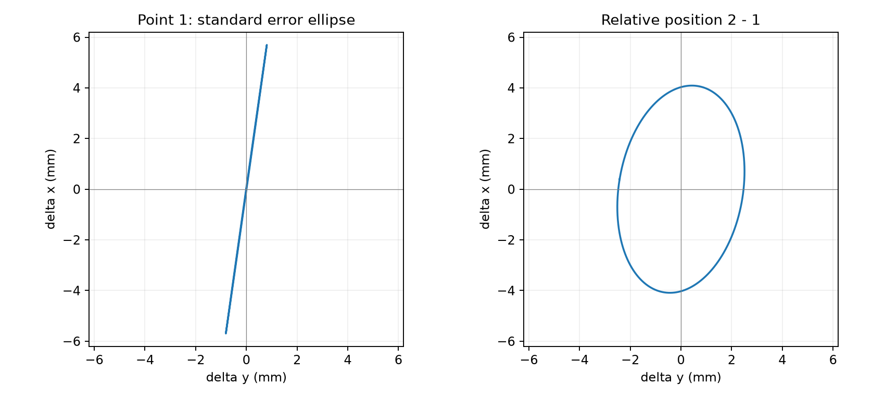

[← 返回题目](#q-16-03) · [返回目录](#contents)

---

<a id="answer-16-04"></a>
#### 16-04　四个协方差阵的误差曲线与误差椭圆

[← 返回题目](#q-16-04)

**课件方法＋整理复算。** 误差曲线的极径是 $m(\alpha)=\sqrt{5.03\cos^2\alpha+7.14\sin^2\alpha+c\sin2\alpha}$；其点坐标为 $(m\cos\alpha,m\sin\alpha)$。椭圆用协方差的特征向量作主轴，半轴为特征值平方根。

| $c$ | 长轴方向（自$x$轴向$y$轴） | $E$ | $F$ |
|---:|---:|---:|---:|
| 1.16 | 66.1430° | 2.7664 | 2.1253 |
| 2.16 | 58.0160° | 2.9136 | 1.9186 |
| 3.16 | 54.2311° | 3.0686 | 1.6594 |
| 4.16 | 52.1153° | 3.2213 | 1.3391 |

随着正协方差增加，长轴变长、短轴变短，总量 $E^2+F^2=12.17$ 不变，主轴趋向 $45^\circ$。绘制两类曲线可用：

```python
import numpy as np
import matplotlib.pyplot as plt
t = np.linspace(0, 2*np.pi, 720)
fig, axes = plt.subplots(2, 2, figsize=(8, 8))
for ax, c in zip(axes.flat, [1.16, 2.16, 3.16, 4.16]):
    D = np.array([[5.03, c], [c, 7.14]])
    m = np.sqrt(D[0,0]*np.cos(t)**2 + D[1,1]*np.sin(t)**2
                + D[0,1]*np.sin(2*t))
    vals, vecs = np.linalg.eigh(D)
    xy = vecs @ (np.sqrt(vals)[:,None]*np.array([np.cos(t), np.sin(t)]))
    ax.plot(m*np.cos(t), m*np.sin(t), label='error curve')
    ax.plot(xy[0], xy[1], label='ellipse')
    ax.set_aspect('equal'); ax.grid(); ax.set_title(f'c={c}')
axes[0,0].legend(); plt.show()
```

**课件疑误：** 第24页矩阵写 $c=4.16$，但所列 $54.23^\circ,3.07,1.66$ 实际对应 $c=3.16$。上表按各矩阵分别计算，未沿用这一错配。

[← 返回题目](#q-16-04) · [返回目录](#contents)

---

<a id="answer-16-05"></a>
#### 16-05　为什么特征根是方向协因数的极值？

[← 返回题目](#q-16-05)

**课件推导补全。** 在约束 $c^Tc=1$ 下，对 $c^TQc-\lambda(c^Tc-1)$ 求导得 $Qc=\lambda c$。左乘 $c^T$ 得 $c^TQc=\lambda$。由对称阵的正交特征分解，令 $c=Uz$，则 $\|z\|=1$ 且 $c^TQc=\sum_i\lambda_i z_i^2$；这是特征值的加权平均，必位于最小与最大特征值之间。取对应单位特征向量时达到边界。最大特征值对应长轴方向；最小特征值对应与它垂直的方向。

实算优先使用 $\operatorname{atan2}(2q_{xy},q_{xx}-q_{yy})/2$，避免单参数 $\arctan$ 的象限混淆。若两特征值相等，图形为圆，所有方向都是极值方向，长轴方向不唯一。

[← 返回题目](#q-16-05) · [返回目录](#contents)

---

<a id="answer-16-06"></a>
#### 16-06　椭圆径向距离是不是位差？

[← 返回题目](#q-16-06)

**课件结论＋整理证明。** 一般不是。设主轴坐标下长短半轴为 $E,F$，方向与长轴夹角为 $\psi$。椭圆沿该方向的径向距离为


$$
r(\psi)=\left(\frac{\cos^2\psi}{E^2}+\frac{\sin^2\psi}{F^2}\right)^{-1/2},
$$


而位差为 $m(\psi)=\sqrt{E^2\cos^2\psi+F^2\sin^2\psi}$。二者只在主轴方向或圆等特殊情形相等。

**切线垂足法：** 作与目标方向垂直的椭圆切线，中心到该切线的垂距就是位差。因为椭圆可写成 $x=D^{1/2}z,\ \|z\|=1$，方向 $c$ 上的最大投影 $\max c^Tx=\|D^{1/2}c\|=\sqrt{c^TDc}$。

[← 返回题目](#q-16-06) · [返回目录](#contents)

---

<a id="answer-16-07"></a>
#### 16-07　两个待定点的相对精度从哪里来？

[← 返回题目](#q-16-07)

**课件结论＋整理推导。** 仅有各自椭圆不够，因为还缺点间互协方差。设联合协因数阵分块为 $Q=\begin{bmatrix}Q_{ii}&Q_{ij}\\Q_{ji}&Q_{jj}\end{bmatrix}$，$\Delta X=X_j-X_i$，则


$$
Q_\Delta=[-I\ I]Q[-I\ I]^T=Q_{ii}+Q_{jj}-Q_{ij}-Q_{ji}.
$$


例如 $q_{\Delta x\Delta x}=q_{x_ix_i}+q_{x_jx_j}-2q_{x_ix_j}$，
$q_{\Delta x\Delta y}=q_{x_iy_i}-q_{x_iy_j}-q_{x_jy_i}+q_{x_jy_j}$。对 $D_\Delta=\sigma_0^2Q_\Delta$ 作特征分解即可求相对误差椭圆。如果点 $i$ 被视作无误差的固定已知点，其协方差及互协方差均为零，此时 $Q_\Delta=Q_{jj}$，退化成普通点位误差椭圆。

[← 返回题目](#q-16-07) · [返回目录](#contents)

---

<a id="answer-16-08"></a>
#### 16-08　根据误差曲线填写八个精度量

[← 返回题目](#q-16-08)

**整理补解。** 图中是以方向位差为极径的**误差曲线**。各段长度取正，$\rho''\simeq206265''$：

1. $\hat\sigma_{x_P}=Pa$。
2. $\hat\sigma_{y_P}=Pb$。
3. $\hat\sigma_E=Pc=E$。
4. $\hat\sigma_F=Pd=F$。
5. $\hat\sigma_P=\sqrt{Pa^2+Pb^2}=\sqrt{Pc^2+Pd^2}$。
6. $\hat\sigma_{PA}=Pe$，即沿 $PA$ 的纵向位差。
7. $\hat\sigma_{\alpha_{PA}}=(Pf/S_{PA})\rho''$，其中 $Pf$ 为与 $PA$ 垂直的横向位差；若角度以弧度表示，不乘 $\rho''$。分子分母长度单位必须统一。
8. $\hat\sigma_\psi=\sqrt{E^2\cos^2\psi+F^2\sin^2\psi}$。图中 $\psi$ 相对长轴，而非相对 $x$ 轴。

[← 返回题目](#q-16-08) · [返回目录](#contents)

---

<a id="answer-16-09"></a>
#### 16-09　将四幅误差曲线与协方差阵配对

[← 返回题目](#q-16-09)

**整理补解。** $\boxed{A\to1,\ B\to4,\ C\to2,\ D\to3}$。对角元相同，协方差依次增大时，误差曲线的长方向变长、短方向变短，凹腰逐渐明显。因此图 A、B、C、D 对应协方差 $1,2,3,4$，按选项编号填写 **1、4、2、3**。

[← 返回题目](#q-16-09) · [返回目录](#contents)

---

<a id="answer-16-10"></a>
#### 16-10　动态误差椭圆带与置信椭圆

[← 返回题目](#q-16-10)

**整理补解／方法答案。** 原始时序数据不在这18份PDF中，因此不能给出真实数据的变化曲线或报告结论。可按下列可执行算法完成：对每个历元 $k$ 的中心 $\hat X_k$ 和对称半正定协方差 $D_k$，求 $D_k=U_k\operatorname{diag}(\lambda_{1k},\lambda_{2k})U_k^T$，绘制


$$
X_k(t)=\hat X_k+c_pU_k\begin{bmatrix}\sqrt{\lambda_{1k}}\cos t\\\sqrt{\lambda_{2k}}\sin t\end{bmatrix},\quad 0\le t\le2\pi.
$$


标准误差椭圆取 $c_p=1$；二维正态且协方差视为已知时，置信概率 $p$ 对应 $c_p=\sqrt{\chi^2_{2,p}}=\sqrt{-2\ln(1-p)}$，95%取约2.4477。分析应报告长短半轴随时间变化、主轴方向变化、面积 $\pi c_p^2\sqrt{\det D_k}$ 和异常历元；不能仅凭椭圆是否相交就断言碰撞或安全。

避碰分析先构造相对位置及其协方差，再结合相对运动、时间和物体尺寸评估碰撞概率。若协方差也由小样本估计，需要相应的 $F$/Hotelling 型置信区域，不能机械套用已知协方差的卡方倍数。

[← 返回题目](#q-16-10) · [返回目录](#contents)

---

<a id="answer-16-11"></a>
#### 16-11　标准误差椭圆内的概率与误差曲线内概率

[← 返回题目](#q-16-11)

**课件结论＋整理核查。** 标准化后 $Z_1^2+Z_2^2\sim\chi^2(2)$，所以


$$
P(B_k)=1-\exp(-k^2/2).
$$


| $k$ | 1 | 2 | 3 | 4 |
|---|---:|---:|---:|---:|
| 概率 | 0.393469 | 0.864665 | 0.988891 | 0.999665 |

该概率与 $E,F$ 无关；一倍误差椭圆的概率是39.35%，不能套用一维正态的68.27%。误差曲线不是等密度椭圆；只有 $E=F$ 时两图都是圆且概率相同。为复算原表，令


$$
g(\theta)=\cos^2\theta/E^2+\sin^2\theta/F^2,\quad R(\theta)=k\sqrt{E^2\cos^2\theta+F^2\sin^2\theta},
$$


$$
P_{\mathrm{curve}}=\frac1{2\pi EF}\int_0^{2\pi}\frac{1-\exp[-g(\theta)R(\theta)^2/2]}{g(\theta)}\,d\theta.
$$


由柯西不等式 $g(\theta)R(\theta)^2\ge k^2$，误差曲线包围区域包含相应椭圆区域，故其概率不小于椭圆内概率。第45页 $E=10,F=9,k=1$ 将误差曲线概率写成0.385152，小于0.393469，与该包含关系矛盾，该表不能未经复核直接背诵。完整复算表见下表。

| $E$ | $F$ | $k$ | 椭圆内概率 | 误差曲线内概率（复算） |
|---:|---:|---:|---:|---:|
| 10 | 5 | 1 | 0.393469 | 0.462142 |
| 10 | 5 | 2 | 0.864665 | 0.911576 |
| 10 | 5 | 3 | 0.988891 | 0.994927 |
| 10 | 5 | 4 | 0.999665 | 0.999887 |
| 10 | 6 | 1 | 0.393469 | 0.431873 |
| 10 | 6 | 2 | 0.864665 | 0.894262 |
| 10 | 6 | 3 | 0.988891 | 0.993278 |
| 10 | 6 | 4 | 0.999665 | 0.999846 |
| 10 | 7 | 1 | 0.393469 | 0.412494 |
| 10 | 7 | 2 | 0.864665 | 0.880470 |
| 10 | 7 | 3 | 0.988891 | 0.991496 |
| 10 | 7 | 4 | 0.999665 | 0.999785 |
| 10 | 8 | 1 | 0.393469 | 0.400980 |
| 10 | 8 | 2 | 0.864665 | 0.871183 |
| 10 | 8 | 3 | 0.988891 | 0.990041 |
| 10 | 8 | 4 | 0.999665 | 0.999723 |
| 10 | 9 | 1 | 0.393469 | 0.395151 |
| 10 | 9 | 2 | 0.864665 | 0.866156 |
| 10 | 9 | 3 | 0.988891 | 0.989164 |
| 10 | 9 | 4 | 0.999665 | 0.999679 |
| 10 | 10 | 1 | 0.393469 | 0.393469 |
| 10 | 10 | 2 | 0.864665 | 0.864665 |
| 10 | 10 | 3 | 0.988891 | 0.988891 |
| 10 | 10 | 4 | 0.999665 | 0.999665 |

[← 返回题目](#q-16-11) · [返回目录](#contents)

---

<a id="answers-17"></a>
### 17　统计假设原理与常用统计量 · 答案

[返回目录](#contents) · [本章题目](#chapter-17)

<a id="answer-17-01"></a>
#### 17-01　观测值2.5与两类错误

[← 返回题目](#q-17-01)

**课件结论＋整理说明。** 双侧临界值分别为1.64485与2.57583。$\alpha=0.10$ 时 $|2.5|>1.64485$，拒绝 $H_0$；$\alpha=0.01$ 时 $|2.5|<2.57583$，不拒绝 $H_0$。

| 真实分布 | 10%水平 | 1%水平 |
|---|---|---|
| $N(0,1)$ | 弃真，第一类错误 | 正确地不拒绝 |
| $N(3,1)$ | 正确地拒绝 | 纳伪，第二类错误 |

“不拒绝”不等于证明 $H_0$ 为真，单个样本值也不能被说成“服从某分布”；分布描述的是生成样本的随机机制。第一类错误概率由水平 $\alpha$ 控制，第二类错误概率取决于实际备择分布及检验规则。

[← 返回题目](#q-17-01) · [返回目录](#contents)

---

<a id="answer-17-02"></a>
#### 17-02　已知精度时检验三角形内角和的均值

[← 返回题目](#q-17-02)

**课件结果与条件辨析。** $H_0:\mu=180^\circ$，$H_1:\mu\ne180^\circ$。若按课件计算口径，把 $1.8''$ 当作每个“三角形内角和”的已知标准差，且16个内角和独立，则


$$
u=\frac{4.0}{1.8/\sqrt{16}}=8.8889.
$$


临界值 $\pm1.95996$，故拒绝 $H_0$，与课件的 $u=8.89$ 一致。

**须分清测角精度和内角和精度：** 题面文字说的是单角中误差。若三角形三个角独立且各为 $1.8''$，则内角和中误差为 $\sqrt3\times1.8''$，此时 $u=4.0/(\sqrt3\times1.8/4)=5.1320$，仍拒绝 $H_0$。若不同三角形共享相关观测，均值方差须由完整协方差传播，不能直接除以16。此检验只说明均值相对平面模型的显著偏离，原因还可能是球面超额等模型项。

[← 返回题目](#q-17-02) · [返回目录](#contents)

---

<a id="answer-17-03"></a>
#### 17-03　检验测角精度是否与标定值一致

[← 返回题目](#q-17-03)

**课件解答，已复算。** $H_0:\sigma^2=(1.8'')^2$，$H_1:\sigma^2\ne(1.8'')^2$。


$$
T=\frac{(16-1)(1.7)^2}{(1.8)^2}=13.37963\sim\chi^2(15).
$$


以左侧累积概率记分位数，接受区间为 $[\chi^2_{15,0.025},\chi^2_{15,0.975}]=[6.26214,27.48839]$，故不拒绝 $H_0$。考试按原填空措辞可写“接受”，含义是没有发现显著差异，不能证明精度恰好相等。

这里沿用课件 $n-1=15$ 的样本方差模型；若 $1.7''$ 来自平差后验单位权中误差，统计量应写为 $r\hat\sigma_0^2/\sigma_0^2$，自由度取该平差的多余观测数 $r$。

[← 返回题目](#q-17-03) · [返回目录](#contents)

---

<a id="answer-17-04"></a>
#### 17-04　方差未知时检验16个内角和

[← 返回题目](#q-17-04)

**整理复算，并与课件对照。** 对超出 $180^\circ$ 的秒数 $d_i$，检验 $H_0:E(d_i)=0$ 对 $H_1:E(d_i)\ne0$，假设独立正态。由原始16个数得到


$$
\bar d=3.0625'',\quad s=\sqrt{\frac{\sum(d_i-\bar d)^2}{15}}=0.9871677'',\quad t=\frac{3.0625}{0.9871677/4}=12.40924.
$$


$t_{15,0.975}=2.13145$，所以拒绝 $H_0$，存在显著均值偏离。

**课件疑误：** 第22页写 $\bar d=3.1'',s=0.96'',t=12.92$；后两数无法由列出的原始数据严格得到。若直接按课件展示值计算，则 $3.1/(0.96/4)=12.9167$；本册按原题数据复算为 $\boxed{t=12.41}$，判断结论不变。第21页标准差公式也少写根号：$s^2=\sum(d_i-\bar d)^2/(n-1)$，而 $s$ 必须开平方。

[← 返回题目](#q-17-04) · [返回目录](#contents)

---

<a id="answer-17-05"></a>
#### 17-05　第三期与第二期精度比较：2.0秒版本

[← 返回题目](#q-17-05)

**整理补解／条件答案。** 用独立正态方差估计的 $F$ 检验，$H_0:\sigma_3^2=\sigma_2^2$，$H_1:\sigma_3^2\ne\sigma_2^2$：


$$
F=\frac{\hat\sigma_3^2}{\hat\sigma_2^2}\sim F(r_3,r_2),\quad F\notin[F_{r_3,r_2,\alpha/2},F_{r_3,r_2,1-\alpha/2}]\Longrightarrow\text{拒绝 }H_0.
$$


**题面不足以给唯一判断。** 上一页的 $0.96''$（或按数据复算的 $0.98717''$）是内角和的样本标准差，不能不作转换就与本页“单角中误差2.0秒”混用。若明确另作课堂简化：两者是同一观测量的标准差、各自由度15、$\alpha=0.05$，用原始内角和复算值可得 $F=2.0^2/0.9871677^2\approx4.1047$，大于 $F_{15,15,0.975}\approx2.8621$，拒绝 $H_0$。这只是附加假设下的示范，不能当成原页无条件答案。

[← 返回题目](#q-17-05) · [返回目录](#contents)

---

<a id="answer-17-06"></a>
#### 17-06　再次观测与第一期精度比较：1.2秒版本

[← 返回题目](#q-17-06)

**整理复算。** 令 $F=s_{\mathrm{new}}^2/s_1^2$，则 $F=1.2^2/1.7^2=0.49827$，在 $H_0:\sigma_{\mathrm{new}}^2=\sigma_1^2$ 下服从 $F(15,15)$。双侧不拒绝区间为 $[0.41607,2.40345]$，故不拒绝 $H_0$。

**课件疑误：** 第26页列 $F=0.64$，不能由第一期的 $1.7''$ 与本页 $1.2''$ 得到；判断“不显著”在上述自由度下仍相同。方差检验没有拒绝相等性，并不能排除操作偏差、仪器偏差或其他均值偏差，课件关于系统误差原因的进一步判断不由这一检验单独支持。

[← 返回题目](#q-17-06) · [返回目录](#contents)

---

<a id="answer-17-07"></a>
#### 17-07　还有哪些原因造成系统偏差？

[← 返回题目](#q-17-07)

**课件答案：理论模型的局限性。** 大地三角形不能一律视作平面三角形，球面三角形内角和为 $\pi+\varepsilon$；球面超额 $\varepsilon=A/R^2$（弧度，$A$ 为球面面积），因此没有扣除球面超额时，用180°作为期望可能出现正偏离。

**整理补充：** 还可能有折光、温度等环境修正不充分，仪器常数或尺度改正遗漏，以及基准或投影模型处理不当等。应以数据和模型逐项验证原因。不能仅因一次方差检验未显著，就宣布仪器或操作因素已被排除。

[← 返回题目](#q-17-07) · [返回目录](#contents)

---

<a id="answer-17-08"></a>
#### 17-08　教材9-2：32个三角形闭合差，已知标准差

[← 返回题目](#q-17-08)

**整理补解，已复算。** $n=32,\sum w_i=-2.45'',\bar w=-0.0765625''$。


$$
u=\frac{\bar w-0}{1/\sqrt{32}}=-0.4331029.
$$


因此填 $\boxed{-0.433}$，$|u|<1.95996$，填 $\boxed{\text{接受}}$（严谨说“不拒绝” $H_0$）。若教材以统计量绝对值填空，则是0.433；这里保留有符号的定义。

[← 返回题目](#q-17-08) · [返回目录](#contents)

---

<a id="answer-17-09"></a>
#### 17-09　教材9-3：32个三角形闭合差，未知标准差

[← 返回题目](#q-17-09)

**整理补解，已复算。** $\bar w=-0.0765625''$，$s=\sqrt{\sum(w_i-\bar w)^2/31}=0.9621971''$。


$$
t=\frac{\bar w}{s/\sqrt{32}}=-0.4501187,\quad t\sim t(31).
$$


双侧临界值 $t_{31,0.975}=2.039513$。填 $\boxed{-0.45}$，$\boxed{\text{接受}}$（不拒绝）。不得因为 $n>30$ 就在已知正态、方差未知的题目中省略 $t$ 检验。

[← 返回题目](#q-17-09) · [返回目录](#contents)

---

<a id="answer-17-10"></a>
#### 17-10　教材9-5：两人纬度观测结果的差异

[← 返回题目](#q-17-10)

**整理补解。** 已知两个总体方差，假设两人的观测互相独立，使用双样本 $u$ 检验。$H_0:\mu_\mathrm{甲}=\mu_\mathrm{乙}$。


$$
u=\frac{12.33-12.38}{\sqrt{0.63^2/8+0.63^2/8}}=\frac{-0.05}{0.315}=-0.15873.
$$


填 $\boxed{u}$、$\boxed{-0.16}$、$\boxed{\text{无}}$。这里“无”应理解为没有发现两人结果之间的显著系统差异，不能排除两人共同存在同方向系统偏差。

[← 返回题目](#q-17-10) · [返回目录](#contents)

---

<a id="answer-17-11"></a>
#### 17-11　教材9-8：检验精密水准仪读数精度

[← 返回题目](#q-17-11)

**整理补解，已复算。** 在独立正态假设下，$\bar x=1412.818\ \mathrm{mm}$，$\sum v_i^2=0.25984\ \mathrm{mm}^2$，$s^2=0.01856\ \mathrm{mm}^2$。自由度 $14$，双侧不拒绝区间为 $[5.62873,26.11895]$。


$$
T_1=\frac{14s^2}{0.08^2}=\boxed{40.60},\qquad T_2=\frac{14s^2}{0.20^2}=\boxed{6.50}.
$$


$T_1$ 超过上限，拒绝（1）；$T_2$ 位于区间内，不拒绝（2）。编号填 $\boxed{2}$。这里6.50由未舍入值6.496四舍五入得到。

[← 返回题目](#q-17-11) · [返回目录](#contents)

---

<a id="answer-17-12"></a>
#### 17-12　教材9-12：两个独立测角网的后验单位权方差

[← 返回题目](#q-17-12)

**整理补解，已复算。** 两网的权须采用可比单位权基准；若各自任意缩放权阵，单位权方差比不能直接解释成精度比。按题设可比且独立、误差正态：


$$
H_0:\sigma_{01}^2=\sigma_{02}^2,\qquad H_1:\sigma_{01}^2\ne\sigma_{02}^2.
$$


取第一网方差在分子，


$$
F=\frac{4.3928/31}{8.7152/49}=0.79670668\approx\boxed{0.80},\qquad F\sim F(31,49).
$$


双尾检验，分子自由度 $m=31$、分母自由度 $n=49$，**不再各减1**。查左右累积概率0.025与0.975，得到区间 $[0.51182,1.86347]$；因此不拒绝 $H_0$。按课件上尾概率表的措辞，查表尾概率填 $\boxed{0.025}$。

依次填：**F；A（方差相等）；0.80；双尾；31；49；0.025；接受**。这里的“概率值”是查临界值使用的尾概率，不是本次检验的 $p$ 值；实际双侧 $p\approx0.506$。若采用大方差在分子，也可取 $F=1.26$、自由度$(49,31)$，相应查表并得到同样判断。

[← 返回题目](#q-17-12) · [返回目录](#contents)

---
